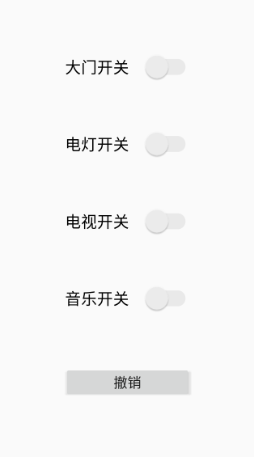

# 设计模式

[English Version](./DesignPatterns.md)


## 前言

------

### 概述

------

设计模式在面试中的考点通常是介绍其原理并说出优缺点。或者对比几个比较相似的模式的异同点。在笔试中可能会出现画出某个设计模式的 UML 图这样的题。虽说面试中占的比重不大，但并不代表它不重要。恰恰相反，设计模式于程序员而言相当重要，它是我们写出优秀程序的保障。设计模式与程序员的架构能力与阅读源码的能力息息相关，非常值得我们深入学习。

面向对象的特点是**可维护、可复用、可扩展、灵活性好**，它最强大的地方在于：随着业务变得越来越复杂，面向对象依然能够使得程序结构良好，而面向过程却会导致程序越来越臃肿。

让面向对象保持结构良好的秘诀就是设计模式，面向对象结合设计模式，才能真正体会到程序变得可维护、可复用、可扩展、灵活性好。设计模式对于程序员而言并不陌生，每个程序员在编程时都会或多或少的接触到设计模式。无论是在大型程序的架构中，亦或是在源码的学习中，设计模式都扮演着非常重要的角色。

### 设计模式的六大原则

------

设计模式的世界丰富多彩，比如生产一个个“产品”的工厂模式，衔接两个不相关接口的适配器模式，用不同的方式做同一件事的策略模式，构建步骤稳定、根据构建过程的不同配置构建出不同对象的建造者模式等等。

无论何种设计模式，都是基于六大设计原则：

* 开闭原则：一个软件实体如类、模块和函数应该对修改封闭，对扩展开放。
* 单一职责原则：一个类只做一件事，一个类应该只有一个引起它修改的原因。】
* 里氏替换原则：子类应该可以完全替换父类。也就是说在使用继承时，只扩展新功能，而不要破坏父类原有的功能。
* 依赖倒置原则：细节应该依赖于抽象，抽象不应依赖于细节。把抽象层放在程序设计的高层，并保持稳定，程序的细节变化由低层的实现层来完成。
* 迪米特法则：又名“最少知道原则”，一个类不应知道自己操作的类的细节，换言之，只和朋友谈话，不和朋友的朋友谈话。
* 接口隔离原则：客户端不应依赖它不需要的接口。如果一个接口在实现时，部分方法由于冗余被客户端空实现，则应该将接口拆分，让实现类只需依赖自己需要的接口方法。


## 构建者模式

------

### 工厂模式

在平时编程中，构建对象最常用的方式是 new 一个对象。乍一看这种做法没什么不好，而实际上这也属于一种硬编码。每 new 一个对象，相当于调用者多知道了一个类，增加了类与类之间的联系，不利于程序的松耦合。其实构建过程可以被封装起来，工厂模式便是用于封装对象的设计模式。

#### 简单工厂模式

举个例子，直接 new 对象的方式相当于当我们需要一个苹果时，我们需要知道苹果的构造方法，需要一个梨子时，需要知道梨子的构造方法。更好的实现方式是有一个水果工厂，我们告诉工厂需要什么种类的水果，水果工厂将我们需要的水果制造出来给我们就可以了。这样我们就无需知道苹果、梨子是怎么种出来的，只用和水果工厂打交道即可。

水果工厂：

```java
public class FruitFactory {
    public Fruit create(String type){
        switch (type){
            case "苹果": return new Apple();
            case "梨子": return new Pear();
            default: throw new IllegalArgumentException("暂时没有这种水果");
        }
    }
}
```

调用者：

```java
public class User {
    private void eat(){
        FruitFactory fruitFactory = new FruitFactory();
        Fruit apple = fruitFactory.create("苹果");
        Fruit pear = fruitFactory.create("梨子");
        apple.eat();
        pear.eat();
    }
}
```

事实上，将构建过程封装的好处不仅可以降低耦合，如果某个产品构造方法相当复杂，使用工厂模式可以大大减少代码重复。比如，如果生产一个苹果需要苹果种子、阳光、水分，将工厂修改如下：

```java
public class FruitFactory {
    public Fruit create(String type) {
        switch (type) {
            case "苹果":
                AppleSeed appleSeed = new AppleSeed();
                Sunlight sunlight = new Sunlight();
                Water water = new Water();
                return new Apple(appleSeed, sunlight, water);
            case "梨子":
                return new Pear();
            default:
                throw new IllegalArgumentException("暂时没有这种水果");
        }
    }
}
```

调用者的代码则完全不需要变化，而且调用者不需要在每次需要苹果时，自己去构建苹果种子、阳光、水分以获得苹果。苹果的生产过程再复杂，也只是工厂的事。这就是封装的好处，假如某天科学家发明了让苹果更香甜的肥料，要加入苹果的生产过程中的话，也只需要在工厂中修改，调用者完全不用关心。

不知不觉中，我们就写出了简单工厂模式的代码。工厂模式一共有三种：

* 简单工厂模式
* 工厂方法模式
* 抽象工厂模式

> 注：在 GoF 所著的《设计模式》一书中，简单工厂模式被划分为工厂方法模式的一种特例，没有单独被列出来。

总而言之，简单工厂模式就是让一个工厂类承担构建所有对象的职责。调用者需要什么产品，让工厂生产出来即可。它的弊端也显而易见：

* 一是如果需要生产的产品过多，此模式会导致工厂类过于庞大，承担过多的职责，变成超级类。当苹果生产过程需要修改时，要来修改此工厂。梨子生产过程需要修改时，也要来修改此工厂。也就是说这个类不止一个引起修改的原因。违背了单一职责原则。

* 二是当要生产新的产品时，必须在工厂类中添加新的分支。而开闭原则告诉我们：类应该对修改封闭。我们希望在添加新功能时，只需增加新的类，而不是修改既有的类，所以这就违背了开闭原则。

#### 工厂方法模式

为了解决简单工厂模式的这两个弊端，工厂方法模式应运而生，它规定每个产品都有一个专属工厂。比如苹果有专属的苹果工厂，梨子有专属的梨子工厂，代码如下：

苹果工厂：

```java
public class AppleFactory {
    public Fruit create(){
        return new Apple();
    }
}
```

梨子工厂：

```java
public class PearFactory {
    public Fruit create(){
        return new Pear();
    }
}
```

调用者：

```java
public class User {
    private void eat(){
        AppleFactory appleFactory = new AppleFactory();
        Fruit apple = appleFactory.create();
        PearFactory pearFactory = new PearFactory();
        Fruit pear = pearFactory.create();
        apple.eat();
        pear.eat();
    }
}
```

有读者可能会开喷了，这样和直接 new 出苹果和梨子有什么区别？上文说工厂是为了减少类与类之间的耦合，让调用者尽可能少的和其他类打交道。用简单工厂模式，我们只需要知道 `FruitFactory`，无需知道 `Apple` 、`Pear` 类，很容易看出耦合度降低了。但用工厂方法模式，调用者虽然不需要和 `Apple` 、`Pear` 类打交道了，但却需要和 `AppleFactory`、`PearFactory` 类打交道。有几种水果就需要知道几个工厂类，耦合度完全没有下降啊，甚至还增加了代码量！

这位读者请先放下手中的大刀，仔细想一想，工厂模式的第二个优点在工厂方法模式中还是存在的。当构建过程相当复杂时，工厂将构建过程封装起来，调用者可以很方便的直接使用，同样以苹果生产为例：

```java
public class AppleFactory {
    public Fruit create(){
        AppleSeed appleSeed = new AppleSeed();
        Sunlight sunlight = new Sunlight();
        Water water = new Water();
        return new Apple(appleSeed, sunlight, water);
    }
}
```

调用者无需知道苹果的生产细节，当生产过程需要修改时也无需更改调用端。同时，工厂方法模式解决了简单工厂模式的两个弊端。

* 当生产的产品种类越来越多时，工厂类不会变成超级类。工厂类会越来越多，保持灵活。不会越来越大、变得臃肿。如果苹果的生产过程需要修改时，只需修改苹果工厂。梨子的生产过程需要修改时，只需修改梨子工厂。符合单一职责原则。

* 当需要生产新的产品时，无需更改既有的工厂，只需要添加新的工厂即可。保持了面向对象的可扩展性，符合开闭原则。
  OK，学以致用，接下来我们来做两个思考题。同样地，在以后的每一篇文章后面，都会附上几个小练习供大家思考。希望大家能够独立思考出问题的答案，当然，在必要时也可参考底部的解析。

问 1：现有医用口罩和 N95 口罩两种产品，都继承自 Mask 类：

```java
abstract class Mask {
}

public class SurgicalMask extends Mask {
    @NonNull
    @Override
    public String toString() {
        return "这是医用口罩";
    }
}

public class N95Mask extends Mask {
    @NonNull
    @Override
    public String toString() {
        return "这是 N95 口罩";
    }
}
```

请使用简单工厂模式完成以下代码：

```java
public class MaskFactory {
    public Mask create(String type){
        // TODO: 使用简单工厂模式实现此处的逻辑
    }
}
```

使其通过以下客户端测试：

```java
public class Client {

    @Test
    public void test() {
        MaskFactory factory = new MaskFactory();
        // 输出：这是医用口罩
        System.out.println(factory.create("Surgical"));
        // 输出：这是 N95 口罩
        System.out.println(factory.create("N95"));
    }
}
```

答案：

```java
public class MaskFactory {
    public Mask create(String type){
        // 使用简单工厂模式实现此处的逻辑
        switch (type){
            case "Surgical":
                return new SurgicalMask();
            case "N95":
                return new N95Mask();
            default:
                throw new IllegalArgumentException("Unsupported mask type");
        }
    }
}
```

问 2：如何用工厂方法模式实现呢？

客户端测试代码：

```java
public class Client {

    @Test
    public void test() {
        SurgicalMaskFactory surgicalMaskFactory = new SurgicalMaskFactory();
        // 输出：这是医用口罩
        System.out.println(surgicalMaskFactory.create());
        N95MaskFactory N95MaskFactory = new N95MaskFactory();
        // 输出：这是 N95 口罩
        System.out.println(N95MaskFactory.create());
    }
}
```

答案：

```java
public class SurgicalMaskFactory{

    public Mask create() {
        return new SurgicalMask();
    }
}

public class N95MaskFactory {
    public Mask create() {
        return new N95Mask();
    }
}
```


### 抽象工厂模式

------

上一节中的工厂方法模式可以进一步优化，提取出公共的工厂接口：

```java
public interface IFactory {
    Fruit create();
}
```

然后苹果工厂和梨子工厂都实现此接口：

```java
public class AppleFactory implements IFactory {
    @Override
    public Fruit create(){
        return new Apple();
    }
}

public class PearFactory implements IFactory {
    @Override
    public Fruit create(){
        return new Pear();
    }
}
```

此时，调用者可以将 `AppleFactory` 和 `PearFactory` 统一作为 `IFactory` 对象使用，调用者代码如下：

```java
public class User {
    private void eat(){
        IFactory appleFactory = new AppleFactory();
        Fruit apple = appleFactory.create();
        IFactory pearFactory = new PearFactory();
        Fruit pear = pearFactory.create();
        apple.eat();
        pear.eat();
    }
}
```

可以看到，我们在创建时指定了具体的工厂类后，在使用时就无需再关心是哪个工厂类，只需要将此工厂当作抽象的 IFactory 接口使用即可。这种经过抽象的工厂方法模式被称作抽象工厂模式。

由于客户端只和 IFactory 打交道了，调用的是接口中的方法，使用时根本不需要知道是在哪个具体工厂中实现的这些方法，这就使得替换工厂变得非常容易。

例如：

```java
public class User {
    private void eat(){
        IFactory factory = new AppleFactory();
        Fruit fruit = factory.create();
        fruit.eat();
    }
}
```

如果需要替换为吃梨子，只需要更改一行代码即可：

```java
public class User {
    private void eat(){
        IFactory factory = new PearFactory();
        Fruit fruit = factory.create();
        fruit.eat();
    }
}
```

`IFactory` 中只有一个抽象方法时，或许还看不出抽象工厂模式的威力。实际上抽象工厂模式主要用于替换一系列方法。例如将程序中的 SQL Server 数据库整个替换为 Access 数据库，使用抽象方法模式的话，只需在 `IFactory` 接口中定义好增删改查四个方法，让 `SQLFactory` 和 `AccessFactory` 实现此接口，调用时直接使用 IFactory 中的抽象方法即可，调用者无需知道使用的什么数据库，我们就可以非常方便的整个替换程序的数据库，并且让客户端毫不知情。

抽象工厂模式很好的发挥了开闭原则、依赖倒置原则，但缺点是抽象工厂模式太重了，如果 IFactory 接口需要新增功能，则会影响到所有的具体工厂类。使用抽象工厂模式，替换具体工厂时只需更改一行代码，但要新增抽象方法则需要修改所有的具体工厂类。所以抽象工厂模式适用于增加同类工厂这样的横向扩展需求，不适合新增功能这样的纵向扩展。

问：上一节中提到的问题如何用抽象工厂模式实现呢？

客户端测试代码：

```java
public class Client {

    @Test
    public void test() {
        IFactory surgicalMaskFactory = new SurgicalMaskFactory();
        // 输出：这是医用口罩
        System.out.println(surgicalMaskFactory.create());
        IFactory N95MaskFactory = new N95MaskFactory();
        // 输出：这是 N95 口罩
        System.out.println(N95MaskFactory.create());
    }
}
```

答案：

```java
public interface IFactory {
    Mask create();
}

public class SurgicalMaskFactory implements IFactory{

    @Override
    public Mask create() {
        return new SurgicalMask();
    }
}

public class N95MaskFactory implements IFactory {
    @Override
    public Mask create() {
        return new N95Mask();
    }
}
```


### 单例模式

------

单例模式非常常见，某个对象全局只需要一个实例时，就可以使用单例模式。它的优点也显而易见：

* 它能够避免对象重复创建，节约空间并提升效率

* 避免由于操作不同实例导致的逻辑错误

单例模式有两种实现方式：饿汉式和懒汉式。

#### 饿汉式

* 饿汉式：变量在声明时便初始化。

```java
public class Singleton {
  
    private static Singleton instance = new Singleton();

    private Singleton() {
    }

    public static Singleton getInstance() {
        return instance;
    }
}
```

可以看到，我们将构造方法定义为 private，这就保证了其他类无法实例化此类，必须通过 getInstance 方法才能获取到唯一的 instance 实例，非常直观。但饿汉式有一个弊端，那就是即使这个单例不需要使用，它也会在类加载之后立即创建出来，占用一块内存，并增加类初始化时间。就好比一个电工在修理灯泡时，先把所有工具拿出来，不管是不是所有的工具都用得上。就像一个饥不择食的饿汉，所以称之为饿汉式。

#### 懒汉式

* 懒汉式：先声明一个空变量，需要用时才初始化。例如：

```java
public class Singleton {
  
    private static Singleton instance = null;
  
    private Singleton() {
    }
    
    public static Singleton getInstance(){
        if (instance == null) {
            instance = new Singleton();
        }
        return instance;
    }
}
```

我们先声明了一个初始值为 null 的 instance 变量，当需要使用时判断此变量是否已被初始化，没有初始化的话才 new 一个实例出来。就好比电工在修理灯泡时，开始比较偷懒，什么工具都不拿，当发现需要使用螺丝刀时，才把螺丝刀拿出来。当需要用钳子时，再把钳子拿出来。就像一个不到万不得已不会行动的懒汉，所以称之为懒汉式。

懒汉式解决了饿汉式的弊端，好处是按需加载，避免了内存浪费，减少了类初始化时间。

上述代码的懒汉式单例乍一看没什么问题，但其实它不是线程安全的。如果有多个线程同一时间调用 getInstance 方法，instance 变量可能会被实例化多次。为了保证线程安全，我们需要给判空过程加上锁：

```java
public class Singleton {

    private static Singleton instance = null;

    private Singleton() {
    }

    public static Singleton getInstance() {
        synchronized (Singleton.class) {
            if (instance == null) {
                instance = new Singleton();
            }
        }
        return instance;
    }
}
```

这样就能保证多个线程调用 getInstance 时，一次最多只有一个线程能够执行判空并 new 出实例的操作，所以 instance 只会实例化一次。但这样的写法仍然有问题，当多个线程调用 getInstance 时，每次都需要执行 synchronized 同步化方法，这样会严重影响程序的执行效率。所以更好的做法是在同步化之前，再加上一层检查：

```java
public class Singleton {
    
    private static Singleton instance = null;

    private Singleton() {
    }

    public static Singleton getInstance() {
        if (instance == null) {
            synchronized (Singleton.class) {
                if (instance == null) {
                    instance = new Singleton();
                }
            }
        }
        return instance;
    }
}
```

这样增加一种检查方式后，如果 instance 已经被实例化，则不会执行同步化操作，大大提升了程序效率。上面这种写法也就是我们平时较常用的双检锁方式实现的线程安全的单例模式。

但这样的懒汉式单例仍然有一个问题，JVM 底层为了优化程序运行效率，可能会对我们的代码进行指令重排序，在一些特殊情况下会导致出现空指针，为了防止这个问题，更进一步的优化是给 instance 变量加上 volatile 关键字。

有读者可能会有疑问，我们在外面检查了 instance == null, 那么锁里面的空检查是否可以去掉呢？

答案是不可以。如果里面不做空检查，可能会有两个线程同时通过了外面的空检查，然后在一个线程 new 出实例后，第二个线程进入锁中又 new 出一个实例，导致创建多个实例。

除了双检锁方式外，还有一种比较常见的静态内部类方式保证懒汉式单例的线程安全：

```java
public class Singleton {
    
    private static class SingletonHolder {
        public static Singleton instance = new Singleton();
    }

    private Singleton() {
    }

    public static Singleton getInstance() {
        return SingletonHolder.instance;
    }
}
```

虽然我们经常使用这种静态内部类的懒加载方式，但其中的原理不一定每个人都清楚。接下来我们便来分析其原理，搞清楚两个问题：

* 静态内部类方式是怎么实现懒加载的

* 静态内部类方式是怎么保证线程安全的

Java 类的加载过程包括：加载、验证、准备、解析、初始化。初始化阶段即执行类的 clinit 方法（clinit = class + initialize），包括为类的静态变量赋初始值和执行静态代码块中的内容。但不会立即加载内部类，内部类会在使用时才加载。所以当此 Singleton 类加载时，SingletonHolder 并不会被立即加载，所以不会像饿汉式那样占用内存。

另外，Java 虚拟机规定，当访问一个类的静态字段时，如果该类尚未初始化，则立即初始化此类。当调用Singleton 的 getInstance 方法时，由于其使用了 SingletonHolder 的静态变量 instance，所以这时才会去初始化 SingletonHolder，在 SingletonHolder 中 new 出 Singleton 对象。这就实现了懒加载。

第二个问题的答案是 Java 虚拟机的设计是非常稳定的，早已经考虑到了多线程并发执行的情况。虚拟机在加载类的 clinit 方法时，会保证 clinit 在多线程中被正确的加锁、同步。即使有多个线程同时去初始化一个类，一次也只有一个线程可以执行 clinit 方法，其他线程都需要阻塞等待，从而保证了线程安全。

懒加载方式在平时非常常见，比如打开我们常用的美团、饿了么、支付宝 app，应用首页会立刻刷新出来，但其他标签页在我们点击到时才会刷新。这样就减少了流量消耗，并缩短了程序启动时间。再比如游戏中的某些模块，当我们点击到时才会去下载资源，而不是事先将所有资源都先下载下来，这也属于懒加载方式，避免了内存浪费。

但懒汉式的缺点就是将程序加载时间从启动时延后到了运行时，虽然启动时间缩短了，但我们浏览页面时就会看到数据的 loading 过程。如果用饿汉式将页面提前加载好，我们浏览时就会特别的顺畅，也不失为一个好的用户体验。比如我们常用的 QQ、微信 app，作为即时通讯的工具软件，它们会在启动时立即刷新所有的数据，保证用户看到最新最全的内容。著名的软件大师 Martin 在《代码整洁之道》一书中也说到：不提倡使用懒加载方式，因为程序应该将构建与使用分离，达到解耦。饿汉式在声明时直接初始化变量的方式也更直观易懂。所以在使用饿汉式还是懒汉式时，需要权衡利弊。

一般的建议是：对于构建不复杂，加载完成后会立即使用的单例对象，推荐使用饿汉式。对于构建过程耗时较长，并不是所有使用此类都会用到的单例对象，推荐使用懒汉式。

问：双检锁单例模式中，volatile 主要用来防止哪几条指令重排序？如果发生了重排序，会导致什么样的错误？

答案：

```java
instance = new Singleton();
```

这一行代码中，执行了三条重要的指令：

* 分配对象的内存空间

* 初始化对象

将变量 instance 指向刚分配的内存空间
在这个过程中，如果第二条指令和第三条指令发生了重排序，可能导致 instance 还未初始化时，其他线程提前通过双检锁外层的 null 检查，获取到“不为 null，但还没有执行初始化”的 instance 对象，发生空指针异常。


### 建造者模式

------

建造者模式用于创建过程稳定，但配置多变的对象。在《设计模式》一书中的定义是：**将一个复杂的构建与其表示相分离，使得同样的构建过程可以创建不同的表示。**

经典的“建造者-指挥者”模式现在已经不太常用了，现在建造者模式主要用来通过链式调用生成不同的配置。比如我们要制作一杯珍珠奶茶。它的制作过程是稳定的，除了必须要知道奶茶的种类和规格外，是否加珍珠和是否加冰是可选的。使用建造者模式表示如下：

```java
public class MilkTea {
    private final String type;
    private final String size;
    private final boolean pearl;
    private final boolean ice;

	private MilkTea() {}
	
    private MilkTea(Builder builder) {
        this.type = builder.type;
        this.size = builder.size;
        this.pearl = builder.pearl;
        this.ice = builder.ice;
    }

    public String getType() {
        return type;
    }

    public String getSize() {
        return size;
    }

    public boolean isPearl() {
        return pearl;
    }
    public boolean isIce() {
        return ice;
    }

    public static class Builder {

        private final String type;
        private String size = "中杯";
        private boolean pearl = true;
        private boolean ice = false;

        public Builder(String type) {
            this.type = type;
        }

        public Builder size(String size) {
            this.size = size;
            return this;
        }

        public Builder pearl(boolean pearl) {
            this.pearl = pearl;
            return this;
        }

        public Builder ice(boolean cold) {
            this.ice = cold;
            return this;
        }

        public MilkTea build() {
            return new MilkTea(this);
        }
    }
}
```

可以看到，我们将 MilkTea 的构造方法设置为私有的，所以外部不能通过 new 构建出 MilkTea 实例，只能通过 Builder 构建。对于必须配置的属性，通过 Builder 的构造方法传入，可选的属性通过 Builder 的链式调用方法传入，如果不配置，将使用默认配置，也就是中杯、加珍珠、不加冰。根据不同的配置可以制作出不同的奶茶：

```java
public class User {
    private void buyMilkTea() {
        MilkTea milkTea = new MilkTea.Builder("原味").build();
        show(milkTea);

        MilkTea chocolate =new MilkTea.Builder("巧克力味")
                .ice(false)
                .build();
        show(chocolate);
        
        MilkTea strawberry = new MilkTea.Builder("草莓味")
                .size("大杯")
                .pearl(false)
                .ice(true)
                .build();
        show(strawberry);
    }

    private void show(MilkTea milkTea) {
        String pearl;
        if (milkTea.isPearl())
            pearl = "加珍珠";
        else
            pearl = "不加珍珠";
        String ice;
        if (milkTea.isIce()) {
            ice = "加冰";
        } else {
            ice = "不加冰";
        }
        System.out.println("一份" + milkTea.getSize() + "、"
                + pearl + "、"
                + ice + "的"
                + milkTea.getType() + "奶茶");
    }
}
```

运行程序，输出如下：

```
一份中杯、加珍珠、不加冰的原味奶茶
一份中杯、加珍珠、不加冰的巧克力味奶茶
一份大杯、不加珍珠、加冰的草莓味奶茶
```

使用建造者模式的好处是不用担心忘了指定某个配置，保证了构建过程是稳定的。在 OkHttp、Retrofit 等著名框架的源码中都使用到了建造者模式。


### 原型模式

原型模式：**用原型实例指定创建对象的种类，并且通过拷贝这些原型创建新的对象。**

定义看起来有点绕口，实际上在 Java 中，Object 的 clone() 方法就属于原型模式，不妨简单的理解为：原型模式就是用来克隆对象的。

举个例子，比如有一天，周杰伦到奶茶店点了一份不加冰的原味奶茶，你说我是周杰伦的忠实粉，我也要一份跟周杰伦一样的。用程序表示如下：

奶茶类：

```java
public class MilkTea {
    public String type;
    public boolean ice;
}
```

下单：

```java
private void order(){
    MilkTea milkTeaOfJay = new MilkTea();
    milkTeaOfJay.type = "原味";
    milkTeaOfJay.ice = false;
    
    MilkTea yourMilkTea = milkTeaOfJay;
}
```

好像没什么问题，将周杰伦的奶茶直接赋值到你的奶茶上就行了，看起来我们并不需要 clone 方法。但是这样真的是复制了一份奶茶吗？

当然不是，Java 的赋值只是引用传递，而不是值传递。这样赋值之后，yourMilkTea 仍然指向的周杰伦的奶茶，并不会多一份一样的奶茶。

那么我们要怎么做才能点一份一样的奶茶呢？将程序修改如下就可以了：

```java
private void order(){
    MilkTea milkTeaOfJay = new MilkTea();
    milkTeaOfJay.type = "原味";
    milkTeaOfJay.ice = false;
    
    MilkTea yourMilkTea = new MilkTea();
    yourMilkTea.type = "原味";
    yourMilkTea.ice = false;
}
```

只有这样，yourMilkTea 才是 new 出来的一份全新的奶茶。我们设想一下，如果有一千个粉丝都需要点和周杰伦一样的奶茶的话，按照现在的写法就需要 new 一千次，并为每一个新的对象赋值一千次，造成大量的重复。

更糟糕的是，如果周杰伦临时决定加个冰，那么粉丝们的奶茶配置也要跟着修改：

```java
private void order(){
    MilkTea milkTeaOfJay = new MilkTea();
    milkTeaOfJay.type = "原味";
    milkTeaOfJay.ice = true;
    
    MilkTea yourMilkTea = new MilkTea();
    yourMilkTea.type = "原味";
    yourMilkTea.ice = true;
    
    // 将一千个粉丝的 ice 都修改为 true
    ...
}
```

大批量的修改无疑是非常丑陋的做法，这就是我们需要 clone 方法的理由！

运用原型模式，在 MilkTea 中新增 clone 方法：

```java
public class MilkTea{
    public String type;
    public boolean ice;

    public MilkTea clone(){
        MilkTea milkTea = new MilkTea();
        milkTea.type = this.type;
        milkTea.ice = this.ice;
        return milkTea;
    }
}
```

下单：

```java
private void order(){
    MilkTea milkTeaOfJay = new MilkTea();
    milkTeaOfJay.type = "原味";
    milkTeaOfJay.ice = false;
    
    MilkTea yourMilkTea = milkTeaOfJay.clone();
    
    // 一千位粉丝都调用 milkTeaOfJay 的 clone 方法即可
    ...
}
```

这就是原型模式，Java 中有一个语法糖，让我们并不需要手写 clone 方法。这个语法糖就是 Cloneable 接口，我们只要让需要拷贝的类实现此接口即可。

```java
public class MilkTea implements Cloneable{
    public String type;
    public boolean ice;

    @NonNull
    @Override
    protected MilkTea clone() throws CloneNotSupportedException {
        return (MilkTea) super.clone();
    }
}
```

值得注意的是，Java 自带的 clone 方法是浅拷贝的。也就是说调用此对象的 clone 方法，只有基本类型的参数会被拷贝一份，非基本类型的对象不会被拷贝一份，而是继续使用传递引用的方式。如果需要实现深拷贝，必须要自己手动修改 clone 方法才行。


### 小结

------

* 工厂方法模式：为每一类对象建立工厂，将对象交由工厂创建，客户端只和工厂打交道。

* 抽象工厂模式：为每一类工厂提取出抽象接口，使得新增工厂、替换工厂变得非常容易。

* 建造者模式：用于创建构造过程稳定的对象，不同的 Builder 可以定义不同的配置。

* 单例模式：全局使用同一个对象，分为饿汉式和懒汉式。懒汉式有双检锁和内部类两种实现方式。

* 原型模式：为一个类定义 clone 方法，使得创建相同的对象更方便。


## 结构型模式

------

### 适配器模式

------

说到适配器，我们最熟悉的莫过于电源适配器了，也就是手机的充电头。它就是适配器模式的一个应用。

试想一下，你有一条连接电脑和手机的 USB 数据线，连接电脑的一端从电脑接口处接收 5V 的电压，连接手机的一端向手机输出 5V 的电压，并且他们工作良好。

中国的家用电压都是 220V，所以 USB 数据线不能直接拿来给手机充电，这时候我们有两种方案：

* 单独制作手机充电器，接收 220V 家用电压，输出 5V 电压。

* 添加一个适配器，将 220V 家庭电压转化为类似电脑接口的 5V 电压，再连接数据线给手机充电。

如果你使用过早期的手机，就会知道以前的手机厂商采用的就是第一种方案：早期的手机充电器都是单独制作的，充电头和充电线是连在一起的。现在的手机都采用了电源适配器加数据线的方案。这是生活中应用适配器模式的一个进步。

> 适配器模式：将一个类的接口转换成客户希望的另外一个接口，使得原本由于接口不兼容而不能一起工作的那些类能一起工作。

适配的意思是适应、匹配。通俗地讲，适配器模式适用于有相关性但不兼容的结构，源接口通过一个中间件转换后才可以适用于目标接口，这个转换过程就是适配，这个中间件就称之为适配器。

家用电源和 USB 数据线有相关性：家用电源输出电压，USB 数据线输入电压。但两个接口无法兼容，因为一个输出 220V，一个输入 5V，通过适配器将输出 220V 转换成输出 5V 之后才可以一起工作。

让我们用程序来模拟一下这个过程。

首先，家庭电源提供 220V 的电压：

```java
class HomeBattery {
    int supply() {
        // 家用电源提供一个 220V 的输出电压
        return 220;
    }
}
```

USB 数据线只接收 5V 的充电电压：

```java
class USBLine {
    void charge(int volt) {
        // 如果电压不是 5V，抛出异常
        if (volt != 5) throw new IllegalArgumentException("只能接收 5V 电压");
        // 如果电压是 5V，正常充电
        System.out.println("正常充电");
    }
}
```

先来看看适配之前，用户如果直接用家庭电源给手机充电：

```java
public class User {
    @Test
    public void chargeForPhone() {
        HomeBattery homeBattery = new HomeBattery();
        int homeVolt = homeBattery.supply();
        System.out.println("家庭电源提供的电压是 " + homeVolt + "V");

        USBLine usbLine = new USBLine();
        usbLine.charge(homeVolt);
    }
}
```

运行程序，输出如下：

```java
家庭电源提供的电压是 220V

java.lang.IllegalArgumentException: 只能接收 5V 电压
```

这时，我们加入电源适配器：

```java
class Adapter {
    int convert(int homeVolt) {
        // 适配过程：使用电阻、电容等器件将其降低为输出 5V
        int chargeVolt = homeVolt - 215;
        return chargeVolt;
    }
}
```

然后，用户再使用适配器将家庭电源提供的电压转换为充电电压：

```java
public class User {
    @Test
    public void chargeForPhone() {
        HomeBattery homeBattery = new HomeBattery();
        int homeVolt = homeBattery.supply();
        System.out.println("家庭电源提供的电压是 " + homeVolt + "V");

        Adapter adapter = new Adapter();
        int chargeVolt = adapter.convert(homeVolt);
        System.out.println("使用适配器将家庭电压转换成了 " + chargeVolt + "V");

        USBLine usbLine = new USBLine();
        usbLine.charge(chargeVolt);
    }
}
```

运行程序，输出如下：

```java
家庭电源提供的电压是 220V
使用适配器将家庭电压转换成了 5V
正常充电
```

这就是适配器模式。在我们日常的开发中经常会使用到各种各样的 Adapter，都属于适配器模式的应用。

但适配器模式并不推荐多用。因为未雨绸缪好过亡羊补牢，如果事先能预防接口不同的问题，不匹配问题就不会发生，只有遇到源接口无法改变时，才应该考虑使用适配器。比如现代的电源插口中很多已经增加了专门的 USB 充电接口，让我们不需要再使用适配器转换接口，这又是社会的一个进步。


### 桥接模式

-------

考虑这样一个需求：绘制矩形、圆形、三角形这三种图案。按照面向对象的理念，我们至少需要三个具体类，对应三种不同的图形。

抽象接口 IShape：

```java
public interface IShape {
    void draw();
}
```

三个具体形状类：

```java
class Rectangle implements IShape {
    @Override
    public void draw() {
        System.out.println("绘制矩形");
    }
}

class Round implements IShape {
    @Override
    public void draw() {
        System.out.println("绘制圆形");
    }
}

class Triangle implements IShape {
    @Override
    public void draw() {
        System.out.println("绘制三角形");
    }
}
```

接下来我们有了新的需求，每种形状都需要有四种不同的颜色：红、蓝、黄、绿。

这时我们很容易想到两种设计方案：

* 为了复用形状类，将每种形状定义为父类，每种不同颜色的图形继承自其形状父类。此时一共有 12 个类。

* 为了复用颜色类，将每种颜色定义为父类，每种不同颜色的图形继承自其颜色父类。此时一共有 12 个类。

乍一看没什么问题，我们使用了面向对象的继承特性，复用了父类的代码并扩展了新的功能。

但仔细想一想，如果以后要增加一种颜色，比如黑色，那么我们就需要增加三个类；如果再要增加一种形状，我们又需要增加五个类，对应 5 种颜色。

更不用说遇到增加 20 个形状，20 种颜色的需求，不同的排列组合将会使工作量变得无比的庞大。看来我们不得不重新思考设计方案。

形状和颜色，都是图形的两个属性。他们两者的关系是平等的，所以不属于继承关系。更好的的实现方式是：**将形状和颜色分离，根据需要对形状和颜色进行组合**，这就是桥接模式的思想。

> 桥接模式：将抽象部分与它的实现部分分离，使它们都可以独立地变化。它是一种对象结构型模式，又称为柄体模式或接口模式。

官方定义非常精准、简练，但却有点不易理解。通俗地说，如果一个对象有两种或者多种分类方式，并且两种分类方式都容易变化，比如本例中的形状和颜色。这时使用继承很容易造成子类越来越多，所以更好的做法是把这种分类方式分离出来，让他们独立变化，使用时将不同的分类进行组合即可。

说到这里，不得不提一个设计原则：合成 / 聚合复用原则。虽然它没有被划分到六大设计原则中，但它在面向对象的设计中也非常的重要。

> 合成 / 聚合复用原则：优先使用合成 / 聚合，而不是类继承。

继承虽然是面向对象的三大特性之一，但继承会导致子类与父类有非常紧密的依赖关系，它会限制子类的灵活性和子类的复用性。而使用合成 / 聚合，也就是使用接口实现的方式，就不存在依赖问题，一个类可以实现多个接口，可以很方便地拓展功能。

让我们一起来看一下本例使用桥接模式的程序实现：

新建接口类 IColor，仅包含一个获取颜色的方法：

```java
public interface IColor {
    String getColor();
}
```

每种颜色都实现此接口：

```java
public class Red implements IColor {
    @Override
    public String getColor() {
        return "红";
    }
}

public class Blue implements IColor {
    @Override
    public String getColor() {
        return "蓝";
    }
}

public class Yellow implements IColor {
    @Override
    public String getColor() {
        return "黄";
    }
}

public class Green implements IColor {
    @Override
    public String getColor() {
        return "绿";
    }
}
```

在每个形状类中，桥接 IColor 接口：

```java
class Rectangle implements IShape {

    private IColor color;

    void setColor(IColor color) {
        this.color = color;
    }

    @Override
    public void draw() {
        System.out.println("绘制" + color.getColor() + "矩形");
    }
}

class Round implements IShape {

    private IColor color;

    void setColor(IColor color) {
        this.color = color;
    }

    @Override
    public void draw() {
        System.out.println("绘制" + color.getColor() + "圆形");
    }
}

class Triangle implements IShape {

    private IColor color;

    void setColor(IColor color) {
        this.color = color;
    }

    @Override
    public void draw() {
        System.out.println("绘制" + color.getColor() + "三角形");
    }
}
```

测试函数：

```java
@Test
public void drawTest() {
    Rectangle rectangle = new Rectangle();
    rectangle.setColor(new Red());
    rectangle.draw();
    
    Round round = new Round();
    round.setColor(new Blue());
    round.draw();
    
    Triangle triangle = new Triangle();
    triangle.setColor(new Yellow());
    triangle.draw();
}
```

运行程序，输出如下：

```java
绘制红矩形
绘制蓝圆形
绘制黄三角形
```

这时我们再来回顾一下官方定义：将抽象部分与它的实现部分分离，使它们都可以独立地变化。抽象部分指的是父类，对应本例中的形状类，实现部分指的是不同子类的区别之处。将子类的区别方式 —— 也就是本例中的颜色 —— 分离成接口，通过组合的方式桥接颜色和形状，这就是桥接模式，它主要用于**两个或多个同等级的接口。**


### 组合模式

------

上文说到，桥接模式用于将同等级的接口互相组合，那么组合模式和桥接模式有什么共同点吗？

事实上组合模式和桥接模式的组合完全不一样。组合模式用于整体与部分的结构，当整体与部分有相似的结构，在操作时可以被一致对待时，就可以使用组合模式。例如：

* 文件夹和子文件夹的关系：文件夹中可以存放文件，也可以新建文件夹，子文件夹也一样。

* 总公司子公司的关系：总公司可以设立部门，也可以设立分公司，子公司也一样。

* 树枝和分树枝的关系：树枝可以长出叶子，也可以长出树枝，分树枝也一样。

在这些关系中，虽然整体包含了部分，但无论整体或部分，都具有一致的行为。

> 组合模式：又叫部分整体模式，是用于把一组相似的对象当作一个单一的对象。组合模式依据树形结构来组合对象，用来表示部分以及整体层次。这种类型的设计模式属于结构型模式，它创建了对象组的树形结构。
>

考虑这样一个实际应用：设计一个公司的人员分布结构，结构如下图所示。


我们注意到人员结构中有两种结构，一是管理者，如老板，PM，CFO，CTO，二是职员。其中有的管理者不仅仅要管理职员，还会管理其他的管理者。这就是一个典型的整体与部分的结构。

#### 不适用组合模式的设计方案

要描述这样的结构，我们很容易想到以下设计方案：

新建管理者类：

```java
public class Manager {
    // 职位
    private String position;
    // 工作内容
    private String job;
    // 管理的管理者
    private List<Manager> managers = new ArrayList<>();
    // 管理的职员
    private List<Employee> employees = new ArrayList<>();

    public Manager(String position, String job) {
        this.position = position;
        this.job = job;
    }
    
    public void addManager(Manager manager) {
        managers.add(manager);
    }

    public void removeManager(Manager manager) {
        managers.remove(manager);
    }

    public void addEmployee(Employee employee) {
        employees.add(employee);
    }

    public void removeEmployee(Employee employee) {
        employees.remove(employee);
    }

    // 做自己的本职工作
    public void work() {
        System.out.println("我是" + position + "，我正在" + job);
    }
    
    // 检查下属
    public void check() {
        work();
        for (Employee employee : employees) {
            employee.work();
        }
        for (Manager manager : managers) {
            manager.check();
        }
    }
}
```

新建职员类：

```java
public class Employee {
    // 职位
    private String position;
    // 工作内容
    private String job;

    public Employee(String position, String job) {
        this.position = position;
        this.job = job;
    }

    // 做自己的本职工作
    public void work() {
        System.out.println("我是" + position + "，我正在" + job);
    }
}
```

客户端建立人员结构关系：

```java
public class Client {
    
    @Test
    public void test() {
        Manager boss = new Manager("老板", "唱怒放的生命");
        Employee HR = new Employee("人力资源", "聊微信");
        Manager PM = new Manager("产品经理", "不知道干啥");
        Manager CFO = new Manager("财务主管", "看剧");
        Manager CTO = new Manager("技术主管", "划水");
        Employee UI = new Employee("设计师", "画画");
        Employee operator = new Employee("运营人员", "兼职客服");
        Employee webProgrammer = new Employee("程序员", "学习设计模式");
        Employee backgroundProgrammer = new Employee("后台程序员", "CRUD");
        Employee accountant = new Employee("会计", "背九九乘法表");
        Employee clerk = new Employee("文员", "给老板递麦克风");
        boss.addEmployee(HR);
        boss.addManager(PM);
        boss.addManager(CFO);
        PM.addEmployee(UI);
        PM.addManager(CTO);
        PM.addEmployee(operator);
        CTO.addEmployee(webProgrammer);
        CTO.addEmployee(backgroundProgrammer);
        CFO.addEmployee(accountant);
        CFO.addEmployee(clerk);

        boss.check();
    }
}
```

运行测试方法，输出如下（为方便查看，笔者添加了缩进）：

```java
我是老板，我正在唱怒放的生命
	我是人力资源，我正在聊微信
	我是产品经理，我正在不知道干啥
		我是设计师，我正在画画
		我是运营人员，我正在兼职客服
		我是技术主管，我正在划水
			我是程序员，我正在学习设计模式
			我是后台程序员，我正在CRUD
	我是财务主管，我正在看剧
		我是会计，我正在背九九乘法表
		我是文员，我正在给老板递麦克风
```

这样我们就设计出了公司的结构，但是这样的设计有两个弊端：

* name 字段，job 字段，work 方法重复了。

* 管理者对其管理的管理者和职员需要区别对待。

关于第一个弊端，虽然这里为了讲解，只有两个字段和一个方法重复，实际工作中这样的整体部分结构会有相当多的重复。比如此例中还可能有工号、年龄等字段，领取工资、上下班打卡、开各种无聊的会等方法。

大量的重复显然是很丑陋的代码，分析一下可以发现， Manager 类只比 Employee 类多一个管理人员的列表字段，多几个增加 / 移除人员的方法，其他的字段和方法全都是一样的。

有读者应该会想到：我们可以将重复的字段和方法提取到一个工具类中，让 Employee 和 Manager 都去调用此工具类，就可以消除重复了。

这样固然可行，但属于 Employee 和 Manager 类自己的东西却要通过其他类调用，并不利于程序的高内聚。

关于第二个弊端，此方案无法解决，此方案中 Employee 和 Manager 类完全是两个不同的对象，两者的相似性被忽略了。

所以我们有更好的设计方案，那就是组合模式！

#### 使用组合模式的设计方案

组合模式最主要的功能就是让用户可以一致对待整体和部分结构，将两者都作为一个相同的组件，所以我们先新建一个抽象的组件类：

```java
public abstract class Component {
    // 职位
    private String position;
    // 工作内容
    private String job;

    public Component(String position, String job) {
        this.position = position;
        this.job = job;
    }

    // 做自己的本职工作
    public void work() {
        System.out.println("我是" + position + "，我正在" + job);
    }

    abstract void addComponent(Component component);

    abstract void removeComponent(Component component);

    abstract void check();
}
```

管理者继承自此抽象类：

```java
public class Manager extends Component {
    // 管理的组件
    private List<Component> components = new ArrayList<>();

    public Manager(String position, String job) {
        super(position, job);
    }

    @Override
    public void addComponent(Component component) {
        components.add(component);
    }

    @Override
    void removeComponent(Component component) {
        components.remove(component);
    }

    // 检查下属
    @Override
    public void check() {
        work();
        for (Component component : components) {
            component.check();
        }
    }
}
```

职员同样继承自此抽象类：

```java
public class Employee extends Component {

    public Employee(String position, String job) {
        super(position, job);
    }

    @Override
    void addComponent(Component component) {
        System.out.println("职员没有管理权限");
    }

    @Override
    void removeComponent(Component component) {
        System.out.println("职员没有管理权限");
    }

    @Override
    void check() {
        work();
    }
}
```

修改客户端如下：

```java
public class Client {

    @Test
    public void test(){
        Component boss = new Manager("老板", "唱怒放的生命");
        Component HR = new Employee("人力资源", "聊微信");
        Component PM = new Manager("产品经理", "不知道干啥");
        Component CFO = new Manager("财务主管", "看剧");
        Component CTO = new Manager("技术主管", "划水");
        Component UI = new Employee("设计师", "画画");
        Component operator = new Employee("运营人员", "兼职客服");
        Component webProgrammer = new Employee("程序员", "学习设计模式");
        Component backgroundProgrammer = new Employee("后台程序员", "CRUD");
        Component accountant = new Employee("会计", "背九九乘法表");
        Component clerk = new Employee("文员", "给老板递麦克风");
        boss.addComponent(HR);
        boss.addComponent(PM);
        boss.addComponent(CFO);
        PM.addComponent(UI);
        PM.addComponent(CTO);
        PM.addComponent(operator);
        CTO.addComponent(webProgrammer);
        CTO.addComponent(backgroundProgrammer);
        CFO.addComponent(accountant);
        CFO.addComponent(clerk);

        boss.check();
    }
}
```

运行测试方法，输出结果与之前的结果一模一样。

可以看到，使用组合模式后，我们解决了之前的两个弊端。一是将共有的字段与方法移到了父类中，消除了重复，并且在客户端中，可以一致对待 Manager 和 Employee 类：

* Manager 类和 Employee 类统一声明为 Component 对象

* 统一调用 Component 对象的 addComponent 方法添加子对象即可

#### 组合模式中的安全方式与透明方式

读者可能已经注意到了，Employee 类虽然继承了父类的 addComponent 和 removeComponent 方法，但是仅仅提供了一个空实现，因为 Employee 类是不支持添加和移除组件的。这样是否违背了接口隔离原则呢？

> 接口隔离原则：客户端不应依赖它不需要的接口。如果一个接口在实现时，部分方法由于冗余被客户端空实现，则应该将接口拆分，让实现类只需依赖自己需要的接口方法。

答案是肯定的，这样确实违背了接口隔离原则。这种方式在组合模式中被称作透明方式.

> 透明方式：在 Component 中声明所有管理子对象的方法，包括 add 、remove 等，这样继承自 Component 的子类都具备了 add、remove 方法。对于外界来说叶节点和枝节点是透明的，它们具备完全一致的接口。
>

这种方式有它的优点：让 Manager 类和 Employee 类具备完全一致的行为接口，调用者可以一致对待它们。

但它的缺点也显而易见：Employee 类并不支持管理子对象，不仅违背了接口隔离原则，而且客户端可以用 Employee 类调用 addComponent 和 removeComponent 方法，导致程序出错，所以这种方式是不安全的。

那么我们可不可以将 addComponent 和 removeComponent 方法移到 Manager 子类中去单独实现，让 Employee 不再实现这两个方法呢？我们来尝试一下。

将抽象类修改为：

```java
public abstract class Component {
    // 职位
    private String position;
    // 工作内容
    private String job;

    public Component(String position, String job) {
        this.position = position;
        this.job = job;
    }

    // 做自己的本职工作
    public void work() {
        System.out.println("我是" + position + "，我正在" + job);
    }

    abstract void check();
}
```

可以看到，我们在父类中去掉了 addComponent 和 removeComponent 这两个抽象方法。

Manager 类修改为：

```java
public class Manager extends Component {
    // 管理的组件
    private List<Component> components = new ArrayList<>();

    public Manager(String position, String job) {
        super(position, job);
    }

    public void addComponent(Component component) {
        components.add(component);
    }

    void removeComponent(Component component) {
        components.remove(component);
    }

    // 检查下属
    @Override
    public void check() {
        work();
        for (Component component : components) {
            component.check();
        }
    }
}
```

Manager 类单独实现了 addComponent 和 removeComponent 这两个方法，去掉了 @Override 注解。

Employee 类修改为：

```java
public class Employee extends Component {

    public Employee(String position, String job) {
        super(position, job);
    }

    @Override
    void check() {
        work();
    }
}
```

客户端建立人员结构关系：

```java
public class Client {

    @Test
    public void test(){
        Manager boss = new Manager("老板", "唱怒放的生命");
        Employee HR = new Employee("人力资源", "聊微信");
        Manager PM = new Manager("产品经理", "不知道干啥");
        Manager CFO = new Manager("财务主管", "看剧");
        Manager CTO = new Manager("技术主管", "划水");
        Employee UI = new Employee("设计师", "画画");
        Employee operator = new Employee("运营人员", "兼职客服");
        Employee webProgrammer = new Employee("程序员", "学习设计模式");
        Employee backgroundProgrammer = new Employee("后台程序员", "CRUD");
        Employee accountant = new Employee("会计", "背九九乘法表");
        Employee clerk = new Employee("文员", "给老板递麦克风");
        boss.addComponent(HR);
        boss.addComponent(PM);
        boss.addComponent(CFO);
        PM.addComponent(UI);
        PM.addComponent(CTO);
        PM.addComponent(operator);
        CTO.addComponent(webProgrammer);
        CTO.addComponent(backgroundProgrammer);
        CFO.addComponent(accountant);
        CFO.addComponent(clerk);

        boss.check();
    }
}
```

运行程序，输出结果与之前一模一样。

这种方式在组合模式中称之为安全方式。

> 安全方式：在 Component 中不声明 add 和 remove 等管理子对象的方法，这样叶节点就无需实现它，只需在枝节点中实现管理子对象的方法即可。

安全方式遵循了接口隔离原则，但由于不够透明，Manager 和 Employee 类不具有相同的接口，在客户端中，我们无法将 Manager 和 Employee 统一声明为 Component 类了，必须要区别对待，带来了使用上的不方便。

安全方式和透明方式各有好处，在使用组合模式时，需要根据实际情况决定。但大多数使用组合模式的场景都是采用的透明方式，虽然它有点不安全，但是客户端无需做任何判断来区分是叶子结点还是枝节点，用起来是真香。

问：组合模式中的安全方式与透明方式有什么区别？

答案：透明方式：在 Component 中声明所有管理子对象的方法，包括 add 、remove 等，这样继承自 Component 的子类都具备了 add、remove 方法。对于外界来说叶节点和枝节点是透明的，它们具备完全一致的接口。

安全方式：在 Component 中不声明 add 和 remove 等管理子对象的方法，这样叶节点就无需实现它，只需在枝节点中实现管理子对象的方法即可。


### 装饰模式

------

提到装饰，我们先来想一下生活中有哪些装饰：

* 女生的首饰：戒指、耳环、项链等装饰品

* 家居装饰品：粘钩、镜子、壁画、盆栽等等

我们为什么需要这些装饰品呢？我们很容易想到是为了美，戒指、耳环、项链、壁画、盆栽都是为了提高颜值或增加美观度。但粘钩、镜子不一样，它们是为了方便我们挂东西、洗漱。所以我们可以总结出装饰品共有两种功能：

* 增强原有的特性：我们本身就是有一定颜值的，添加装饰品提高了我们的颜值。同样地，房屋本身就有一定的美观度，家居装饰提高了房屋的美观度。

* 添加新的特性：在墙上挂上粘钩，让墙壁有了挂东西的功能。在洗漱台装上镜子，让洗漱台有了照镜子的功能。

并且我们发现，装饰品并不会改变物品本身，只是起到一个锦上添花的作用。装饰模式也一样，它的主要作用就是：

* 增强一个类原有的功能

* 为一个类添加新的功能

并且装饰模式也不会改变原有的类。

> 装饰模式：动态地给一个对象增加一些额外的职责，就增加对象功能来说，装饰模式比生成子类实现更为灵活。其别名也可以称为包装器，与适配器模式的别名相同，但它们适用于不同的场合。根据翻译的不同，装饰模式也有人称之为“油漆工模式”。
>

#### 用于增强功能的装饰模式

我们用程序来模拟一下带上装饰品提高我们颜值的过程：

新建颜值接口：

```java
public interface IBeauty {
    int getBeautyValue();
}
```

新建 Me 类，实现颜值接口：

```java
public class Me implements IBeauty {

    @Override
    public int getBeautyValue() {
        return 100;
    }
}
```

戒指装饰类，将 Me 包装起来：

```java
public class RingDecorator implements IBeauty {
    private final IBeauty me;

    public RingDecorator(IBeauty me) {
        this.me = me;
    }

    @Override
    public int getBeautyValue() {
        return me.getBeautyValue() + 20;
    }
}
```

客户端测试：

```java
public class Client {
    @Test
    public void show() {
        IBeauty me = new Me();
        System.out.println("我原本的颜值：" + me.getBeautyValue());

        IBeauty meWithRing = new RingDecorator(me);
        System.out.println("戴上了戒指后，我的颜值：" + meWithRing.getBeautyValue());
    }
}
```

运行程序，输出如下：

```java
我原本的颜值：100
戴上了戒指后，我的颜值：120
```

这就是最简单的增强功能的装饰模式。以后我们可以添加更多的装饰类，比如：

耳环装饰类：

```java
public class EarringDecorator implements IBeauty {
    private final IBeauty me;

    public EarringDecorator(IBeauty me) {
        this.me = me;
    }

    @Override
    public int getBeautyValue() {
        return me.getBeautyValue() + 50;
    }
}
```

项链装饰类：

```java
public class NecklaceDecorator implements IBeauty {
    private final IBeauty me;

    public NecklaceDecorator(IBeauty me) {
        this.me = me;
    }

    @Override
    public int getBeautyValue() {
        return me.getBeautyValue() + 80;
    }
}
```

客户端测试：

```java
public class Client {
    @Test
    public void show() {
        IBeauty me = new Me();
        System.out.println("我原本的颜值：" + me.getBeautyValue());

        // 随意挑选装饰
        IBeauty meWithNecklace = new NecklaceDecorator(me);
        System.out.println("戴上了项链后，我的颜值：" + meWithNecklace.getBeautyValue());

        // 多次装饰
        IBeauty meWithManyDecorators = new NecklaceDecorator(new RingDecorator(new EarringDecorator(me)));
        System.out.println("戴上耳环、戒指、项链后，我的颜值：" + meWithManyDecorators.getBeautyValue());

        // 任意搭配装饰
        IBeauty meWithNecklaceAndRing = new NecklaceDecorator(new RingDecorator(me));
        System.out.println("戴上戒指、项链后，我的颜值：" + meWithNecklaceAndRing.getBeautyValue());
    }
}
```

运行程序，输出如下：

```java
我原本的颜值：100
戴上了项链后，我的颜值：180
戴上耳环、戒指、项链后，我的颜值：250
戴上戒指、项链后，我的颜值：200
```

可以看到，装饰器也实现了 IBeauty 接口，并且没有添加新的方法，也就是说这里的装饰器**仅用于增强功能，并不会改变 Me 原有的功能**，这种装饰模式称之为透明装饰模式，由于没有改变接口，也没有新增方法，所以透明装饰模式可以无限装饰。

装饰模式是继承的一种替代方案。本例如果不使用装饰模式，而是改用继承实现的话，戴着戒指的 Me 需要派生一个子类、戴着项链的 Me 需要派生一个子类、戴着耳环的 Me 需要派生一个子类、戴着戒指 + 项链的需要派生一个子类...各种各样的排列组合会造成类爆炸。而采用了装饰模式就只需要为每个装饰品生成一个装饰类即可，所以说**就增加对象功能来说，装饰模式比生成子类实现更为灵活**。

#### 用于添加功能的装饰模式

我们用程序来模拟一下房屋装饰粘钩后，新增了挂东西功能的过程：

新建房屋接口：

```java
public interface IHouse {
    void live();
}
```

房屋类：

```java
public class House implements IHouse{

    @Override
    public void live() {
        System.out.println("房屋原有的功能：居住功能");
    }
}
```

新建粘钩装饰器接口，继承自房屋接口：

```java
public interface IStickyHookHouse extends IHouse{
    void hangThings();
}
```

粘钩装饰类：

```java
public class StickyHookDecorator implements IStickyHookHouse {
    private final IHouse house;

    public StickyHookDecorator(IHouse house) {
        this.house = house;
    }

    @Override
    public void live() {
        house.live();
    }

    @Override
    public void hangThings() {
        System.out.println("有了粘钩后，新增了挂东西功能");
    }
}
```

客户端测试：

```java
public class Client {
    @Test
    public void show() {
        IHouse house = new House();
        house.live();

        IStickyHookHouse stickyHookHouse = new StickyHookDecorator(house);
        stickyHookHouse.live();
        stickyHookHouse.hangThings();
    }
}
```

运行程序，显示如下：

```java
房屋原有的功能：居住功能
房屋原有的功能：居住功能
有了粘钩后，新增了挂东西功能
```

这就是用于新增功能的装饰模式。我们在接口中新增了方法：hangThings，然后在装饰器中将 House 类包装起来，之前 House 中的方法仍然调用 house 去执行，也就是说我们并没有修改原有的功能，只是扩展了新的功能，这种模式在装饰模式中称之为半透明装饰模式。

为什么叫半透明呢？由于新的接口 IStickyHookHouse 拥有之前 IHouse 不具有的方法，所以我们如果要使用装饰器中添加的功能，就不得不区别对待装饰前的对象和装饰后的对象。也就是说客户端要使用新方法，必须知道具体的装饰类 StickyHookDecorator，所以这个装饰类对客户端来说是可见的、不透明的。而被装饰者不一定要是 House，它可以是实现了 IHouse 接口的任意对象，所以被装饰者对客户端是不可见的、透明的。由于一半透明，一半不透明，所以称之为半透明装饰模式。

我们可以添加更多的装饰器：

新建镜子装饰器的接口，继承自房屋接口：

```java
public interface IMirrorHouse extends IHouse {
    void lookMirror();
}
```

镜子装饰类：

```java
public class MirrorDecorator implements IMirrorHouse{
    private final IHouse house;

    public MirrorDecorator(IHouse house) {
        this.house = house;
    }

    @Override
    public void live() {
        house.live();
    }

    @Override
    public void lookMirror() {
        System.out.println("有了镜子后，新增了照镜子功能");
    }
}
```

客户端测试：

```java
public class Client {
    @Test
    public void show() {
        IHouse house = new House();
        house.live();

        IMirrorHouse mirrorHouse = new MirrorDecorator(house);
        mirrorHouse.live();
        mirrorHouse.lookMirror();
    }
}
```

运行程序，输出如下：

```java
房屋原有的功能：居住功能
房屋原有的功能：居住功能
有了镜子后，新增了照镜子功能
```

现在我们仿照透明装饰模式的写法，同时添加粘钩和镜子装饰试一试：

```java
public class Client {
    @Test
    public void show() {
        IHouse house = new House();
        house.live();

        IStickyHookHouse stickyHookHouse = new StickyHookDecorator(house);
        IMirrorHouse houseWithStickyHookMirror = new MirrorDecorator(stickyHookHouse);
        houseWithStickyHookMirror.live();
        houseWithStickyHookMirror.hangThings(); // 这里会报错，找不到 hangThings 方法
        houseWithStickyHookMirror.lookMirror();
    }
}
```

我们会发现，第二次装饰时，无法获得上一次装饰添加的方法。原因很明显，当我们用 IMirrorHouse 装饰器后，接口变为了 IMirrorHouse，这个接口中并没有 hangThings 方法。

那么我们能否让 IMirrorHouse 继承自 IStickyHookHouse，以实现新增两个功能呢？可以，但那样做的话两个装饰类之间有了依赖关系，那就不是装饰模式了。装饰类不应该存在依赖关系，而应该在原本的类上进行装饰。这就意味着，**半透明装饰模式中，我们无法多次装饰**。

有的同学会问了，既增强了功能，又添加了新功能的装饰模式叫什么呢？

—— 举一反三，肯定是叫全不透明装饰模式！

—— 并不是！只要添加了新功能的装饰模式都称之为半透明装饰模式，他们都具有不可以多次装饰的特点。仔细理解上文半透明名称的由来就知道了，“透明”指的是我们无需知道被装饰者具体的类，既增强了功能，又添加了新功能的装饰模式仍然具有半透明特性。

看了这两个简单的例子，是不是发现装饰模式很简单呢？恭喜你学会了 1 + 1 = 2，现在你已经掌握了算数的基本思想，接下来我们来做一道微积分题练习一下。

#### I/O中的装饰模式

I/O 指的是 Input/Output，即输入、输出。我们以 Input 为例。先在 `src` 文件夹下新建一个文件 readme.text，随便写点文字：

```java
禁止套娃
禁止禁止套娃
禁止禁止禁止套娃
```

然后用 Java 的 InputStream 读取，代码一般长这样：

```java
public void io() throws IOException {
    InputStream in = new BufferedInputStream(new FileInputStream("src/readme.txt"));
    byte[] buffer = new byte[1024];
    while (in.read(buffer) != -1) {
        System.out.println(new String(buffer));
    }
    in.close();
}
```

这样写有一个问题，如果读取过程中出现了 IO 异常，InputStream 就不能正确的关闭，所以我们要用 `try...finally`来保证 InputStream 正确关闭：

```java
public void io() throws IOException {
    InputStream in = null;
    try {
        in = new BufferedInputStream(new FileInputStream("src/readme.txt"));
        byte[] buffer = new byte[1024];
        while (in.read(buffer) != -1) {
            System.out.println(new String(buffer));
        }
    } finally {
        if (in != null) {
            in.close();
        }
    }
}
```

这种写法实在是太丑了，而 IO 操作又必须这么写，显然 Java 也意识到了这个问题，所以 Java 7 中引入了 `try(resource)`语法糖，IO 的代码就可以简化如下：

```java
public void io() throws IOException {
    try (InputStream in = new BufferedInputStream(new FileInputStream("src/readme.txt"))) {
        byte[] buffer = new byte[1024];
        while (in.read(buffer) != -1) {
            System.out.println(new String(buffer));
        }
    }
}
```

这种写法和上一种逻辑是一样的，运行程序，显示如下：

```java
禁止套娃
禁止禁止套娃
禁止禁止禁止套娃
```

观察获取 InputStream 这句代码：

```java
InputStream in = new BufferedInputStream(new FileInputStream("src/readme.txt"));
```

事实上，查看 I/O 的源码可知，Java I/O 的设计框架便是使用的装饰者模式，InputStream 的继承关系如下：


其中，InputStream 是一个抽象类，对应上文例子中的 IHouse，其中最重要的方法是 read 方法，这是一个抽象方法：

```java
public abstract class InputStream implements Closeable {
    
    public abstract int read() throws IOException;
    
    // ...
}
```

这个方法会读取输入流的下一个字节，并返回字节表示的 int 值（0~255），返回 -1 表示已读到末尾。由于它是抽象方法，所以具体的逻辑交由子类实现。

上图中，左边的三个类 FileInputStream、ByteArrayInputStream、ServletInputStream 是 InputStream 的三个子类，对应上文例子中实现了 IHouse 接口的 House。

右下角的三个类 BufferedInputStream、DataInputStream、CheckedInputStream 是三个具体的装饰者类，他们都为 InputStream 增强了原有功能或添加了新功能。

FilterInputStream 是所有装饰类的父类，它没有实现具体的功能，仅用来包装了一下 InputStream：

```java
public class FilterInputStream extends InputStream {
    protected volatile InputStream in;
    
    protected FilterInputStream(InputStream in) {
        this.in = in;
    }

    public int read() throws IOException {
        return in.read();
    }
    
    //...
}
```

我们以 BufferedInputStream 为例。原有的 InputStream 读取文件时，是一个字节一个字节的读取的，这种方式的执行效率并不高，所以我们可以设立一个缓冲区，先将内容读取到缓冲区中，缓冲区读满后，将内容从缓冲区中取出来，这样就变成了一段一段的读取，用内存换取效率。BufferedInputStream 就是用来做这个的。它继承自 FilterInputStream：

```java
public class BufferedInputStream extends FilterInputStream {
    private static final int DEFAULT_BUFFER_SIZE = 8192;
    protected volatile byte buf[];

    public BufferedInputStream(InputStream in) {
        this(in, DEFAULT_BUFFER_SIZE);
    }

    public BufferedInputStream(InputStream in, int size) {
        super(in);
        if (size <= 0) {
            throw new IllegalArgumentException("Buffer size <= 0");
        }
        buf = new byte[size];
    }
    
    //...
}
```

我们先来看它的构造方法，在构造方法中，新建了一个 byte[] 作为缓冲区，从源码中我们看到，Java 默认设置的缓冲区大小为 8192 byte，也就是 8 KB。

然后我们来查看 read 方法：

```java
public class BufferedInputStream extends FilterInputStream {
    //...

    public synchronized int read() throws IOException {
        if (pos >= count) {
            fill();
            if (pos >= count)
                return -1;
        }
        return getBufIfOpen()[pos++] & 0xff;
    }

    private void fill() throws IOException {
        // 往缓冲区内填充读取内容的过程
        //...
    }
}
```

在 read 方法中，调用了 fill 方法，fill 方法的作用就是往缓冲区中填充读取的内容。这样就实现了增强原有的功能。

在源码中我们发现，BufferedInputStream 没有添加 InputStream 中没有的方法，所以 BufferedInputStream 使用的是透明的装饰模式。

DataInputStream 用于更加方便的读取 int、double 等内容，观察 DataInputStream 的源码可以发现，DataInputStream 中新增了 readInt、readLong 等方法，所以 DataInputStream 使用的是半透明装饰模式。

理解了 InputStream 后，再看一下 OutputStream 的继承关系，相信大家一眼就能看出各个类的作用了：


这就是装饰模式，注意不要和适配器模式混淆了。两者在使用时都是包装一个类，但两者的区别其实也很明显：

* 纯粹的适配器模式仅用于改变接口，不改变其功能，部分情况下我们需要改变一点功能以适配新接口。但使用适配器模式时，接口一定会有一个回炉重造的过程。

* 装饰模式不改变原有的接口，仅用于增强原有功能或添加新功能，强调的是锦上添花。

掌握了装饰者模式之后，理解 Java I/O 的框架设计就非常容易了。但对于不理解装饰模式的人来说，各种各样相似的 InputStream 非常容易让开发者感到困惑。这一点正是装饰模式的缺点：**容易造成程序中有大量相似的类**。虽然这更像是开发者的缺点，我们应该做的是提高自己的技术，掌握了这个设计模式之后它就是我们的一把利器。现在我们再看到 I/O 不同的 InputStream 装饰类，只需要关注它增强了什么功能或添加了什么功能即可。


### 外观模式

-------

外观模式非常简单，体现的就是 Java 中封装的思想。将多个子系统封装起来，提供一个更简洁的接口供外部调用。

> 外观模式：外部与一个子系统的通信必须通过一个统一的外观对象进行，为子系统中的一组接口提供一个一致的界面，外观模式定义了一个高层接口，这个接口使得这一子系统更加容易使用。外观模式又称为门面模式。
>

举个例子，比如我们每天打开电脑时，都需要做三件事：

* 打开浏览器

* 打开 IDE

* 打开微信

每天下班时，关机前需要做三件事：

* 关闭浏览器

* 关闭 IDE

* 关闭微信

用程序模拟如下：

新建浏览器类：

```java
public class Browser {
    public static void open() {
        System.out.println("打开浏览器");
    }

    public static void close() {
        System.out.println("关闭浏览器");
    }
}
```

新建 IDE 类：

```java
public class IDE {
    public static void open() {
        System.out.println("打开 IDE");
    }

    public static void close() {
        System.out.println("关闭 IDE");
    }
}
```

新建微信类：

```java
public class Wechat {
    public static void open() {
        System.out.println("打开微信");
    }

    public static void close() {
        System.out.println("关闭微信");
    }
}
```

客户端调用：

```java
public class Client {
    @Test
    public void test() {
        System.out.println("上班:");
        Browser.open();
        IDE.open();
        Wechat.open();

        System.out.println("下班:");
        Browser.close();
        IDE.close();
        Wechat.close();
    }
}
```

运行程序，输出如下：

```java
上班:
打开浏览器
打开 IDE
打开微信
下班:
关闭浏览器
关闭 IDE
关闭微信
```

由于我们每天都要做这几件事，所以我们可以使用外观模式，将这几个子系统封装起来，提供更简洁的接口：

```java
public class Facade {
    public void open() {
        Browser.open();
        IDE.open();
        Wechat.open();
    }

    public void close() {
        Browser.close();
        IDE.close();
        Wechat.close();
    }
}
```

客户端就可以简化代码，只和这个外观类打交道：

```java
public class Client {
    @Test
    public void test() {
        Facade facade = new Facade();
        System.out.println("上班:");
        facade.open();

        System.out.println("下班:");
        facade.close();
    }
}
```

运行程序，输出与之前一样。

外观模式就是这么简单，它使得两种不同的类不用直接交互，而是通过一个中间件——也就是外观类——间接交互。外观类中只需要暴露简洁的接口，隐藏内部的细节，所以说白了就是封装的思想。

外观模式非常常用，（当然了！写代码哪有不封装的！）尤其是在第三方库的设计中，我们应该提供尽量简洁的接口供别人调用。另外，在 MVC 架构中，C 层（Controller）就可以看作是外观类，Model 和 View 层通过 Controller 交互，减少了耦合。


### 享元模式

------

享元模式体现的是程序可复用的特点，为了节约宝贵的内存，程序应该尽可能地复用，就像《极限编程》作者 Kent 在书里说到的那样：Don't repeat yourself. 简单来说享元模式就是共享对象，提高复用性，官方的定义倒是显得文绉绉的：

> 享元模式：运用共享技术有效地支持大量细粒度对象的复用。系统只使用少量的对象，而这些对象都很相似，状态变化很小，可以实现对象的多次复用。由于享元模式要求能够共享的对象必须是细粒度对象，因此它又称为轻量级模式。
>

有个细节值得注意：有些对象本身不一样，但通过一点点变化后就可以复用，我们编程时可能稍不注意就会忘记复用这些对象。比如说伟大的超级玛丽，谁能想到草和云更改一下颜色就可以实现复用呢？还有里面的三种乌龟，换一个颜色、加一个装饰就变成了不同的怪。

在超级玛丽中，这样的细节还有很多，正是这些精湛的复用使得这一款红遍全球的游戏仅有 40KB 大小。正是印证了那句名言：神在细节之中。


### 代理模式

------

现在我们有一个`人`类，他整天就只负责吃饭、睡觉：

`人`类的接口

```java
public interface IPerson {
    void eat();
    void sleep();
}
```

`人`类：

```java
public class Person implements IPerson{

    @Override
    public void eat() {
        System.out.println("我在吃饭");
    }

    @Override
    public void sleep() {
        System.out.println("我在睡觉");
    }
}
```

客户端测试：

```java
public class Client {
    @Test
    public void test() {
        Person person = new Person();
        person.eat();
        person.sleep();
    }
}
```

运行程序，输出如下：

```java
我在吃饭
我在睡觉
```

我们可以把这个类包装到另一个类中，实现完全一样的行为：

```java
public class PersonProxy implements IPerson {

    private final Person person;

    public PersonProxy(Person person) {
        this.person = person;
    }

    @Override
    public void eat() {
        person.eat();
    }

    @Override
    public void sleep() {
        person.sleep();
    }
}
```

将客户端修改为调用这个新的类：

```java
public class Client {
    @Test
    public void test() {
        Person person = new Person();
        PersonProxy proxy = new PersonProxy(person);
        proxy.eat();
        proxy.sleep();
    }
}
```

运行程序，输出如下：

```java
我在吃饭
我在睡觉
```

这就是代理模式。

笔者力图用最简洁的代码讲解此模式，只要理解了上述这个简单的例子，你就知道代理模式是怎么一回事了。我们在客户端和 Person 类之间新增了一个中间件 PersonProxy，这个类就叫做代理类，他实现了和 Person 类一模一样的行为。

> 代理模式：给某一个对象提供一个代理，并由代理对象控制对原对象的引用。

现在这个代理类还看不出任何意义，我们来模拟一下工作中的需求。在实际工作中，我们可能会遇到这样的需求：在网络请求前后，分别打印将要发送的数据和接收到数据作为日志信息。此时我们就可以新建一个网络请求的代理类，让它代为处理网络请求，并在代理类中打印这些日志信息。

新建网络请求接口：

```java
public interface IHttp {
    void request(String sendData);

    void onSuccess(String receivedData);
}
```

新建 Http 请求工具类：

```java
public class HttpUtil implements IHttp {
    @Override
    public void request(String sendData) {
        System.out.println("网络请求中...");
    }

    @Override
    public void onSuccess(String receivedData) {
        System.out.println("网络请求完成。");
    }
}
```

新建 Http 代理类：

```java
public class HttpProxy implements IHttp {
    private final HttpUtil httpUtil;

    public HttpProxy(HttpUtil httpUtil) {
        this.httpUtil = httpUtil;
    }

    @Override
    public void request(String sendData) {
        httpUtil.request(sendData);
    }

    @Override
    public void onSuccess(String receivedData) {
        httpUtil.onSuccess(receivedData);
    }
}
```

到这里，和我们上述吃饭睡觉的代码是一模一样的，现在我们在 HttpProxy 中新增打印日志信息：

```java
public class HttpProxy implements IHttp {
    private final HttpUtil httpUtil;

    public HttpProxy(HttpUtil httpUtil) {
        this.httpUtil = httpUtil;
    }

    @Override
    public void request(String sendData) {
        System.out.println("发送数据:" + sendData);
        httpUtil.request(sendData);
    }

    @Override
    public void onSuccess(String receivedData) {
        System.out.println("收到数据:" + receivedData);
        httpUtil.onSuccess(receivedData);
    }
}
```

客户端验证：

```java
public class Client {
    @Test
    public void test() {
        HttpUtil httpUtil = new HttpUtil();
        HttpProxy proxy = new HttpProxy(httpUtil);
        proxy.request("request data");
        proxy.onSuccess("received result");
    }
}
```

运行程序，输出如下：

```java
发送数据:request data
网络请求中...
收到数据:received result
网络请求完成。
```

这就是代理模式的一个应用，除了打印日志，它还可以用来做权限管理。读者看到这里可能已经发现了，这个代理类看起来和装饰模式的 FilterInputStream 一模一样，但两者的目的不同，装饰模式是为了增强功能或添加功能，代理模式主要是为了**加以控制**。

#### 动态代理

上例中的代理被称之为静态代理，动态代理与静态代理的原理一模一样，只是换了一种写法。使用动态代理，需要把一个类传入，然后根据它正在调用的方法名判断是否需要加以控制。用伪代码表示如下：

```java
public class HttpProxy {
    private final HttpUtil httpUtil;

    public HttpProxy(HttpUtil httpUtil) {
        this.httpUtil = httpUtil;
    }

    // 假设调用 httpUtil 的任意方法时，都要通过这个方法间接调用, methodName 表示方法名，args 表示方法中传入的参数
    public visit(String methodName, Object[] args) {
        if (methodName.equals("request")) {
            // 如果方法名是 request，打印日志，并调用 request 方法，args 的第一个值就是传入的参数
            System.out.println("发送数据:" + args[0]);
            httpUtil.request(args[0].toString());
        } else if (methodName.equals("onSuccess")) {
            // 如果方法名是 onSuccess，打印日志，并调用 onSuccess 方法，args 的第一个值就是传入的参数
            System.out.println("收到数据:" + args[0]);
            httpUtil.onSuccess(args[0].toString());
        }
    }
}
```

伪代码看起来还是很简单的，实现起来唯一的难点就是**怎么让 httpUtil 调用任意方法时，都通过一个方法间接调用**。这里需要用到反射技术，不了解反射技术也没有关系，不妨把它记做固定的写法。实际的动态代理类代码如下：

```java
public class HttpProxy implements InvocationHandler {
    private HttpUtil httpUtil;

    public IHttp getInstance(HttpUtil httpUtil) {
        this.httpUtil = httpUtil;
        return (IHttp) Proxy.newProxyInstance(httpUtil.getClass().getClassLoader(), httpUtil.getClass().getInterfaces(), this);
    }

    // 调用 httpUtil 的任意方法时，都要通过这个方法调用
    @Override
    public Object invoke(Object proxy, Method method, Object[] args) throws Throwable {
        Object result = null;
        if (method.getName().equals("request")) {
            // 如果方法名是 request，打印日志，并调用 request 方法
            System.out.println("发送数据:" + args[0]);
            result = method.invoke(httpUtil, args);
        } else if (method.getName().equals("onSuccess")) {
            // 如果方法名是 onSuccess，打印日志，并调用 onSuccess 方法
            System.out.println("收到数据:" + args[0]);
            result = method.invoke(httpUtil, args);
        }
        return result;
    }
}
```

先看 getInstance 方法，Proxy.newProxyInstance 方法是 Java 系统提供的方法，专门用于动态代理。其中传入的第一个参数是被代理的类的 ClassLoader，第二个参数是被代理类的 Interfaces，这两个参数都是 Object 中的，每个类都有，这里就是固定写法。我们只要知道系统需要这两个参数才能让我们实现我们的目的：**调用被代理类的任意方法时，都通过一个方法间接调用**。现在我们给系统提供了这两个参数，系统就会在第三个参数中帮我们实现这个目的。

第三个参数是 InvocationHandler 接口，这个接口中只有一个方法：

```java
public Object invoke(Object proxy, Method method, Object[] args) throws Throwable;
```

那么不用猜就知道，现在我们调用被代理类 httpUtil 的任意方法时，都会通过这个 invoke 方法调用了。invoke 方法中，第一个参数我们暂时用不上，第二个参数 method 就是调用的方法，使用 method.getName() 可以获取到方法名，第三个参数是调用 method 方法需要传入的参数。本例中无论 request 还是 onSuccess 都只有一个 String 类型的参数，对应到这里就是 args[0]。返回的 Object 是 method 方法的返回值，本例中都是无返回值的。

我们在 invoke 方法中判断了当前调用方法的方法名，如果现在调用的方法是 request，那么打印请求参数，并使用这一行代码继续执行当前方法：

```java
result = method.invoke(httpUtil, args);
```

这就是反射调用函数的写法，如果不了解可以记做固定写法。虽然这个函数没有返回值，但我们还是将 result 返回，这是标准做法。

如果现在调用的方法是 onSuccess，那么打印接收到的数据，并反射继续执行当前方法。

修改客户端验证一下：

```java
public class Client {
    @Test
    public void test() {
        HttpUtil httpUtil = new HttpUtil();
        IHttp proxy = new HttpProxy().getInstance(httpUtil);
        proxy.request("request data");
        proxy.onSuccess("received result");
    }
}
```

运行程序，输出与之前一样：

```java
发送数据:request data
网络请求中...
收到数据:received result
网络请求完成。
```

动态代理本质上与静态代理没有区别，它的好处是节省代码量。比如被代理类有 20 个方法，而我们只需要控制其中的两个方法，就可以用动态代理通过方法名对被代理类进行动态的控制，而如果用静态方法，我们就需要将另外的 18 个方法也写出来，非常繁琐。这就是动态代理的优势所在。


### 小结

-------

* 适配器模式：用于有相关性但不兼容的接口

* 桥接模式：用于同等级的接口互相组合

* 组合模式：用于整体与部分的结构

* 外观模式：体现封装的思想

* 享元模式：体现面向对象的可复用性

* 代理模式：主要用于对某个对象加以控制


## 行为型模式

------

### 责任链模式

------

我们每个人在工作中都承担着一定的责任，比如程序员承担着开发新功能、修改 bug 的责任，运营人员承担着宣传的责任、HR 承担着招聘新人的责任。我们每个人的责任与这个责任链有什么关系吗？

——答案是并没有太大关系。

但也不是完全没有关系，主要是因为每个人在不同岗位上的责任是分散的，分散的责任组合在一起更像是一张网，无法组成一条链。

同一个岗位上的责任，就可以组成一条链。

举个切身的例子，比如：普通的程序员可以解决中等难度的 bug，优秀程序员可以解决困难的 bug，而菜鸟程序员只能解决简单的 bug。为了将其量化，我们用一个数字来表示 bug 的难度，`(0, 20]` 表示简单，`(20,50]` 表示中等， `(50,100]` 表示困难，我们来模拟一个 bug 解决的流程。

#### “解决bug”程序 1.0

新建一个bug类：

```java
public class Bug {
    // bug 的难度值
    int value;

    public Bug(int value) {
        this.value = value;
    }
}
```

新建一个程序员类：

```java
public class Programmer {
    // 程序员类型：菜鸟、普通、优秀
    public String type;

    public Programmer(String type) {
        this.type = type;
    }

    public void solve(Bug bug) {
        System.out.println(type + "程序员解决了一个难度为 " + bug.value + " 的 bug");
    }
}
```

客户端：

```java
import org.junit.Test;

public class Client {
    @Test
    public void test() {
        Programmer newbie = new Programmer("菜鸟");
        Programmer normal = new Programmer("普通");
        Programmer good = new Programmer("优秀");

        Bug easy = new Bug(20);
        Bug middle = new Bug(50);
        Bug hard = new Bug(100);

        // 依次尝试解决 bug
        handleBug(newbie, easy);
        handleBug(normal, easy);
        handleBug(good, easy);

        handleBug(newbie, middle);
        handleBug(normal, middle);
        handleBug(good, middle);

        handleBug(newbie, hard);
        handleBug(normal, hard);
        handleBug(good, hard);
    }

    public void handleBug(Programmer programmer, Bug bug) {
        if (programmer.type.equals("菜鸟") && bug.value > 0 && bug.value <= 20) {
            programmer.solve(bug);
        } else if (programmer.type.equals("普通") && bug.value > 20 && bug.value <= 50) {
            programmer.solve(bug);
        } else if (programmer.type.equals("优秀") && bug.value > 50 && bug.value <= 100) {
            programmer.solve(bug);
        }
    }
}
```

代码逻辑很简单，我们让三种类型的程序员依次尝试解决 bug，如果 bug 难度在自己能解决的范围内，则自己处理此 bug。

运行程序，输出如下：

```java
菜鸟程序员解决了一个难度为 20 的 bug
普通程序员解决了一个难度为 50 的 bug
优秀程序员解决了一个难度为 100 的 bug
```

输出没有问题，说明功能完美实现了，但在这个程序中，我们让每个程序员都尝试处理了每一个 bug，这也就相当于大家围着讨论每个 bug 该由谁解决，这无疑是非常低效的做法。那么我们要怎么才能优化呢？

#### “解决bug”程序2.0

实际上，许多公司会选择让项目经理来分派任务，项目经理会根据 bug 的难度指派给不同的人解决。

引入 ProjectManager 类：

```java
public class ProjectManager {
    Programmer newbie = new Programmer("菜鸟");
    Programmer normal = new Programmer("普通");
    Programmer good = new Programmer("优秀");

    public void assignBug(Bug bug) {
        if (bug.value > 0 && bug.value <= 20) {
            System.out.println("项目经理将这个简单的 bug 分配给了菜鸟程序员");
            newbie.solve(bug);
        } else if (bug.value > 20 && bug.value <= 50) {
            System.out.println("项目经理将这个中等的 bug 分配给了普通程序员");
            normal.solve(bug);
        } else if (bug.value > 50 && bug.value <= 100) {
            System.out.println("项目经理将这个困难的 bug 分配给了优秀程序员");
            good.solve(bug);
        }
    }
}
```

我们让项目经理管理所有的程序员，并且根据 bug 的难度指派任务。这样一来，所有的 bug 只需传给项目经理分配即可，修改客户端如下：

```java
import org.junit.Test;

public class Client2 {
    @Test
    public void test() {
        ProjectManager manager = new ProjectManager();

        Bug easy = new Bug(20);
        Bug middle = new Bug(50);
        Bug hard = new Bug(100);

        manager.assignBug(easy);
        manager.assignBug(middle);
        manager.assignBug(hard);
    }
}
```

运行程序，输出如下：

```java
项目经理将这个简单的 bug 分配给了菜鸟程序员
菜鸟程序员解决了一个难度为 20 的 bug
项目经理将这个中等的 bug 分配给了普通程序员
普通程序员解决了一个难度为 50 的 bug
项目经理将这个困难的 bug 分配给了优秀程序员
优秀程序员解决了一个难度为 100 的 bug
```

看起来很美好，除了项目经理在骂骂咧咧地反驳这个方案。

在这个经过修改的程序中，项目经理一个人承担了分配所有 bug 这个体力活。程序没有变得简洁，只是把复杂的逻辑从客户端转移到了项目经理类中。

而且项目经理类承担了过多的职责，如果以后新增一类程序员，必须改动项目经理类，将其处理 bug 的职责插入分支判断语句中，违反了单一职责原则和开闭原则。

所以，我们需要更优的解决方案，那就是——责任链模式！

#### “解决bug”程序3.0

> 责任链模式：使多个对象都有机会处理请求，从而避免请求的发送者和接收者之间的耦合关系。将这些对象连成一条链，并沿着这条链传递该请求，直到有一个对象处理它为止。

在本例的场景中，每个程序员的责任都是“解决这个 bug”，当测试提出一个 bug 时，可以走这样一条责任链：

* 先交由菜鸟程序员之手，如果是简单的 bug，菜鸟程序员自己处理掉。如果这个 bug 对于菜鸟程序员来说太难了，交给普通程序员

* 如果是中等难度的 bug，普通程序员处理掉。如果他也解决不了，交给优秀程序员

* 优秀程序员处理掉困难的 bug

有的读者会提出疑问，如果优秀程序员也无法处理这个 bug 呢？

——那当然是处理掉这个假冒优秀程序员。

修改客户端如下：

```java
import org.junit.Test;

public class Client3 {
    @Test
    public void test() throws Exception {
        Programmer newbie = new Programmer("菜鸟");
        Programmer normal = new Programmer("普通");
        Programmer good = new Programmer("优秀");

        Bug easy = new Bug(20);
        Bug middle = new Bug(50);
        Bug hard = new Bug(100);

        // 链式传递责任
        if (!handleBug(newbie, easy)) {
            if (!handleBug(normal, easy)) {
                if (!handleBug(good, easy)) {
                    throw new Exception("Kill the fake good programmer!");
                }
            }
        }

        if (!handleBug(newbie, middle)) {
            if (!handleBug(normal, middle)) {
                if (!handleBug(good, middle)) {
                    throw new Exception("Kill the fake good programmer!");
                }
            }
        }

        if (!handleBug(newbie, hard)) {
            if (!handleBug(normal, hard)) {
                if (!handleBug(good, hard)) {
                    throw new Exception("Kill the fake good programmer!");
                }
            }
        }
    }

    public boolean handleBug(Programmer programmer, Bug bug) {
        if (programmer.type.equals("菜鸟") && bug.value > 0 && bug.value <= 20) {
            programmer.solve(bug);
            return true;
        } else if (programmer.type.equals("普通") && bug.value > 20 && bug.value <= 50) {
            programmer.solve(bug);
            return true;
        } else if (programmer.type.equals("优秀") && bug.value > 50 && bug.value <= 100) {
            programmer.solve(bug);
            return true;
        }
        return false;
    }
}
```

三个嵌套的 if 条件句就组成了一条 `菜鸟-> 普通 -> 优秀` 的责任链。我们使 handleBug 方法返回一个 boolean 值，如果此 bug 被处理了，返回 true；否则返回 false，使得责任沿着 `菜鸟-> 普通 -> 优秀`这条链继续传递，这就是责任链模式的思路。

运行程序，输出如下：

```java
菜鸟程序员解决了一个难度为 20 的 bug
普通程序员解决了一个难度为 50 的 bug
优秀程序员解决了一个难度为 100 的 bug
```

熟悉责任链模式的同学应该可以看出，这个责任链模式和我们平时使用的不太一样。事实上，这段代码已经很好地体现了责任链模式的基本思想。我们平时使用的责任链模式只是在面向对象的基础上，将这段代码封装了一下。那么接下来我们就来对这段代码进行封装，将它变成规范的责任链模式的写法。

#### “解决bug”程序4.0

新建一个程序员抽象类：

```java
public abstract class Programmer {
    protected Programmer next;

    public void setNext(Programmer next) {
        this.next = next;
    }

    abstract void handle(Bug bug);
}
```

在这个抽象类中：

* next 对象表示如果自己解决不了，需要将责任传递给的下一个人；

* handle 方法表示自己处理此 bug 的逻辑，在这里判断是自己解决或者继续传递。

新建菜鸟程序员类：

```java
public class NewbieProgrammer extends Programmer {

    @Override
    public void handle(Bug bug) {
        if (bug.value > 0 && bug.value <= 20) {
            solve(bug);
        } else if (next != null) {
            next.handle(bug);
        }
    }

    private void solve(Bug bug) {
        System.out.println("菜鸟程序员解决了一个难度为 " + bug.value + " 的 bug");
    }
}
```

新建普通程序员类：

```java
public class NormalProgrammer extends Programmer {

    @Override
    public void handle(Bug bug) {
        if (bug.value > 20 && bug.value <= 50) {
            solve(bug);
        } else if (next != null) {
            next.handle(bug);
        }
    }

    private void solve(Bug bug) {
        System.out.println("普通程序员解决了一个难度为 " + bug.value + " 的 bug");
    }
}
```

新建优秀程序员类：

````java
public class GoodProgrammer extends Programmer {

    @Override
    public void handle(Bug bug) {
        if (bug.value > 50 && bug.value <= 100) {
            solve(bug);
        } else if (next != null) {
            next.handle(bug);
        }
    }

    private void solve(Bug bug) {
        System.out.println("优秀程序员解决了一个难度为 " + bug.value + " 的 bug");
    }
}
````

客户端测试：

```java
import org.junit.Test;

public class Client4 {
    @Test
    public void test() {
        NewbieProgrammer newbie = new NewbieProgrammer();
        NormalProgrammer normal = new NormalProgrammer();
        GoodProgrammer good = new GoodProgrammer();

        Bug easy = new Bug(20);
        Bug middle = new Bug(50);
        Bug hard = new Bug(100);

        // 组成责任链
        newbie.setNext(normal);
        normal.setNext(good);

        // 从菜鸟程序员开始，沿着责任链传递
        newbie.handle(easy);
        newbie.handle(middle);
        newbie.handle(hard);
    }
}
```

在客户端中，我们通过 setNext() 方法将三个程序员组成了一条责任链，由菜鸟程序员接收所有的 bug，发现自己不能处理的 bug，就传递给普通程序员，普通程序员收到 bug 后，如果发现自己不能解决，则传递给优秀程序员，这就是规范的责任链模式的写法了。

责任链思想在生活中有很多应用，比如假期审批、加薪申请等，在员工提出申请后，从经理开始，由你的经理决定自己处理或是交由更上一层的经理处理。

再比如处理客户投诉时，从基层的客服人员开始，决定自己回应或是上报给领导，领导再判断是否继续上报。

理清了责任链模式，笔者突然回想起，公司的测试组每次提出 bug 后，总是先指派给我！一瞬间仿佛明白了什么了不得的道理，不禁陷入了沉思。

#### 责任链模式小结

通过这个例子，我们已经了解到，责任链主要用于处理 职责相同，程度不同的类。

其主要优点有：

* 降低了对象之间的耦合度。在责任链模式中，客户只需要将请求发送到责任链上即可，无须关心请求的处理细节和请求的传递过程，所以责任链将请求的发送者和请求的处理者解耦了。

* 扩展性强，满足开闭原则。可以根据需要增加新的请求处理类。

* 灵活性强。可以动态地改变链内的成员或者改变链的次序来适应流程的变化。

* 简化了对象之间的连接。每个对象只需保持一个指向其后继者的引用，不需保持其他所有处理者的引用，这避免了使用众多的条件判断语句。

* 责任分担。每个类只需要处理自己该处理的工作，不该处理的传递给下一个对象完成，明确各类的责任范围，符合类的单一职责原则。不再需要 “项目经理” 来处理所有的责任分配任务。

但我们在使用中也发现了它的一个明显缺点，如果这个 bug 没人处理，可能导致 “程序员祭天” 异常。其主要缺点有：

* 不能保证每个请求一定被处理，该请求可能一直传到链的末端都得不到处理。

* 如果责任链过长，请求的处理可能涉及多个处理对象，系统性能将受到一定影响。

* 责任链建立的合理性要靠客户端来保证，增加了客户端的复杂性，可能会由于责任链拼接次序错误而导致系统出错，比如可能出现循环调用。


### 命令模式

------

近年来，智能家居越来越流行。躺在家中，只需要打开对应的 app，就可以随手控制家电开关。但随之而来一个问题，手机里的 app 实在是太多了，每一个家具公司都想要提供一个 app 给用户，以求增加用户粘性，推广他们的其他产品等。

站在用户的角度来看，有时我们只想打开一下电灯，却要先看到恼人的 “新式电灯上新” 的弹窗通知，让人烦不胜烦。如果能有一个万能遥控器将所有的智能家居开关综合起来，统一控制，一定会方便许多。

说干就干，笔者立马打开 PS，设计了一张草图：


“咳咳，我对这个 app 的设计理念呢，是基于 “简洁就是美” 的原则。一个好的设计，首先，最重要的一点就是 '接地气'。当然，我也可以用一些华丽的素材拼接出一个花里胡哨的设计，但，那是一个最低级的设计师才会做的事情...”

> 翻译：He has no UI design skills.

总之 UI 设计完成啦，我们再来看下四个智能家居类的结构。

大门类：

```java
public class Door {
    public void openDoor() {
        System.out.println("门打开了");
    }

    public void closeDoor() {
        System.out.println("门关闭了");
    }
}
```

电灯类：

```java
public class Light {
    public void lightOn() {
        System.out.println("打开了电灯");
    }

    public void lightOff() {
        System.out.println("关闭了电灯");
    }
}
```

电视类：

```java
public class Tv {
    public void TurnOnTv() {
        System.out.println("电视打开了");
    }

    public void TurnOffTv() {
        System.out.println("电视关闭了");
    }
}
```

音乐类：

```java
public class Music {
    public void play() {
        System.out.println("开始播放音乐");
    }

    public void stop() {
        System.out.println("停止播放音乐");
    }
}
```

由于是不同公司的产品，所以接口有所不同，接下来就一起来实现我们的万能遥控器！

#### 万能遥控器 1.0

不一会儿，我们就写出了下面的代码：

```java
// 初始化开关
Switch switchDoor = 省略绑定UI代码;
Switch switchLight = 省略绑定UI代码;
Switch switchTv = 省略绑定UI代码;
Switch switchMusic = 省略绑定UI代码;

// 初始化智能家居
Door door = new Door();
Light light = new Light();
Tv tv = new Tv();
Music music = new Music();

// 大门开关遥控
switchDoor.setOnCheckedChangeListener((view, isChecked) -> {
    if (isChecked) {
        door.openDoor();
    } else {
        door.closeDoor();
    }
});
// 电灯开关遥控
switchLight.setOnCheckedChangeListener((view, isChecked) -> {
    if (isChecked) {
        light.lightOn();
    } else {
        light.lightOff();
    }
});
// 电视开关遥控
switchTv.setOnCheckedChangeListener((view, isChecked) -> {
    if (isChecked) {
        tv.TurnOnTv();
    } else {
        tv.TurnOffTv();
    }
});
// 音乐开关遥控
switchMusic.setOnCheckedChangeListener((view, isChecked) -> {
    if (isChecked) {
        music.play();
    } else {
        music.stop();
    }
});
```

这份代码很直观，在每个开关状态改变时，调用对应家居的 API 实现打开或关闭。

只有这样的功能实在是太单一了，接下来我们再为它添加一个有趣的功能。

#### 万能遥控器 2.0

一般来说，电视遥控器上都有一个回退按钮，用来回到上一个频道。相当于文本编辑器中的 “撤销” 功能，既然别的小朋友都有，那我们也要！

设计狮本狮马不停蹄地设计了 UI 2.0：



UI 设计倒是简单，底部添加一个按钮即可。代码设计就比较复杂了，我们需要保存上一步操作，并且将其回退。

一个很容易想到的想法是：设计一个枚举类 Operation，代表每一步的操作：

```java
public enum Operation {
    DOOR_OPEN,
    DOOR_CLOSE,
    LIGHT_ON,
    LIGHT_OFF,
    TV_TURN_ON,
    TV_TURN_OFF,
    MUSIC_PLAY,
    MUSIC_STOP
}
```

然后在客户端定义一个 Operation 变量，变量名字叫 lastOperation，在每一步操作后，更新此变量。然后在撤销按钮的点击事件中，根据上一步的操作实现回退：

```java
public class Client {

    // 上一步的操作
    Operation lastOperation;
    
    @Test
    protected void test() {
        
        // 初始化开关和撤销按钮
        Switch switchDoor = 省略绑定UI代码;
        Switch switchLight = 省略绑定UI代码;
        Switch switchTv = 省略绑定UI代码;
        Switch switchMusic = 省略绑定UI代码;
        Button btnUndo = 省略绑定UI代码;

        // 初始化智能家居
        Door door = new Door();
        Light light = new Light();
        Tv tv = new Tv();
        Music music = new Music();

        // 大门开关遥控
        switchDoor.setOnCheckedChangeListener((view, isChecked) -> {
            if (isChecked) {
                lastOperation = Operation.DOOR_OPEN;
                door.openDoor();
            } else {
                lastOperation = Operation.DOOR_CLOSE;
                door.closeDoor();
            }
        });

        // 电灯开关遥控
        switchLight.setOnCheckedChangeListener((view, isChecked) -> {
            if (isChecked) {
                lastOperation = Operation.LIGHT_ON;
                light.lightOn();
            } else {
                lastOperation = Operation.LIGHT_OFF;
                light.lightOff();
            }
        });

        ... 电视、音乐类似

        btnUndo.setOnClickListener(view -> {
            if (lastOperation == null) return;
            // 撤销上一步
            switch (lastOperation) {
                case DOOR_OPEN:
                    door.closeDoor();
                    break;
                case DOOR_CLOSE:
                    door.openDoor();
                    break;
                case LIGHT_ON:
                    light.lightOff();
                    break;
                case LIGHT_OFF:
                    light.lightOn();
                    break;
                ... 电视、音乐类似
            }
        });
    }
}
```

大功告成，不过这份代码只实现了撤销一步，如果我们需要实现撤销多步怎么做呢？

思考一下，每次回退时，都是先将最后一步 Operation 撤销。对于这种后进先出的结构，我们自然就会想到——栈结构。使用栈结构实现回退多步的代码如下：

```java
public class Client {

    // 所有的操作
    Stack<Operation> operations = new Stack<>();

    @Test
    protected void test() {

        // 初始化开关和撤销按钮
        Switch switchDoor = 省略绑定UI代码;
        Switch switchLight = 省略绑定UI代码;
        Switch switchTv = 省略绑定UI代码;
        Switch switchMusic = 省略绑定UI代码;
        Button btnUndo = 省略绑定UI代码;

        // 初始化智能家居
        Door door = new Door();
        Light light = new Light();
        Tv tv = new Tv();
        Music music = new Music();

        // 大门开关遥控
        switchDoor.setOnCheckedChangeListener((view, isChecked) -> {
            if (isChecked) {
                operations.push(Operation.DOOR_OPEN);
                door.openDoor();
            } else {
                operations.push(Operation.DOOR_CLOSE);
                door.closeDoor();
            }
        });

        // 电灯开关遥控
        switchLight.setOnCheckedChangeListener((view, isChecked) -> {
            if (isChecked) {
                operations.push(Operation.LIGHT_ON);
                light.lightOn();
            } else {
                operations.push(Operation.LIGHT_OFF);
                light.lightOff();
            }
        });

        ...电视、音乐类似

        // 撤销按钮
        btnUndo.setOnClickListener(view -> {
            if (operations.isEmpty()) return;
            // 弹出栈顶的上一步操作
            Operation lastOperation = operations.pop();
            // 撤销上一步
            switch (lastOperation) {
                case DOOR_OPEN:
                    door.closeDoor();
                    break;
                case DOOR_CLOSE:
                    door.openDoor();
                    break;
                case LIGHT_ON:
                    light.lightOff();
                    break;
                case LIGHT_OFF:
                    light.lightOn();
                    break;
                ...电视、音乐类似
            }
        });
    }
}
```

我们将每一步 Operation 记录到栈中，每次撤销时，弹出栈顶的 Operation，再使用 switch 语句判断，将其恢复。

虽然实现了功能，但代码明显已经变得越来越臃肿了，因为遥控器知道了太多的细节，它必须要知道每个家居的调用方式。以后有开关加入时，不仅要修改 Status 类，增加新的 Operation，还要修改客户端，增加新的分支判断，导致这个类变成一个庞大的类。不仅违背了单一权责原则，还违背了开闭原则，所以我们不得不思考怎么优化这份代码。

#### 万能遥控器 3.0

我们期待能有一种设计，让遥控器不需要知道家居的接口。它只需要负责监听用户按下开关，再根据开关状态发出正确的命令，对应的家居在收到命令后做出响应。就可以达到将 “行为请求者” 和 ”行为实现者“ 解耦的目的。

先定义一个命令接口：

```java
public interface ICommand {
    void execute();
}
```

接口中只有一个 execute 方法，表示 “执行” 命令。

定义开门命令，实现此接口：

```java
public class DoorOpenCommand implements ICommand {
    private Door door;

    public void setDoor(Door door) {
        this.door = door;
    }

    @Override
    public void execute() {
        door.openDoor();
    }
}
```

关门命令：

```java
public class DoorCloseCommand implements ICommand {
    private Door door;

    public void setDoor(Door door) {
        this.door = door;
    }


    @Override
    public void execute() {
        door.closeDoor();
    }
}
```

开灯命令：

```java
public class LightOnCommand implements ICommand {

    Light light;

    public void setLight(Light light) {
        this.light = light;
    }

    @Override
    public void execute() {
        light.lightOn();
    }
}
```

关门命令：

```java
public class LightOffCommand implements ICommand {

    Light light;

    public void setLight(Light light) {
        this.light = light;
    }

    @Override
    public void execute() {
        light.lightOff();
    }
}
```

电视、音乐的命令类似。

可以看到，我们将家居控制的代码转移到了命令类中，当命令执行时，调用对应家具的 API 实现开启或关闭。

客户端代码：

```java
// 初始化命令
DoorOpenCommand doorOpenCommand = new DoorOpenCommand();
DoorCloseCommand doorCloseCommand = new DoorCloseCommand();
doorOpenCommand.setDoor(door);
doorCloseCommand.setDoor(door);
LightOnCommand lightOnCommand = new LightOnCommand();
LightOffCommand lightOffCommand = new LightOffCommand();
lightOnCommand.setLight(light);
lightOffCommand.setLight(light);
...电视、音乐类似

// 大门开关遥控
switchDoor.setOnCheckedChangeListener((view, isChecked) -> {
    if (isChecked) {
        doorOpenCommand.execute();
    } else {
        doorCloseCommand.execute();
    }
});
// 电灯开关遥控
switchLight.setOnCheckedChangeListener((view, isChecked) -> {
    if (isChecked) {
        lightOnCommand.execute();
    } else {
        lightOffCommand.execute();
    }
});
...电视、音乐类似
```

现在，遥控器只知道用户控制开关后，需要执行对应的命令，遥控器并不知道这个命令会执行什么内容，它只负责调用 execute 方法，达到了隐藏技术细节的目的。

与此同时，我们还获得了一个附带的好处。由于每个命令都被抽象成了同一个接口，我们可以将开关代码统一起来。客户端优化如下：

```java
public class Client {

    @Test
    protected void test() {
        ...初始化

        // 大门开关遥控
        switchDoor.setOnCheckedChangeListener((view, isChecked) -> {
            handleCommand(isChecked, doorOpenCommand, doorCloseCommand);
        });
        // 电灯开关遥控
        switchLight.setOnCheckedChangeListener((view, isChecked) -> {
            handleCommand(isChecked, lightOnCommand, lightOffCommand);
        });
        // 电视开关遥控
        switchTv.setOnCheckedChangeListener((view, isChecked) -> {
            handleCommand(isChecked, turnOnTvCommand, turnOffTvCommand);
        });
        // 音乐开关遥控
        switchMusic.setOnCheckedChangeListener((view, isChecked) -> {
            handleCommand(isChecked, musicPlayCommand, musicStopCommand);
        });
    }

    private void handleCommand(boolean isChecked, ICommand openCommand, ICommand closeCommand) { 
        if (isChecked) {
            openCommand.execute();
        } else {
            closeCommand.execute();
        }
    }
}
```

不知不觉中，我们就写出了命令模式的代码。来看下命令模式的定义：

> 命令模式：将一个请求封装为一个对象，从而使你可用不同的请求对客户进行参数化，对请求排队或记录请求日志，以及支持可撤销的操作。

使用命令模式后，现在我们要实现撤销功能会非常容易。

首先，在命令接口中，新增 undo 方法：

```java
public interface ICommand {
    
    void execute();

    void undo();
}
```

开门命令中新增 undo：

```java
public class DoorOpenCommand implements ICommand {
    private Door door;

    public void setDoor(Door door) {
        this.door = door;
    }

    @Override
    public void execute() {
        door.openDoor();
    }

    @Override
    public void undo() {
        door.closeDoor();
    }
}
```

关门命令中新增 undo：

```java
public class DoorCloseCommand implements ICommand {
    private Door door;

    public void setDoor(Door door) {
        this.door = door;
    }

    @Override
    public void execute() {
        door.closeDoor();
    }

    @Override
    public void undo() {
        door.openDoor();
    }
}
```

开灯命令中新增 undo：

```java
public class LightOnCommand implements ICommand {

    Light light;

    public void setLight(Light light) {
        this.light = light;
    }

    @Override
    public void execute() {
        light.lightOn();
    }

    @Override
    public void undo() {
        light.lightOff();
    }
}
```

关灯命令中新增 undo：

```java
public class LightOffCommand implements ICommand {

    Light light;

    public void setLight(Light light) {
        this.light = light;
    }

    @Override
    public void execute() {
        light.lightOff();
    }

    @Override
    public void undo() {
        light.lightOn();
    }
}
```

电视、音乐命令类似。

客户端：

```java
public class Client {

    // 所有的命令
    Stack<ICommand> commands = new Stack<>();

    @Test
    protected void test() {
        ...初始化

        // 大门开关遥控
        switchDoor.setOnCheckedChangeListener((view, isChecked) -> {
            handleCommand(isChecked, doorOpenCommand, doorCloseCommand);
        });
        // 电灯开关遥控
        switchLight.setOnCheckedChangeListener((view, isChecked) -> {
            handleCommand(isChecked, lightOnCommand, lightOffCommand);
        });
        // 电视开关遥控
        switchTv.setOnCheckedChangeListener((view, isChecked) -> {
            handleCommand(isChecked, turnOnTvCommand, turnOffTvCommand);
        });
        // 音乐开关遥控
        switchMusic.setOnCheckedChangeListener((view, isChecked) -> {
            handleCommand(isChecked, musicPlayCommand, musicStopCommand);
        });

        // 撤销按钮
        btnUndo.setOnClickListener(view -> {
            if (commands.isEmpty()) return;
            // 撤销上一个命令
            ICommand lastCommand = commands.pop();
            lastCommand.undo();
        });
    }

    private void handleCommand(boolean isChecked, ICommand openCommand, ICommand closeCommand) {
        if (isChecked) {
            commands.push(openCommand);
            openCommand.execute();
        } else {
            commands.push(closeCommand);
            closeCommand.execute();
        }
    }
}
```

我们同样使用了一个栈结构，用于存储所有的命令，在每次执行命令前，将命令压入栈中。撤销时，弹出栈顶的命令，执行其 undo 方法即可。

命令模式使得客户端的职责更加简洁、清晰了，命令执行、撤销的代码都被隐藏到了命令类中。唯一的缺点是 —— 多了很多的命令类，因为我们必须针对每一个命令都设计一个命令类，容易导致类爆炸。

除了撤销方便外，命令模式还有一个优点，那就是宏命令的使用，宏命令也就是组合多个命令的 “宏大的命令”。

#### 宏命令

在我们学习宏命令前，先来了解一下宏。在使用 word 时，有时会弹出一个提示：是否启用宏？

在笔者小的时候（当然现在也没有很老），小小的眼睛里有大大的疑惑：这个 “宏” 是什么意思呢？简简单单一个字，却看起来如此的高大上，一定是一个很难的东西吧。

其实宏一点也不难，宏（英语：Macro）的意思是 “批量处理”，能够帮我们实现合并多个操作。

比如，在 word 中，我们需要设置一个文字加粗、斜体和字号 36。通常来说，我们需要三个步骤：

* 选中文字，设置加粗

* 选中文字，设置斜体

* 选中文字，设置字号 36

如果有一个设置，能一键实现这三个步骤，这个设置就称为一个宏。

（就这？）

如果我们有大量的文字需要这三个设置，定义一个宏就可以省下许多重复操作。

听起来是不是很像格式刷，不过宏远比格式刷要强大。比如宏可以实现将一段文字一键加上 `【】`，在 Excel 中的宏还可以一键实现 `居中 `+ `排序 `等操作。

比如笔者写的一个宏，效果是运行时给两个汉字自动加上中括号：


这个宏对应的 vba 代码长这样：

```java
Sub Macro1()
'
' Macro1 Macro
'
'
    Selection.TypeText Text:=ChrW(12304)
    Selection.MoveRight Unit:=wdCharacter, Count:=2
    Selection.TypeText Text:=ChrW(12305)
End Sub
```

它执行的逻辑就是先添加`【`，再向后移动两个字符，再添加`】`，这个宏帮我们一键实现了三个步骤。

当然这份 vba 代码完全是笔者为了秀一秀，不是我们讲解的重点。

重点是了解了宏，就不难理解宏命令了。宏命令就是 **将多个命令合并起来组成的命令**。

接下来我们给遥控器添加一个 “睡眠” 按钮，按下时可以一键关闭大门，关闭电灯，关闭电视、打开音乐（听着音乐睡觉，就是这么优雅）。UI 设计...就不看了吧，这时就可以使用宏命令：

```java
public class MacroCommand implements ICommand {
    // 定义一组命令
    List<ICommand> commands;

    public MacroCommand(List<ICommand> commands) {
        this.commands = commands;
    }

    @Override
    public void execute() {
        // 宏命令执行时，每个命令依次执行
        for (int i = 0; i < commands.size(); i++) {
            commands.get(i).execute();
        }
    }

    @Override
    public void undo() {
        // 宏命令撤销时，每个命令依次撤销
        for (int i = 0; i < commands.size(); i++) {
            commands.get(i).undo();
        }
    }
}
```

有了宏命令，我们就可以任意组合多个命令，并且完全不会增加程序结构的复杂度。

客户端代码如下：

```java
// 定义睡眠宏命令
MacroCommand sleepCommand = new MacroCommand(Arrays.asList(doorCloseCommand, lightOffCommand, turnOffTvCommand, musicPlayCommand));
// 睡眠按钮
btnSleep.setOnClickListener(view -> {
    // 将执行的命令保存到栈中，以便撤销
    commands.push(sleepCommand);
    // 执行睡眠命令
    sleepCommand.execute();
});
```

可以看到，我们将 doorCloseCommand, lightOffCommand, turnOffTvCommand, musicPlayCommand 三个命令组合到了宏命令 sleepCommand 中，这个宏命令的使用方式和普通命令一模一样，因为它本身也是一个实现了 ICommand 接口的命令而已。

#### 请求排队

前文的定义中讲到，命令模式还可以用于请求排队。那么怎么实现请求排队功能呢？

要实现请求排队功能，只需创建一个命令队列，将每个需要执行的命令依次传入队列中，然后工作线程不断地从命令队列中取出队列头的命令，再执行命令即可。

事实上，安卓 app 的界面就是这么实现的。源码中使用了一个阻塞式死循环 Looper，不断地从 MessageQueue 中取出消息，交给 Handler 处理，用户的每一个操作也会通过 Handler 传递到 MessageQueue 中排队执行。

#### 命令模式小结

命令模式可以说将封装发挥得淋漓尽致。在我们平时的程序设计中，最常用的封装是将拥有一类职责的对象封装成类，而命令对象的唯一职责就是通过 execute 去调用一个方法，也就是说它将 “方法调用” 这个步骤封装起来了，使得我们可以对 “方法调用” 进行排队、撤销等处理。

命令模式的主要优点如下：

* 降低系统的耦合度。将 “行为请求者” 和 ”行为实现者“ 解耦。

* 扩展性强。增加或删除命令非常方便，并且不会影响其他类。

* 封装 “方法调用”，方便实现 Undo 和 Redo 操作。

* 灵活性强，可以实现宏命令。

它的主要缺点是：

* 会产生大量命令类。增加了系统的复杂性。


### 解释器模式

------

我国 IT 界历来有一个汉语编程梦，虽然各方对于汉语编程争论不休，甚至上升到民族大义的高度，本文不讨论其对与错，但我们不妨来尝试一下，定义一个简单的中文编程语法。

在设计模式中，解释器模式就是用来自定义语法的，它的定义如下。

> 解释器模式（Interpreter Pattern）：给定一门语言，定义它的文法的一种表示，并定义一个解释器，该解释器使用该表示来解释语言中的句子。

解释器模式较为晦涩难懂，但本文我们仍然深入浅出，通过一个简单的例子来学习解释器模式：使用中文编写出十以内的加减法公式。比如：

* 输入“一加一”，输出结果 2

* 输入“一加一加一”，输出结果 3

* 输入“二加五减三”，输出结果 4

* 输入“七减五加四减一”，输出结果 5

* 输入“九减五加三减一”，输出结果 6

看到这个需求，我们很容易想到一种写法：将输入的字符串分割成单个字符，把数字字符通过`switch-case`转换为数字，再通过计算符判断是加法还是减法，对应做加、减计算，最后返回结果即可。

的确可行，但这实在太面向过程了。众所周知，面向过程编程会有耦合度高，不易扩展等缺点。接下来我们尝试按照面向对象的写法来实现这个功能。

按照面向对象的编程思想，我们应该为公式中不同种类的元素建立一个对应的对象。那么我们先分析一下公式中的成员：

* 数字：`零到九`对应` 0 ~ 9`

* 计算符：`加、减`对应`+、-`

公式中仅有这两种元素，其中对于数字的处理比较简单，只需要通过 `switch-case` 将中文名翻译成阿拉伯数字即可。

计算符怎么处理呢？计算符左右两边可能是单个数字，也可能是另一个计算公式。但无论是数字还是公式，两者都有一个共同点，那就是他们都会返回一个整数：数字返回其本身，公式返回其计算结果。

所以我们可以根据这个共同点提取出一个返回整数的接口，数字和计算符都作为该接口的实现类。在计算时，使用栈结构存储数据，将数字和计算符统一作为此接口的实现类压入栈中计算。

> talk is cheap, show me the code.

数字和计算符公共的接口：

```java
interface Expression {
    int intercept();
}
```

上文已经说到，数字和计算符都属于表达式的一部分，他们的共同点是都会返回一个整数。从表达式计算出整数的过程，我们称之为`解释`（intercept）。

对数字类的解释实现起来相对比较简单：

```java
public class Number implements Expression {
    int number;

    public Number(char word) {
        switch (word) {
            case '零':
                number = 0;
                break;
            case '一':
                number = 1;
                break;
            case '二':
                number = 2;
                break;
            case '三':
                number = 3;
                break;
            case '四':
                number = 4;
                break;
            case '五':
                number = 5;
                break;
            case '六':
                number = 6;
                break;
            case '七':
                number = 7;
                break;
            case '八':
                number = 8;
                break;
            case '九':
                number = 9;
                break;
            default:
                break;
        }
    }

    @Override
    public int intercept() {
        return number;
    }
}
```

在 Number 类的构造函数中，先将传入的字符转换为对应的数字。在解释时将转换后的数字返回即可。

无论是加法还是减法，他们都是对左右两个表达式进行操作，所以我们可以将计算符提取出共同的抽象父类：

```java
abstract class Operator implements Expression {
    Expression left;
    Expression right;

    Operator(Expression left, Expression right) {
        this.left = left;
        this.right = right;
    }
}
```

在此抽象父类中，我们存入了两个变量，表达计算符左右两边的表达式。

加法类实现如下：

```java
class Add extends Operator {

    Add(Expression left, Expression right) {
        super(left, right);
    }

    @Override
    public int intercept() {
        return left.intercept() + right.intercept();
    }
}
```

减法类：

```java
class Sub extends Operator {

    Sub(Expression left, Expression right) {
        super(left, right);
    }

    @Override
    public int intercept() {
        return left.intercept() - right.intercept();
    }
}
```

加法类和减法类都继承自 Operator 类，在对他们进行解释时，将左右两边表达式解释出的值相加或相减即可。

数字类和计算符内都定义好了，这时我们只需要再编写一个计算类将他们综合起来，统一计算即可。

计算类：

```java
class Calculator {
    int calculate(String expression) {
        Stack<Expression> stack = new Stack<>();
        for (int i = 0; i < expression.length(); i++) {
            char word = expression.charAt(i);
            switch (word) {
                case '加':
                    stack.push(new Add(stack.pop(), new Number(expression.charAt(++i))));
                    break;
                case '减':
                    stack.push(new Sub(stack.pop(), new Number(expression.charAt(++i))));
                    break;
                default:
                    stack.push(new Number(word));
                    break;
            }
        }
        return stack.pop().intercept();
    }
}
```

在计算类中，我们使用栈结构保存每一步操作。遍历 expression 公式：

* 遇到数字则将其压入栈中；

* 遇到计算符时，先将栈顶元素 pop 出来，再和下一个数字一起传入计算符的构造函数中，组成一个计算符公式压入栈中。


需要注意的是，入栈出栈过程并不会执行真正的计算，栈操作只是将表达式组装成一个嵌套的类对象而已。比如：

* “一加一”表达式，经过入栈出栈操作后，生成的对象是 `new Add(new Number('一'), new Number('一'))`

* “二加五减三”表达式，经过入栈出栈操作后，生成的对象是 `new Sub(new Add(new Number('二'), new Number('五')), new Number('三'))`

最后一步 `stack.pop().intercept()`，将栈顶的元素弹出，执行 `intercept()` ，这时才会执行真正的计算。计算时会将中文的数字和运算符分别解释成计算机能理解的指令。

测试类：

```java
public class Client {
    @Test
    public void test() {
        Calculator calculator = new Calculator();
        String expression1 = "一加一";
        String expression2 = "一加一加一";
        String expression3 = "二加五减三";
        String expression4 = "七减五加四减一";
        String expression5 = "九减五加三减一";
        // 输出： 一加一 等于 2
        System.out.println(expression1 + " 等于 " + calculator.calculate(expression1));
        // 输出： 一加一加一 等于 3
        System.out.println(expression2 + " 等于 " + calculator.calculate(expression2));
        // 输出： 二加五减三 等于 4
        System.out.println(expression3 + " 等于 " + calculator.calculate(expression3));
        // 输出： 七减五加四减一 等于 5
        System.out.println(expression4 + " 等于 " + calculator.calculate(expression4));
        // 输出： 九减五加三减一 等于 6
        System.out.println(expression5 + " 等于 " + calculator.calculate(expression5));
    }
}
```

这就是解释器模式，我们将一句中文的公式解释给计算机，然后计算机为我们运算出了正确的结果。

分析本例中公式的组成，我们可以发现几条显而易见的性质：

* 数字类不可被拆分，属于计算中的最小单元；

* 加法类、减法类可以被拆分成两个数字（或两个公式）加一个计算符，他们不是计算的最小单元。

在解释器模式中，我们将不可拆分的最小单元称之为终结表达式，可以被拆分的表达式称之为非终结表达式。

解释器模式具有一定的拓展性，当需要添加其他计算符时，我们可以通过添加 Operator 的子类来完成。但添加后需要按照运算优先级修改计算规则。可见一个完整的解释器模式是非常复杂的，实际开发中几乎没有需要自定义解释器的情况。

解释器模式有一个常见的应用，在我们平时匹配字符串时，用到的正则表达式就是一个解释器。

