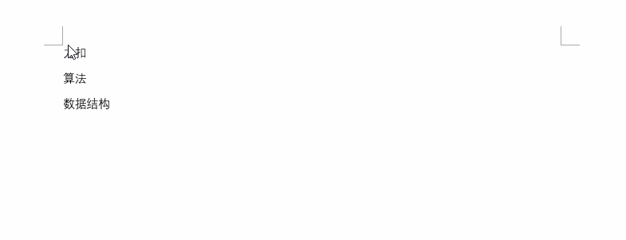

# 設計模式

[English Version](./DesignPatterns.md)


## 前言

------

### 概述

------

設計模式在面試中的考點通常是介紹其原理並說出優缺點。或者對比幾個比較相似的模式的異同點。在筆試中可能會出現畫出某個設計模式的 UML 圖這樣的題。雖說面試中佔的比重不大，但並不代表它不重要。恰恰相反，設計模式於程式設計師而言相當重要，它是我們寫出優秀程式的保障。設計模式與程式設計師的架構能力與閱讀原始碼的能力息息相關，非常值得我們深入學習。

面向物件的特點是**可維護、可複用、可擴充套件、靈活性好**，它最強大的地方在於：隨著業務變得越來越複雜，面向物件依然能夠使得程式結構良好，而面向過程卻會導致程式越來越臃腫。

讓面向物件保持結構良好的秘訣就是設計模式，面向物件結合設計模式，才能真正體會到程式變得可維護、可複用、可擴充套件、靈活性好。設計模式對於程式設計師而言並不陌生，每個程式設計師在程式設計時都會或多或少的接觸到設計模式。無論是在大型程式的架構中，亦或是在原始碼的學習中，設計模式都扮演著非常重要的角色。

### 設計模式的六大原則

------

設計模式的世界豐富多彩，比如生產一個個“產品”的工廠模式，銜接兩個不相關介面的介面卡模式，用不同的方式做同一件事的策略模式，構建步驟穩定、根據構建過程的不同配置構建出不同物件的建造者模式等等。

無論何種設計模式，都是基於六大設計原則：

* 開閉原則：一個軟體實體如類、模組和函式應該對修改封閉，對擴充套件開放。
* 單一職責原則：一個類只做一件事，一個類應該只有一個引起它修改的原因。】
* 里氏替換原則：子類應該可以完全替換父類。也就是說在使用繼承時，只擴充套件新功能，而不要破壞父類原有的功能。
* 依賴倒置原則：細節應該依賴於抽象，抽象不應依賴於細節。把抽象層放在程式設計的高層，並保持穩定，程式的細節變化由低層的實現層來完成。
* 迪米特法則：又名“最少知道原則”，一個類不應知道自己操作的類的細節，換言之，只和朋友談話，不和朋友的朋友談話。
* 介面隔離原則：客戶端不應依賴它不需要的介面。如果一個介面在實現時，部分方法由於冗餘被客戶端空實現，則應該將介面拆分，讓實現類只需依賴自己需要的介面方法。


## 構建者模式

------

### 工廠模式

在平時程式設計中，構建物件最常用的方式是 new 一個物件。乍一看這種做法沒什麼不好，而實際上這也屬於一種硬編碼。每 new 一個物件，相當於呼叫者多知道了一個類，增加了類與類之間的聯絡，不利於程式的松耦合。其實構建過程可以被封裝起來，工廠模式便是用於封裝物件的設計模式。

#### 簡單工廠模式

舉個例子，直接 new 物件的方式相當於當我們需要一個蘋果時，我們需要知道蘋果的構造方法，需要一個梨子時，需要知道梨子的構造方法。更好的實現方式是有一個水果工廠，我們告訴工廠需要什麼種類的水果，水果工廠將我們需要的水果製造出來給我們就可以了。這樣我們就無需知道蘋果、梨子是怎麼種出來的，只用和水果工廠打交道即可。

水果工廠：

```java
public class FruitFactory {
    public Fruit create(String type){
        switch (type){
            case "蘋果": return new Apple();
            case "梨子": return new Pear();
            default: throw new IllegalArgumentException("暫時沒有這種水果");
        }
    }
}
```

呼叫者：

```java
public class User {
    private void eat(){
        FruitFactory fruitFactory = new FruitFactory();
        Fruit apple = fruitFactory.create("蘋果");
        Fruit pear = fruitFactory.create("梨子");
        apple.eat();
        pear.eat();
    }
}
```

事實上，將構建過程封裝的好處不僅可以降低耦合，如果某個產品構造方法相當複雜，使用工廠模式可以大大減少程式碼重複。比如，如果生產一個蘋果需要蘋果種子、陽光、水分，將工廠修改如下：

```java
public class FruitFactory {
    public Fruit create(String type) {
        switch (type) {
            case "蘋果":
                AppleSeed appleSeed = new AppleSeed();
                Sunlight sunlight = new Sunlight();
                Water water = new Water();
                return new Apple(appleSeed, sunlight, water);
            case "梨子":
                return new Pear();
            default:
                throw new IllegalArgumentException("暫時沒有這種水果");
        }
    }
}
```

呼叫者的程式碼則完全不需要變化，而且呼叫者不需要在每次需要蘋果時，自己去構建蘋果種子、陽光、水分以獲得蘋果。蘋果的生產過程再複雜，也只是工廠的事。這就是封裝的好處，假如某天科學家發明了讓蘋果更香甜的肥料，要加入蘋果的生產過程中的話，也只需要在工廠中修改，呼叫者完全不用關心。

不知不覺中，我們就寫出了簡單工廠模式的程式碼。工廠模式一共有三種：

* 簡單工廠模式
* 工廠方法模式
* 抽象工廠模式

> 注：在 GoF 所著的《設計模式》一書中，簡單工廠模式被劃分為工廠方法模式的一種特例，沒有單獨被列出來。

總而言之，簡單工廠模式就是讓一個工廠類承擔構建所有物件的職責。呼叫者需要什麼產品，讓工廠生產出來即可。它的弊端也顯而易見：

* 一是如果需要生產的產品過多，此模式會導致工廠類過於龐大，承擔過多的職責，變成超級類。當蘋果生產過程需要修改時，要來修改此工廠。梨子生產過程需要修改時，也要來修改此工廠。也就是說這個類不止一個引起修改的原因。違背了單一職責原則。

* 二是當要生產新的產品時，必須在工廠類中新增新的分支。而開閉原則告訴我們：類應該對修改封閉。我們希望在新增新功能時，只需增加新的類，而不是修改既有的類，所以這就違背了開閉原則。

#### 工廠方法模式

為了解決簡單工廠模式的這兩個弊端，工廠方法模式應運而生，它規定每個產品都有一個專屬工廠。比如蘋果有專屬的蘋果工廠，梨子有專屬的梨子工廠，程式碼如下：

蘋果工廠：

```java
public class AppleFactory {
    public Fruit create(){
        return new Apple();
    }
}
```

梨子工廠：

```java
public class PearFactory {
    public Fruit create(){
        return new Pear();
    }
}
```

呼叫者：

```java
public class User {
    private void eat(){
        AppleFactory appleFactory = new AppleFactory();
        Fruit apple = appleFactory.create();
        PearFactory pearFactory = new PearFactory();
        Fruit pear = pearFactory.create();
        apple.eat();
        pear.eat();
    }
}
```

有讀者可能會開噴了，這樣和直接 new 出蘋果和梨子有什麼區別？上文說工廠是為了減少類與類之間的耦合，讓呼叫者儘可能少的和其他類打交道。用簡單工廠模式，我們只需要知道 `FruitFactory`，無需知道 `Apple` 、`Pear` 類，很容易看出耦合度降低了。但用工廠方法模式，呼叫者雖然不需要和 `Apple` 、`Pear` 類打交道了，但卻需要和 `AppleFactory`、`PearFactory` 類打交道。有幾種水果就需要知道幾個工廠類，耦合度完全沒有下降啊，甚至還增加了程式碼量！

這位讀者請先放下手中的大刀，仔細想一想，工廠模式的第二個優點在工廠方法模式中還是存在的。當構建過程相當複雜時，工廠將構建過程封裝起來，呼叫者可以很方便的直接使用，同樣以蘋果生產為例：

```java
public class AppleFactory {
    public Fruit create(){
        AppleSeed appleSeed = new AppleSeed();
        Sunlight sunlight = new Sunlight();
        Water water = new Water();
        return new Apple(appleSeed, sunlight, water);
    }
}
```

呼叫者無需知道蘋果的生產細節，當生產過程需要修改時也無需更改呼叫端。同時，工廠方法模式解決了簡單工廠模式的兩個弊端。

* 當生產的產品種類越來越多時，工廠類不會變成超級類。工廠類會越來越多，保持靈活。不會越來越大、變得臃腫。如果蘋果的生產過程需要修改時，只需修改蘋果工廠。梨子的生產過程需要修改時，只需修改梨子工廠。符合單一職責原則。

* 當需要生產新的產品時，無需更改既有的工廠，只需要新增新的工廠即可。保持了面向物件的可擴充套件性，符合開閉原則。
  OK，學以致用，接下來我們來做兩個思考題。同樣地，在以後的每一篇文章後面，都會附上幾個小練習供大家思考。希望大家能夠獨立思考出問題的答案，當然，在必要時也可參考底部的解析。

問 1：現有醫用口罩和 N95 口罩兩種產品，都繼承自 Mask 類：

```java
abstract class Mask {
}

public class SurgicalMask extends Mask {
    @NonNull
    @Override
    public String toString() {
        return "這是醫用口罩";
    }
}

public class N95Mask extends Mask {
    @NonNull
    @Override
    public String toString() {
        return "這是 N95 口罩";
    }
}
```

請使用簡單工廠模式完成以下程式碼：

```java
public class MaskFactory {
    public Mask create(String type){
        // TODO: 使用簡單工廠模式實現此處的邏輯
    }
}
```

使其透過以下客戶端測試：

```java
public class Client {

    @Test
    public void test() {
        MaskFactory factory = new MaskFactory();
        // 輸出：這是醫用口罩
        System.out.println(factory.create("Surgical"));
        // 輸出：這是 N95 口罩
        System.out.println(factory.create("N95"));
    }
}
```

答案：

```java
public class MaskFactory {
    public Mask create(String type){
        // 使用簡單工廠模式實現此處的邏輯
        switch (type){
            case "Surgical":
                return new SurgicalMask();
            case "N95":
                return new N95Mask();
            default:
                throw new IllegalArgumentException("Unsupported mask type");
        }
    }
}
```

問 2：如何用工廠方法模式實現呢？

客戶端測試程式碼：

```java
public class Client {

    @Test
    public void test() {
        SurgicalMaskFactory surgicalMaskFactory = new SurgicalMaskFactory();
        // 輸出：這是醫用口罩
        System.out.println(surgicalMaskFactory.create());
        N95MaskFactory N95MaskFactory = new N95MaskFactory();
        // 輸出：這是 N95 口罩
        System.out.println(N95MaskFactory.create());
    }
}
```

答案：

```java
public class SurgicalMaskFactory{

    public Mask create() {
        return new SurgicalMask();
    }
}

public class N95MaskFactory {
    public Mask create() {
        return new N95Mask();
    }
}
```


### 抽象工廠模式

------

上一節中的工廠方法模式可以進一步最佳化，提取出公共的工廠介面：

```java
public interface IFactory {
    Fruit create();
}
```

然後蘋果工廠和梨子工廠都實現此介面：

```java
public class AppleFactory implements IFactory {
    @Override
    public Fruit create(){
        return new Apple();
    }
}

public class PearFactory implements IFactory {
    @Override
    public Fruit create(){
        return new Pear();
    }
}
```

此時，呼叫者可以將 `AppleFactory` 和 `PearFactory` 統一作為 `IFactory` 物件使用，呼叫者程式碼如下：

```java
public class User {
    private void eat(){
        IFactory appleFactory = new AppleFactory();
        Fruit apple = appleFactory.create();
        IFactory pearFactory = new PearFactory();
        Fruit pear = pearFactory.create();
        apple.eat();
        pear.eat();
    }
}
```

可以看到，我們在建立時指定了具體的工廠類後，在使用時就無需再關心是哪個工廠類，只需要將此工廠當作抽象的 IFactory 介面使用即可。這種經過抽象的工廠方法模式被稱作抽象工廠模式。

由於客戶端只和 IFactory 打交道了，呼叫的是介面中的方法，使用時根本不需要知道是在哪個具體工廠中實現的這些方法，這就使得替換工廠變得非常容易。

例如：

```java
public class User {
    private void eat(){
        IFactory factory = new AppleFactory();
        Fruit fruit = factory.create();
        fruit.eat();
    }
}
```

如果需要替換為吃梨子，只需要更改一行程式碼即可：

```java
public class User {
    private void eat(){
        IFactory factory = new PearFactory();
        Fruit fruit = factory.create();
        fruit.eat();
    }
}
```

`IFactory` 中只有一個抽象方法時，或許還看不出抽象工廠模式的威力。實際上抽象工廠模式主要用於替換一系列方法。例如將程式中的 SQL Server 資料庫整個替換為 Access 資料庫，使用抽象方法模式的話，只需在 `IFactory` 介面中定義好增刪改查四個方法，讓 `SQLFactory` 和 `AccessFactory` 實現此介面，呼叫時直接使用 IFactory 中的抽象方法即可，呼叫者無需知道使用的什麼資料庫，我們就可以非常方便的整個替換程式的資料庫，並且讓客戶端毫不知情。

抽象工廠模式很好的發揮了開閉原則、依賴倒置原則，但缺點是抽象工廠模式太重了，如果 IFactory 介面需要新增功能，則會影響到所有的具體工廠類。使用抽象工廠模式，替換具體工廠時只需更改一行程式碼，但要新增抽象方法則需要修改所有的具體工廠類。所以抽象工廠模式適用於增加同類工廠這樣的橫向擴充套件需求，不適合新增功能這樣的縱向擴充套件。

問：上一節中提到的問題如何用抽象工廠模式實現呢？

客戶端測試程式碼：

```java
public class Client {

    @Test
    public void test() {
        IFactory surgicalMaskFactory = new SurgicalMaskFactory();
        // 輸出：這是醫用口罩
        System.out.println(surgicalMaskFactory.create());
        IFactory N95MaskFactory = new N95MaskFactory();
        // 輸出：這是 N95 口罩
        System.out.println(N95MaskFactory.create());
    }
}
```

答案：

```java
public interface IFactory {
    Mask create();
}

public class SurgicalMaskFactory implements IFactory{

    @Override
    public Mask create() {
        return new SurgicalMask();
    }
}

public class N95MaskFactory implements IFactory {
    @Override
    public Mask create() {
        return new N95Mask();
    }
}
```


### 單例模式

------

單例模式非常常見，某個物件全域性只需要一個例項時，就可以使用單例模式。它的優點也顯而易見：

* 它能夠避免物件重複建立，節約空間並提升效率

* 避免由於操作不同例項導致的邏輯錯誤

單例模式有兩種實現方式：餓漢式和懶漢式。

#### 餓漢式

* 餓漢式：變數在宣告時便初始化。

```java
public class Singleton {
  
    private static Singleton instance = new Singleton();

    private Singleton() {
    }

    public static Singleton getInstance() {
        return instance;
    }
}
```

可以看到，我們將構造方法定義為 private，這就保證了其他類無法例項化此類，必須透過 getInstance 方法才能獲取到唯一的 instance 例項，非常直觀。但餓漢式有一個弊端，那就是即使這個單例不需要使用，它也會在類載入之後立即創建出來，佔用一塊記憶體，並增加類初始化時間。就好比一個電工在修理燈泡時，先把所有工具拿出來，不管是不是所有的工具都用得上。就像一個飢不擇食的餓漢，所以稱之為餓漢式。

#### 懶漢式

* 懶漢式：先宣告一個空變數，需要用時才初始化。例如：

```java
public class Singleton {
  
    private static Singleton instance = null;
  
    private Singleton() {
    }
    
    public static Singleton getInstance(){
        if (instance == null) {
            instance = new Singleton();
        }
        return instance;
    }
}
```

我們先聲明瞭一個初始值為 null 的 instance 變數，當需要使用時判斷此變數是否已被初始化，沒有初始化的話才 new 一個例項出來。就好比電工在修理燈泡時，開始比較偷懶，什麼工具都不拿，當發現需要使用螺絲刀時，才把螺絲刀拿出來。當需要用鉗子時，再把鉗子拿出來。就像一個不到萬不得已不會行動的懶漢，所以稱之為懶漢式。

懶漢式解決了餓漢式的弊端，好處是按需載入，避免了記憶體浪費，減少了類初始化時間。

上述程式碼的懶漢式單例乍一看沒什麼問題，但其實它不是執行緒安全的。如果有多個執行緒同一時間呼叫 getInstance 方法，instance 變數可能會被例項化多次。為了保證執行緒安全，我們需要給判空過程加上鎖：

```java
public class Singleton {

    private static Singleton instance = null;

    private Singleton() {
    }

    public static Singleton getInstance() {
        synchronized (Singleton.class) {
            if (instance == null) {
                instance = new Singleton();
            }
        }
        return instance;
    }
}
```

這樣就能保證多個執行緒呼叫 getInstance 時，一次最多隻有一個執行緒能夠執行判空並 new 出例項的操作，所以 instance 只會例項化一次。但這樣的寫法仍然有問題，當多個執行緒呼叫 getInstance 時，每次都需要執行 synchronized 同步化方法，這樣會嚴重影響程式的執行效率。所以更好的做法是在同步化之前，再加上一層檢查：

```java
public class Singleton {
    
    private static Singleton instance = null;

    private Singleton() {
    }

    public static Singleton getInstance() {
        if (instance == null) {
            synchronized (Singleton.class) {
                if (instance == null) {
                    instance = new Singleton();
                }
            }
        }
        return instance;
    }
}
```

這樣增加一種檢查方式後，如果 instance 已經被例項化，則不會執行同步化操作，大大提升了程式效率。上面這種寫法也就是我們平時較常用的雙檢鎖方式實現的執行緒安全的單例模式。

但這樣的懶漢式單例仍然有一個問題，JVM 底層為了最佳化程式執行效率，可能會對我們的程式碼進行指令重排序，在一些特殊情況下會導致出現空指標，為了防止這個問題，更進一步的最佳化是給 instance 變數加上 volatile 關鍵字。

有讀者可能會有疑問，我們在外面檢查了 instance == null, 那麼鎖裡面的空檢查是否可以去掉呢？

答案是不可以。如果裡面不做空檢查，可能會有兩個執行緒同時通過了外面的空檢查，然後在一個執行緒 new 出例項後，第二個執行緒進入鎖中又 new 出一個例項，導致建立多個例項。

除了雙檢鎖方式外，還有一種比較常見的靜態內部類方式保證懶漢式單例的執行緒安全：

```java
public class Singleton {
    
    private static class SingletonHolder {
        public static Singleton instance = new Singleton();
    }

    private Singleton() {
    }

    public static Singleton getInstance() {
        return SingletonHolder.instance;
    }
}
```

雖然我們經常使用這種靜態內部類的懶載入方式，但其中的原理不一定每個人都清楚。接下來我們便來分析其原理，搞清楚兩個問題：

* 靜態內部類方式是怎麼實現懶載入的

* 靜態內部類方式是怎麼保證執行緒安全的

Java 類的載入過程包括：載入、驗證、準備、解析、初始化。初始化階段即執行類的 clinit 方法（clinit = class + initialize），包括為類的靜態變數賦初始值和執行靜態程式碼塊中的內容。但不會立即載入內部類，內部類會在使用時才載入。所以當此 Singleton 類載入時，SingletonHolder 並不會被立即載入，所以不會像餓漢式那樣佔用記憶體。

另外，Java 虛擬機器規定，當訪問一個類的靜態欄位時，如果該類尚未初始化，則立即初始化此類。當呼叫Singleton 的 getInstance 方法時，由於其使用了 SingletonHolder 的靜態變數 instance，所以這時才會去初始化 SingletonHolder，在 SingletonHolder 中 new 出 Singleton 物件。這就實現了懶載入。

第二個問題的答案是 Java 虛擬機器的設計是非常穩定的，早已經考慮到了多執行緒併發執行的情況。虛擬機器在載入類的 clinit 方法時，會保證 clinit 在多執行緒中被正確的加鎖、同步。即使有多個執行緒同時去初始化一個類，一次也只有一個執行緒可以執行 clinit 方法，其他執行緒都需要阻塞等待，從而保證了執行緒安全。

懶載入方式在平時非常常見，比如開啟我們常用的美團、餓了麼、支付寶 app，應用首頁會立刻刷新出來，但其他標籤頁在我們點選到時才會重新整理。這樣就減少了流量消耗，並縮短了程式啟動時間。再比如遊戲中的某些模組，當我們點選到時才會去下載資源，而不是事先將所有資源都先下載下來，這也屬於懶載入方式，避免了記憶體浪費。

但懶漢式的缺點就是將程式載入時間從啟動時延後到了執行時，雖然啟動時間縮短了，但我們瀏覽頁面時就會看到資料的 loading 過程。如果用餓漢式將頁面提前載入好，我們瀏覽時就會特別的順暢，也不失為一個好的使用者體驗。比如我們常用的 QQ、微信 app，作為即時通訊的工具軟體，它們會在啟動時立即重新整理所有的資料，保證使用者看到最新最全的內容。著名的軟體大師 Martin 在《程式碼整潔之道》一書中也說到：不提倡使用懶載入方式，因為程式應該將構建與使用分離，達到解耦。餓漢式在宣告時直接初始化變數的方式也更直觀易懂。所以在使用餓漢式還是懶漢式時，需要權衡利弊。

一般的建議是：對於構建不復雜，載入完成後會立即使用的單例物件，推薦使用餓漢式。對於構建過程耗時較長，並不是所有使用此類都會用到的單例物件，推薦使用懶漢式。

問：雙檢鎖單例模式中，volatile 主要用來防止哪幾條指令重排序？如果發生了重排序，會導致什麼樣的錯誤？

答案：

```java
instance = new Singleton();
```

這一行程式碼中，執行了三條重要的指令：

* 分配物件的記憶體空間

* 初始化物件

將變數 instance 指向剛分配的記憶體空間
在這個過程中，如果第二條指令和第三條指令發生了重排序，可能導致 instance 還未初始化時，其他執行緒提前透過雙檢鎖外層的 null 檢查，獲取到“不為 null，但還沒有執行初始化”的 instance 物件，發生空指標異常。


### 建造者模式

------

建造者模式用於建立過程穩定，但配置多變的物件。在《設計模式》一書中的定義是：**將一個複雜的構建與其表示相分離，使得同樣的構建過程可以建立不同的表示。**

經典的“建造者-指揮者”模式現在已經不太常用了，現在建造者模式主要用來透過鏈式呼叫生成不同的配置。比如我們要製作一杯珍珠奶茶。它的製作過程是穩定的，除了必須要知道奶茶的種類和規格外，是否加珍珠和是否加冰是可選的。使用建造者模式表示如下：

```java
public class MilkTea {
    private final String type;
    private final String size;
    private final boolean pearl;
    private final boolean ice;

	private MilkTea() {}
	
    private MilkTea(Builder builder) {
        this.type = builder.type;
        this.size = builder.size;
        this.pearl = builder.pearl;
        this.ice = builder.ice;
    }

    public String getType() {
        return type;
    }

    public String getSize() {
        return size;
    }

    public boolean isPearl() {
        return pearl;
    }
    public boolean isIce() {
        return ice;
    }

    public static class Builder {

        private final String type;
        private String size = "中杯";
        private boolean pearl = true;
        private boolean ice = false;

        public Builder(String type) {
            this.type = type;
        }

        public Builder size(String size) {
            this.size = size;
            return this;
        }

        public Builder pearl(boolean pearl) {
            this.pearl = pearl;
            return this;
        }

        public Builder ice(boolean cold) {
            this.ice = cold;
            return this;
        }

        public MilkTea build() {
            return new MilkTea(this);
        }
    }
}
```

可以看到，我們將 MilkTea 的構造方法設定為私有的，所以外部不能透過 new 構建出 MilkTea 例項，只能透過 Builder 構建。對於必須配置的屬性，透過 Builder 的構造方法傳入，可選的屬性透過 Builder 的鏈式呼叫方法傳入，如果不配置，將使用預設配置，也就是中杯、加珍珠、不加冰。根據不同的配置可以製作出不同的奶茶：

```java
public class User {
    private void buyMilkTea() {
        MilkTea milkTea = new MilkTea.Builder("原味").build();
        show(milkTea);

        MilkTea chocolate =new MilkTea.Builder("巧克力味")
                .ice(false)
                .build();
        show(chocolate);
        
        MilkTea strawberry = new MilkTea.Builder("草莓味")
                .size("大杯")
                .pearl(false)
                .ice(true)
                .build();
        show(strawberry);
    }

    private void show(MilkTea milkTea) {
        String pearl;
        if (milkTea.isPearl())
            pearl = "加珍珠";
        else
            pearl = "不加珍珠";
        String ice;
        if (milkTea.isIce()) {
            ice = "加冰";
        } else {
            ice = "不加冰";
        }
        System.out.println("一份" + milkTea.getSize() + "、"
                + pearl + "、"
                + ice + "的"
                + milkTea.getType() + "奶茶");
    }
}
```

執行程式，輸出如下：

```
一份中杯、加珍珠、不加冰的原味奶茶
一份中杯、加珍珠、不加冰的巧克力味奶茶
一份大杯、不加珍珠、加冰的草莓味奶茶
```

使用建造者模式的好處是不用擔心忘了指定某個配置，保證了構建過程是穩定的。在 OkHttp、Retrofit 等著名框架的原始碼中都使用到了建造者模式。


### 原型模式

原型模式：**用原型例項指定建立物件的種類，並且透過複製這些原型建立新的物件。**

定義看起來有點繞口，實際上在 Java 中，Object 的 clone() 方法就屬於原型模式，不妨簡單的理解為：原型模式就是用來克隆物件的。

舉個例子，比如有一天，周杰倫到奶茶店點了一份不加冰的原味奶茶，你說我是周杰倫的忠實粉，我也要一份跟周杰倫一樣的。用程式表示如下：

奶茶類：

```java
public class MilkTea {
    public String type;
    public boolean ice;
}
```

下單：

```java
private void order(){
    MilkTea milkTeaOfJay = new MilkTea();
    milkTeaOfJay.type = "原味";
    milkTeaOfJay.ice = false;
    
    MilkTea yourMilkTea = milkTeaOfJay;
}
```

好像沒什麼問題，將周杰倫的奶茶直接賦值到你的奶茶上就行了，看起來我們並不需要 clone 方法。但是這樣真的是複製了一份奶茶嗎？

當然不是，Java 的賦值只是引用傳遞，而不是值傳遞。這樣賦值之後，yourMilkTea 仍然指向的周杰倫的奶茶，並不會多一份一樣的奶茶。

那麼我們要怎麼做才能點一份一樣的奶茶呢？將程式修改如下就可以了：

```java
private void order(){
    MilkTea milkTeaOfJay = new MilkTea();
    milkTeaOfJay.type = "原味";
    milkTeaOfJay.ice = false;
    
    MilkTea yourMilkTea = new MilkTea();
    yourMilkTea.type = "原味";
    yourMilkTea.ice = false;
}
```

只有這樣，yourMilkTea 才是 new 出來的一份全新的奶茶。我們設想一下，如果有一千個粉絲都需要點和周杰倫一樣的奶茶的話，按照現在的寫法就需要 new 一千次，併為每一個新的物件賦值一千次，造成大量的重複。

更糟糕的是，如果周杰倫臨時決定加個冰，那麼粉絲們的奶茶配置也要跟著修改：

```java
private void order(){
    MilkTea milkTeaOfJay = new MilkTea();
    milkTeaOfJay.type = "原味";
    milkTeaOfJay.ice = true;
    
    MilkTea yourMilkTea = new MilkTea();
    yourMilkTea.type = "原味";
    yourMilkTea.ice = true;
    
    // 將一千個粉絲的 ice 都修改為 true
    ...
}
```

大批次的修改無疑是非常醜陋的做法，這就是我們需要 clone 方法的理由！

運用原型模式，在 MilkTea 中新增 clone 方法：

```java
public class MilkTea{
    public String type;
    public boolean ice;

    public MilkTea clone(){
        MilkTea milkTea = new MilkTea();
        milkTea.type = this.type;
        milkTea.ice = this.ice;
        return milkTea;
    }
}
```

下單：

```java
private void order(){
    MilkTea milkTeaOfJay = new MilkTea();
    milkTeaOfJay.type = "原味";
    milkTeaOfJay.ice = false;
    
    MilkTea yourMilkTea = milkTeaOfJay.clone();
    
    // 一千位粉絲都呼叫 milkTeaOfJay 的 clone 方法即可
    ...
}
```

這就是原型模式，Java 中有一個語法糖，讓我們並不需要手寫 clone 方法。這個語法糖就是 Cloneable 介面，我們只要讓需要複製的類實現此介面即可。

```java
public class MilkTea implements Cloneable{
    public String type;
    public boolean ice;

    @NonNull
    @Override
    protected MilkTea clone() throws CloneNotSupportedException {
        return (MilkTea) super.clone();
    }
}
```

值得注意的是，Java 自帶的 clone 方法是淺複製的。也就是說呼叫此物件的 clone 方法，只有基本型別的引數會被複製一份，非基本型別的物件不會被複製一份，而是繼續使用傳遞引用的方式。如果需要實現深複製，必須要自己手動修改 clone 方法才行。


### 小結

------

* 工廠方法模式：為每一類物件建立工廠，將物件交由工廠建立，客戶端只和工廠打交道。

* 抽象工廠模式：為每一類工廠提取出抽象介面，使得新增工廠、替換工廠變得非常容易。

* 建造者模式：用於建立構造過程穩定的物件，不同的 Builder 可以定義不同的配置。

* 單例模式：全域性使用同一個物件，分為餓漢式和懶漢式。懶漢式有雙檢鎖和內部類兩種實現方式。

* 原型模式：為一個類定義 clone 方法，使得建立相同的物件更方便。


## 結構型模式

------

### 介面卡模式

------

說到介面卡，我們最熟悉的莫過於電源介面卡了，也就是手機的充電頭。它就是介面卡模式的一個應用。

試想一下，你有一條連線電腦和手機的 USB 資料線，連線電腦的一端從電腦介面處接收 5V 的電壓，連線手機的一端向手機輸出 5V 的電壓，並且他們工作良好。

中國的家用電壓都是 220V，所以 USB 資料線不能直接拿來給手機充電，這時候我們有兩種方案：

* 單獨製作手機充電器，接收 220V 家用電壓，輸出 5V 電壓。

* 新增一個介面卡，將 220V 家庭電壓轉化為類似電腦介面的 5V 電壓，再連線資料線給手機充電。

如果你使用過早期的手機，就會知道以前的手機廠商採用的就是第一種方案：早期的手機充電器都是單獨製作的，充電頭和充電線是連在一起的。現在的手機都採用了電源介面卡加資料線的方案。這是生活中應用介面卡模式的一個進步。

> 介面卡模式：將一個類的介面轉換成客戶希望的另外一個介面，使得原本由於介面不相容而不能一起工作的那些類能一起工作。

適配的意思是適應、匹配。通俗地講，介面卡模式適用於有相關性但不相容的結構，源介面透過一箇中間件轉換後才可以適用於目標介面，這個轉換過程就是適配，這個中介軟體就稱之為介面卡。

家用電源和 USB 資料線有相關性：家用電源輸出電壓，USB 資料線輸入電壓。但兩個介面無法相容，因為一個輸出 220V，一個輸入 5V，透過介面卡將輸出 220V 轉換成輸出 5V 之後才可以一起工作。

讓我們用程式來模擬一下這個過程。

首先，家庭電源提供 220V 的電壓：

```java
class HomeBattery {
    int supply() {
        // 家用電源提供一個 220V 的輸出電壓
        return 220;
    }
}
```

USB 資料線只接收 5V 的充電電壓：

```java
class USBLine {
    void charge(int volt) {
        // 如果電壓不是 5V，丟擲異常
        if (volt != 5) throw new IllegalArgumentException("只能接收 5V 電壓");
        // 如果電壓是 5V，正常充電
        System.out.println("正常充電");
    }
}
```

先來看看適配之前，使用者如果直接用家庭電源給手機充電：

```java
public class User {
    @Test
    public void chargeForPhone() {
        HomeBattery homeBattery = new HomeBattery();
        int homeVolt = homeBattery.supply();
        System.out.println("家庭電源提供的電壓是 " + homeVolt + "V");

        USBLine usbLine = new USBLine();
        usbLine.charge(homeVolt);
    }
}
```

執行程式，輸出如下：

```java
家庭電源提供的電壓是 220V

java.lang.IllegalArgumentException: 只能接收 5V 電壓
```

這時，我們加入電源介面卡：

```java
class Adapter {
    int convert(int homeVolt) {
        // 適配過程：使用電阻、電容等器件將其降低為輸出 5V
        int chargeVolt = homeVolt - 215;
        return chargeVolt;
    }
}
```

然後，使用者再使用介面卡將家庭電源提供的電壓轉換為充電電壓：

```java
public class User {
    @Test
    public void chargeForPhone() {
        HomeBattery homeBattery = new HomeBattery();
        int homeVolt = homeBattery.supply();
        System.out.println("家庭電源提供的電壓是 " + homeVolt + "V");

        Adapter adapter = new Adapter();
        int chargeVolt = adapter.convert(homeVolt);
        System.out.println("使用介面卡將家庭電壓轉換成了 " + chargeVolt + "V");

        USBLine usbLine = new USBLine();
        usbLine.charge(chargeVolt);
    }
}
```

執行程式，輸出如下：

```java
家庭電源提供的電壓是 220V
使用介面卡將家庭電壓轉換成了 5V
正常充電
```

這就是介面卡模式。在我們日常的開發中經常會使用到各種各樣的 Adapter，都屬於介面卡模式的應用。

但介面卡模式並不推薦多用。因為未雨綢繆好過亡羊補牢，如果事先能預防介面不同的問題，不匹配問題就不會發生，只有遇到源介面無法改變時，才應該考慮使用介面卡。比如現代的電源插口中很多已經增加了專門的 USB 充電介面，讓我們不需要再使用介面卡轉換介面，這又是社會的一個進步。


### 橋接模式

-------

考慮這樣一個需求：繪製矩形、圓形、三角形這三種圖案。按照面向物件的理念，我們至少需要三個具體類，對應三種不同的圖形。

抽象介面 IShape：

```java
public interface IShape {
    void draw();
}
```

三個具體形狀類：

```java
class Rectangle implements IShape {
    @Override
    public void draw() {
        System.out.println("繪製矩形");
    }
}

class Round implements IShape {
    @Override
    public void draw() {
        System.out.println("繪製圓形");
    }
}

class Triangle implements IShape {
    @Override
    public void draw() {
        System.out.println("繪製三角形");
    }
}
```

接下來我們有了新的需求，每種形狀都需要有四種不同的顏色：紅、藍、黃、綠。

這時我們很容易想到兩種設計方案：

* 為了複用形狀類，將每種形狀定義為父類，每種不同顏色的圖形繼承自其形狀父類。此時一共有 12 個類。

* 為了複用顏色類，將每種顏色定義為父類，每種不同顏色的圖形繼承自其顏色父類。此時一共有 12 個類。

乍一看沒什麼問題，我們使用了面向物件的繼承特性，複用了父類的程式碼並擴充套件了新的功能。

但仔細想一想，如果以後要增加一種顏色，比如黑色，那麼我們就需要增加三個類；如果再要增加一種形狀，我們又需要增加五個類，對應 5 種顏色。

更不用說遇到增加 20 個形狀，20 種顏色的需求，不同的排列組合將會使工作量變得無比的龐大。看來我們不得不重新思考設計方案。

形狀和顏色，都是圖形的兩個屬性。他們兩者的關係是平等的，所以不屬於繼承關係。更好的的實現方式是：**將形狀和顏色分離，根據需要對形狀和顏色進行組合**，這就是橋接模式的思想。

> 橋接模式：將抽象部分與它的實現部分分離，使它們都可以獨立地變化。它是一種物件結構型模式，又稱為柄體模式或介面模式。

官方定義非常精準、簡練，但卻有點不易理解。通俗地說，如果一個物件有兩種或者多種分類方式，並且兩種分類方式都容易變化，比如本例中的形狀和顏色。這時使用繼承很容易造成子類越來越多，所以更好的做法是把這種分類方式分離出來，讓他們獨立變化，使用時將不同的分類進行組合即可。

說到這裡，不得不提一個設計原則：合成 / 聚合複用原則。雖然它沒有被劃分到六大設計原則中，但它在面向物件的設計中也非常的重要。

> 合成 / 聚合複用原則：優先使用合成 / 聚合，而不是類繼承。

繼承雖然是面向物件的三大特性之一，但繼承會導致子類與父類有非常緊密的依賴關係，它會限制子類的靈活性和子類的複用性。而使用合成 / 聚合，也就是使用介面實現的方式，就不存在依賴問題，一個類可以實現多個介面，可以很方便地拓展功能。

讓我們一起來看一下本例使用橋接模式的程式實現：

新建介面類 IColor，僅包含一個獲取顏色的方法：

```java
public interface IColor {
    String getColor();
}
```

每種顏色都實現此介面：

```java
public class Red implements IColor {
    @Override
    public String getColor() {
        return "紅";
    }
}

public class Blue implements IColor {
    @Override
    public String getColor() {
        return "藍";
    }
}

public class Yellow implements IColor {
    @Override
    public String getColor() {
        return "黃";
    }
}

public class Green implements IColor {
    @Override
    public String getColor() {
        return "綠";
    }
}
```

在每個形狀類中，橋接 IColor 介面：

```java
class Rectangle implements IShape {

    private IColor color;

    void setColor(IColor color) {
        this.color = color;
    }

    @Override
    public void draw() {
        System.out.println("繪製" + color.getColor() + "矩形");
    }
}

class Round implements IShape {

    private IColor color;

    void setColor(IColor color) {
        this.color = color;
    }

    @Override
    public void draw() {
        System.out.println("繪製" + color.getColor() + "圓形");
    }
}

class Triangle implements IShape {

    private IColor color;

    void setColor(IColor color) {
        this.color = color;
    }

    @Override
    public void draw() {
        System.out.println("繪製" + color.getColor() + "三角形");
    }
}
```

測試函式：

```java
@Test
public void drawTest() {
    Rectangle rectangle = new Rectangle();
    rectangle.setColor(new Red());
    rectangle.draw();
    
    Round round = new Round();
    round.setColor(new Blue());
    round.draw();
    
    Triangle triangle = new Triangle();
    triangle.setColor(new Yellow());
    triangle.draw();
}
```

執行程式，輸出如下：

```java
繪製紅矩形
繪製藍圓形
繪製黃三角形
```

這時我們再來回顧一下官方定義：將抽象部分與它的實現部分分離，使它們都可以獨立地變化。抽象部分指的是父類，對應本例中的形狀類，實現部分指的是不同子類的區別之處。將子類的區別方式 —— 也就是本例中的顏色 —— 分離成介面，透過組合的方式橋接顏色和形狀，這就是橋接模式，它主要用於**兩個或多個同等級的介面。**


### 組合模式

------

上文說到，橋接模式用於將同等級的介面互相組合，那麼組合模式和橋接模式有什麼共同點嗎？

事實上組合模式和橋接模式的組合完全不一樣。組合模式用於整體與部分的結構，當整體與部分有相似的結構，在操作時可以被一致對待時，就可以使用組合模式。例如：

* 資料夾和子資料夾的關係：資料夾中可以存放檔案，也可以新建資料夾，子資料夾也一樣。

* 總公司子公司的關係：總公司可以設立部門，也可以設立分公司，子公司也一樣。

* 樹枝和分樹枝的關係：樹枝可以長出葉子，也可以長出樹枝，分樹枝也一樣。

在這些關係中，雖然整體包含了部分，但無論整體或部分，都具有一致的行為。

> 組合模式：又叫部分整體模式，是用於把一組相似的物件當作一個單一的物件。組合模式依據樹形結構來組合物件，用來表示部分以及整體層次。這種型別的設計模式屬於結構型模式，它建立了物件組的樹形結構。

考慮這樣一個實際應用：設計一個公司的人員分佈結構，結構如下圖所示。


我們注意到人員結構中有兩種結構，一是管理者，如老闆，PM，CFO，CTO，二是職員。其中有的管理者不僅僅要管理職員，還會管理其他的管理者。這就是一個典型的整體與部分的結構。

#### 不適用組合模式的設計方案

要描述這樣的結構，我們很容易想到以下設計方案：

新建管理者類：

```java
public class Manager {
    // 職位
    private String position;
    // 工作內容
    private String job;
    // 管理的管理者
    private List<Manager> managers = new ArrayList<>();
    // 管理的職員
    private List<Employee> employees = new ArrayList<>();

    public Manager(String position, String job) {
        this.position = position;
        this.job = job;
    }
    
    public void addManager(Manager manager) {
        managers.add(manager);
    }

    public void removeManager(Manager manager) {
        managers.remove(manager);
    }

    public void addEmployee(Employee employee) {
        employees.add(employee);
    }

    public void removeEmployee(Employee employee) {
        employees.remove(employee);
    }

    // 做自己的本職工作
    public void work() {
        System.out.println("我是" + position + "，我正在" + job);
    }
    
    // 檢查下屬
    public void check() {
        work();
        for (Employee employee : employees) {
            employee.work();
        }
        for (Manager manager : managers) {
            manager.check();
        }
    }
}
```

新建職員類：

```java
public class Employee {
    // 職位
    private String position;
    // 工作內容
    private String job;

    public Employee(String position, String job) {
        this.position = position;
        this.job = job;
    }

    // 做自己的本職工作
    public void work() {
        System.out.println("我是" + position + "，我正在" + job);
    }
}
```

客戶端建立人員結構關係：

```java
public class Client {
    
    @Test
    public void test() {
        Manager boss = new Manager("老闆", "唱怒放的生命");
        Employee HR = new Employee("人力資源", "聊微信");
        Manager PM = new Manager("產品經理", "不知道幹啥");
        Manager CFO = new Manager("財務主管", "看劇");
        Manager CTO = new Manager("技術主管", "划水");
        Employee UI = new Employee("設計師", "畫畫");
        Employee operator = new Employee("運營人員", "兼職客服");
        Employee webProgrammer = new Employee("程式設計師", "學習設計模式");
        Employee backgroundProgrammer = new Employee("後臺程式設計師", "CRUD");
        Employee accountant = new Employee("會計", "背九九乘法表");
        Employee clerk = new Employee("文員", "給老闆遞麥克風");
        boss.addEmployee(HR);
        boss.addManager(PM);
        boss.addManager(CFO);
        PM.addEmployee(UI);
        PM.addManager(CTO);
        PM.addEmployee(operator);
        CTO.addEmployee(webProgrammer);
        CTO.addEmployee(backgroundProgrammer);
        CFO.addEmployee(accountant);
        CFO.addEmployee(clerk);

        boss.check();
    }
}
```

執行測試方法，輸出如下（為方便檢視，筆者添加了縮排）：

```java
我是老闆，我正在唱怒放的生命
	我是人力資源，我正在聊微信
	我是產品經理，我正在不知道幹啥
		我是設計師，我正在畫畫
		我是運營人員，我正在兼職客服
		我是技術主管，我正在划水
			我是程式設計師，我正在學習設計模式
			我是後臺程式設計師，我正在CRUD
	我是財務主管，我正在看劇
		我是會計，我正在背九九乘法表
		我是文員，我正在給老闆遞麥克風
```

這樣我們就設計出了公司的結構，但是這樣的設計有兩個弊端：

* name 欄位，job 欄位，work 方法重複了。

* 管理者對其管理的管理者和職員需要區別對待。

關於第一個弊端，雖然這裡為了講解，只有兩個欄位和一個方法重複，實際工作中這樣的整體部分結構會有相當多的重複。比如此例中還可能有工號、年齡等欄位，領取工資、上下班打卡、開各種無聊的會等方法。

大量的重複顯然是很醜陋的程式碼，分析一下可以發現， Manager 類只比 Employee 類多一個管理人員的列表欄位，多幾個增加 / 移除人員的方法，其他的欄位和方法全都是一樣的。

有讀者應該會想到：我們可以將重複的欄位和方法提取到一個工具類中，讓 Employee 和 Manager 都去呼叫此工具類，就可以消除重複了。

這樣固然可行，但屬於 Employee 和 Manager 類自己的東西卻要透過其他類呼叫，並不利於程式的高內聚。

關於第二個弊端，此方案無法解決，此方案中 Employee 和 Manager 類完全是兩個不同的物件，兩者的相似性被忽略了。

所以我們有更好的設計方案，那就是組合模式！

#### 使用組合模式的設計方案

組合模式最主要的功能就是讓使用者可以一致對待整體和部分結構，將兩者都作為一個相同的元件，所以我們先新建一個抽象的元件類：

```java
public abstract class Component {
    // 職位
    private String position;
    // 工作內容
    private String job;

    public Component(String position, String job) {
        this.position = position;
        this.job = job;
    }

    // 做自己的本職工作
    public void work() {
        System.out.println("我是" + position + "，我正在" + job);
    }

    abstract void addComponent(Component component);

    abstract void removeComponent(Component component);

    abstract void check();
}
```

管理者繼承自此抽象類：

```java
public class Manager extends Component {
    // 管理的元件
    private List<Component> components = new ArrayList<>();

    public Manager(String position, String job) {
        super(position, job);
    }

    @Override
    public void addComponent(Component component) {
        components.add(component);
    }

    @Override
    void removeComponent(Component component) {
        components.remove(component);
    }

    // 檢查下屬
    @Override
    public void check() {
        work();
        for (Component component : components) {
            component.check();
        }
    }
}
```

職員同樣繼承自此抽象類：

```java
public class Employee extends Component {

    public Employee(String position, String job) {
        super(position, job);
    }

    @Override
    void addComponent(Component component) {
        System.out.println("職員沒有管理許可權");
    }

    @Override
    void removeComponent(Component component) {
        System.out.println("職員沒有管理許可權");
    }

    @Override
    void check() {
        work();
    }
}
```

修改客戶端如下：

```java
public class Client {

    @Test
    public void test(){
        Component boss = new Manager("老闆", "唱怒放的生命");
        Component HR = new Employee("人力資源", "聊微信");
        Component PM = new Manager("產品經理", "不知道幹啥");
        Component CFO = new Manager("財務主管", "看劇");
        Component CTO = new Manager("技術主管", "划水");
        Component UI = new Employee("設計師", "畫畫");
        Component operator = new Employee("運營人員", "兼職客服");
        Component webProgrammer = new Employee("程式設計師", "學習設計模式");
        Component backgroundProgrammer = new Employee("後臺程式設計師", "CRUD");
        Component accountant = new Employee("會計", "背九九乘法表");
        Component clerk = new Employee("文員", "給老闆遞麥克風");
        boss.addComponent(HR);
        boss.addComponent(PM);
        boss.addComponent(CFO);
        PM.addComponent(UI);
        PM.addComponent(CTO);
        PM.addComponent(operator);
        CTO.addComponent(webProgrammer);
        CTO.addComponent(backgroundProgrammer);
        CFO.addComponent(accountant);
        CFO.addComponent(clerk);

        boss.check();
    }
}
```

執行測試方法，輸出結果與之前的結果一模一樣。

可以看到，使用組合模式後，我們解決了之前的兩個弊端。一是將共有的欄位與方法移到了父類中，消除了重複，並且在客戶端中，可以一致對待 Manager 和 Employee 類：

* Manager 類和 Employee 類統一宣告為 Component 物件

* 統一呼叫 Component 物件的 addComponent 方法新增子物件即可

#### 組合模式中的安全方式與透明方式

讀者可能已經注意到了，Employee 類雖然繼承了父類的 addComponent 和 removeComponent 方法，但是僅僅提供了一個空實現，因為 Employee 類是不支援新增和移除元件的。這樣是否違背了介面隔離原則呢？

> 介面隔離原則：客戶端不應依賴它不需要的介面。如果一個介面在實現時，部分方法由於冗餘被客戶端空實現，則應該將介面拆分，讓實現類只需依賴自己需要的介面方法。

答案是肯定的，這樣確實違背了介面隔離原則。這種方式在組合模式中被稱作透明方式.

> 透明方式：在 Component 中宣告所有管理子物件的方法，包括 add 、remove 等，這樣繼承自 Component 的子類都具備了 add、remove 方法。對於外界來說葉節點和枝節點是透明的，它們具備完全一致的介面。

這種方式有它的優點：讓 Manager 類和 Employee 類具備完全一致的行為介面，呼叫者可以一致對待它們。

但它的缺點也顯而易見：Employee 類並不支援管理子物件，不僅違背了介面隔離原則，而且客戶端可以用 Employee 類呼叫 addComponent 和 removeComponent 方法，導致程式出錯，所以這種方式是不安全的。

那麼我們可不可以將 addComponent 和 removeComponent 方法移到 Manager 子類中去單獨實現，讓 Employee 不再實現這兩個方法呢？我們來嘗試一下。

將抽象類修改為：

```java
public abstract class Component {
    // 職位
    private String position;
    // 工作內容
    private String job;

    public Component(String position, String job) {
        this.position = position;
        this.job = job;
    }

    // 做自己的本職工作
    public void work() {
        System.out.println("我是" + position + "，我正在" + job);
    }

    abstract void check();
}
```

可以看到，我們在父類中去掉了 addComponent 和 removeComponent 這兩個抽象方法。

Manager 類修改為：

```java
public class Manager extends Component {
    // 管理的元件
    private List<Component> components = new ArrayList<>();

    public Manager(String position, String job) {
        super(position, job);
    }

    public void addComponent(Component component) {
        components.add(component);
    }

    void removeComponent(Component component) {
        components.remove(component);
    }

    // 檢查下屬
    @Override
    public void check() {
        work();
        for (Component component : components) {
            component.check();
        }
    }
}
```

Manager 類單獨實現了 addComponent 和 removeComponent 這兩個方法，去掉了 @Override 註解。

Employee 類修改為：

```java
public class Employee extends Component {

    public Employee(String position, String job) {
        super(position, job);
    }

    @Override
    void check() {
        work();
    }
}
```

客戶端建立人員結構關係：

```java
public class Client {

    @Test
    public void test(){
        Manager boss = new Manager("老闆", "唱怒放的生命");
        Employee HR = new Employee("人力資源", "聊微信");
        Manager PM = new Manager("產品經理", "不知道幹啥");
        Manager CFO = new Manager("財務主管", "看劇");
        Manager CTO = new Manager("技術主管", "划水");
        Employee UI = new Employee("設計師", "畫畫");
        Employee operator = new Employee("運營人員", "兼職客服");
        Employee webProgrammer = new Employee("程式設計師", "學習設計模式");
        Employee backgroundProgrammer = new Employee("後臺程式設計師", "CRUD");
        Employee accountant = new Employee("會計", "背九九乘法表");
        Employee clerk = new Employee("文員", "給老闆遞麥克風");
        boss.addComponent(HR);
        boss.addComponent(PM);
        boss.addComponent(CFO);
        PM.addComponent(UI);
        PM.addComponent(CTO);
        PM.addComponent(operator);
        CTO.addComponent(webProgrammer);
        CTO.addComponent(backgroundProgrammer);
        CFO.addComponent(accountant);
        CFO.addComponent(clerk);

        boss.check();
    }
}
```

執行程式，輸出結果與之前一模一樣。

這種方式在組合模式中稱之為安全方式。

> 安全方式：在 Component 中不宣告 add 和 remove 等管理子物件的方法，這樣葉節點就無需實現它，只需在枝節點中實現管理子物件的方法即可。

安全方式遵循了介面隔離原則，但由於不夠透明，Manager 和 Employee 類不具有相同的介面，在客戶端中，我們無法將 Manager 和 Employee 統一宣告為 Component 類了，必須要區別對待，帶來了使用上的不方便。

安全方式和透明方式各有好處，在使用組合模式時，需要根據實際情況決定。但大多數使用組合模式的場景都是採用的透明方式，雖然它有點不安全，但是客戶端無需做任何判斷來區分是葉子結點還是枝節點，用起來是真香。

問：組合模式中的安全方式與透明方式有什麼區別？

答案：透明方式：在 Component 中宣告所有管理子物件的方法，包括 add 、remove 等，這樣繼承自 Component 的子類都具備了 add、remove 方法。對於外界來說葉節點和枝節點是透明的，它們具備完全一致的介面。

安全方式：在 Component 中不宣告 add 和 remove 等管理子物件的方法，這樣葉節點就無需實現它，只需在枝節點中實現管理子物件的方法即可。


### 裝飾模式

------

提到裝飾，我們先來想一下生活中有哪些裝飾：

* 女生的首飾：戒指、耳環、項鍊等裝飾品

* 家居裝飾品：粘鉤、鏡子、壁畫、盆栽等等

我們為什麼需要這些裝飾品呢？我們很容易想到是為了美，戒指、耳環、項鍊、壁畫、盆栽都是為了提高顏值或增加美觀度。但粘鉤、鏡子不一樣，它們是為了方便我們掛東西、洗漱。所以我們可以總結出裝飾品共有兩種功能：

* 增強原有的特性：我們本身就是有一定顏值的，新增裝飾品提高了我們的顏值。同樣地，房屋本身就有一定的美觀度，家居裝飾提高了房屋的美觀度。

* 新增新的特性：在牆上掛上粘鉤，讓牆壁有了掛東西的功能。在洗漱臺裝上鏡子，讓洗漱臺有了照鏡子的功能。

並且我們發現，裝飾品並不會改變物品本身，只是起到一個錦上添花的作用。裝飾模式也一樣，它的主要作用就是：

* 增強一個類原有的功能

* 為一個類新增新的功能

並且裝飾模式也不會改變原有的類。

> 裝飾模式：動態地給一個物件增加一些額外的職責，就增加物件功能來說，裝飾模式比生成子類實現更為靈活。其別名也可以稱為包裝器，與介面卡模式的別名相同，但它們適用於不同的場合。根據翻譯的不同，裝飾模式也有人稱之為“油漆工模式”。

#### 用於增強功能的裝飾模式

我們用程式來模擬一下帶上裝飾品提高我們顏值的過程：

新建顏值介面：

```java
public interface IBeauty {
    int getBeautyValue();
}
```

新建 Me 類，實現顏值介面：

```java
public class Me implements IBeauty {

    @Override
    public int getBeautyValue() {
        return 100;
    }
}
```

戒指裝飾類，將 Me 包裝起來：

```java
public class RingDecorator implements IBeauty {
    private final IBeauty me;

    public RingDecorator(IBeauty me) {
        this.me = me;
    }

    @Override
    public int getBeautyValue() {
        return me.getBeautyValue() + 20;
    }
}
```

客戶端測試：

```java
public class Client {
    @Test
    public void show() {
        IBeauty me = new Me();
        System.out.println("我原本的顏值：" + me.getBeautyValue());

        IBeauty meWithRing = new RingDecorator(me);
        System.out.println("戴上了戒指後，我的顏值：" + meWithRing.getBeautyValue());
    }
}
```

執行程式，輸出如下：

```java
我原本的顏值：100
戴上了戒指後，我的顏值：120
```

這就是最簡單的增強功能的裝飾模式。以後我們可以新增更多的裝飾類，比如：

耳環裝飾類：

```java
public class EarringDecorator implements IBeauty {
    private final IBeauty me;

    public EarringDecorator(IBeauty me) {
        this.me = me;
    }

    @Override
    public int getBeautyValue() {
        return me.getBeautyValue() + 50;
    }
}
```

項鍊裝飾類：

```java
public class NecklaceDecorator implements IBeauty {
    private final IBeauty me;

    public NecklaceDecorator(IBeauty me) {
        this.me = me;
    }

    @Override
    public int getBeautyValue() {
        return me.getBeautyValue() + 80;
    }
}
```

客戶端測試：

```java
public class Client {
    @Test
    public void show() {
        IBeauty me = new Me();
        System.out.println("我原本的顏值：" + me.getBeautyValue());

        // 隨意挑選裝飾
        IBeauty meWithNecklace = new NecklaceDecorator(me);
        System.out.println("戴上了項鍊後，我的顏值：" + meWithNecklace.getBeautyValue());

        // 多次裝飾
        IBeauty meWithManyDecorators = new NecklaceDecorator(new RingDecorator(new EarringDecorator(me)));
        System.out.println("戴上耳環、戒指、項鍊後，我的顏值：" + meWithManyDecorators.getBeautyValue());

        // 任意搭配裝飾
        IBeauty meWithNecklaceAndRing = new NecklaceDecorator(new RingDecorator(me));
        System.out.println("戴上戒指、項鍊後，我的顏值：" + meWithNecklaceAndRing.getBeautyValue());
    }
}
```

執行程式，輸出如下：

```java
我原本的顏值：100
戴上了項鍊後，我的顏值：180
戴上耳環、戒指、項鍊後，我的顏值：250
戴上戒指、項鍊後，我的顏值：200
```

可以看到，裝飾器也實現了 IBeauty 介面，並且沒有新增新的方法，也就是說這裡的裝飾器**僅用於增強功能，並不會改變 Me 原有的功能**，這種裝飾模式稱之為透明裝飾模式，由於沒有改變介面，也沒有新增方法，所以透明裝飾模式可以無限裝飾。

裝飾模式是繼承的一種替代方案。本例如果不使用裝飾模式，而是改用繼承實現的話，戴著戒指的 Me 需要派生一個子類、戴著項鍊的 Me 需要派生一個子類、戴著耳環的 Me 需要派生一個子類、戴著戒指 + 項鍊的需要派生一個子類...各種各樣的排列組合會造成類爆炸。而採用了裝飾模式就只需要為每個裝飾品生成一個裝飾類即可，所以說**就增加物件功能來說，裝飾模式比生成子類實現更為靈活**。

#### 用於新增功能的裝飾模式

我們用程式來模擬一下房屋裝飾粘鉤後，新增了掛東西功能的過程：

新建房屋介面：

```java
public interface IHouse {
    void live();
}
```

房屋類：

```java
public class House implements IHouse{

    @Override
    public void live() {
        System.out.println("房屋原有的功能：居住功能");
    }
}
```

新建粘鉤裝飾器介面，繼承自房屋介面：

```java
public interface IStickyHookHouse extends IHouse{
    void hangThings();
}
```

粘鉤裝飾類：

```java
public class StickyHookDecorator implements IStickyHookHouse {
    private final IHouse house;

    public StickyHookDecorator(IHouse house) {
        this.house = house;
    }

    @Override
    public void live() {
        house.live();
    }

    @Override
    public void hangThings() {
        System.out.println("有了粘鉤後，新增了掛東西功能");
    }
}
```

客戶端測試：

```java
public class Client {
    @Test
    public void show() {
        IHouse house = new House();
        house.live();

        IStickyHookHouse stickyHookHouse = new StickyHookDecorator(house);
        stickyHookHouse.live();
        stickyHookHouse.hangThings();
    }
}
```

執行程式，顯示如下：

```java
房屋原有的功能：居住功能
房屋原有的功能：居住功能
有了粘鉤後，新增了掛東西功能
```

這就是用於新增功能的裝飾模式。我們在介面中新增了方法：hangThings，然後在裝飾器中將 House 類包裝起來，之前 House 中的方法仍然呼叫 house 去執行，也就是說我們並沒有修改原有的功能，只是擴充套件了新的功能，這種模式在裝飾模式中稱之為半透明裝飾模式。

為什麼叫半透明呢？由於新的介面 IStickyHookHouse 擁有之前 IHouse 不具有的方法，所以我們如果要使用裝飾器中新增的功能，就不得不區別對待裝飾前的物件和裝飾後的物件。也就是說客戶端要使用新方法，必須知道具體的裝飾類 StickyHookDecorator，所以這個裝飾類對客戶端來說是可見的、不透明的。而被裝飾者不一定要是 House，它可以是實現了 IHouse 介面的任意物件，所以被裝飾者對客戶端是不可見的、透明的。由於一半透明，一半不透明，所以稱之為半透明裝飾模式。

我們可以新增更多的裝飾器：

新建鏡子裝飾器的介面，繼承自房屋介面：

```java
public interface IMirrorHouse extends IHouse {
    void lookMirror();
}
```

鏡子裝飾類：

```java
public class MirrorDecorator implements IMirrorHouse{
    private final IHouse house;

    public MirrorDecorator(IHouse house) {
        this.house = house;
    }

    @Override
    public void live() {
        house.live();
    }

    @Override
    public void lookMirror() {
        System.out.println("有了鏡子後，新增了照鏡子功能");
    }
}
```

客戶端測試：

```java
public class Client {
    @Test
    public void show() {
        IHouse house = new House();
        house.live();

        IMirrorHouse mirrorHouse = new MirrorDecorator(house);
        mirrorHouse.live();
        mirrorHouse.lookMirror();
    }
}
```

執行程式，輸出如下：

```java
房屋原有的功能：居住功能
房屋原有的功能：居住功能
有了鏡子後，新增了照鏡子功能
```

現在我們仿照透明裝飾模式的寫法，同時新增粘鉤和鏡子裝飾試一試：

```java
public class Client {
    @Test
    public void show() {
        IHouse house = new House();
        house.live();

        IStickyHookHouse stickyHookHouse = new StickyHookDecorator(house);
        IMirrorHouse houseWithStickyHookMirror = new MirrorDecorator(stickyHookHouse);
        houseWithStickyHookMirror.live();
        houseWithStickyHookMirror.hangThings(); // 這裡會報錯，找不到 hangThings 方法
        houseWithStickyHookMirror.lookMirror();
    }
}
```

我們會發現，第二次裝飾時，無法獲得上一次裝飾新增的方法。原因很明顯，當我們用 IMirrorHouse 裝飾器後，介面變為了 IMirrorHouse，這個介面中並沒有 hangThings 方法。

那麼我們能否讓 IMirrorHouse 繼承自 IStickyHookHouse，以實現新增兩個功能呢？可以，但那樣做的話兩個裝飾類之間有了依賴關係，那就不是裝飾模式了。裝飾類不應該存在依賴關係，而應該在原本的類上進行裝飾。這就意味著，**半透明裝飾模式中，我們無法多次裝飾**。

有的同學會問了，既增強了功能，又添加了新功能的裝飾模式叫什麼呢？

—— 舉一反三，肯定是叫全不透明裝飾模式！

—— 並不是！只要添加了新功能的裝飾模式都稱之為半透明裝飾模式，他們都具有不可以多次裝飾的特點。仔細理解上文半透明名稱的由來就知道了，“透明”指的是我們無需知道被裝飾者具體的類，既增強了功能，又添加了新功能的裝飾模式仍然具有半透明特性。

看了這兩個簡單的例子，是不是發現裝飾模式很簡單呢？恭喜你學會了 1 + 1 = 2，現在你已經掌握了算數的基本思想，接下來我們來做一道微積分題練習一下。

#### I/O中的裝飾模式

I/O 指的是 Input/Output，即輸入、輸出。我們以 Input 為例。先在 `src` 資料夾下新建一個檔案 readme.text，隨便寫點文字：

```java
禁止套娃
禁止禁止套娃
禁止禁止禁止套娃
```

然後用 Java 的 InputStream 讀取，程式碼一般長這樣：

```java
public void io() throws IOException {
    InputStream in = new BufferedInputStream(new FileInputStream("src/readme.txt"));
    byte[] buffer = new byte[1024];
    while (in.read(buffer) != -1) {
        System.out.println(new String(buffer));
    }
    in.close();
}
```

這樣寫有一個問題，如果讀取過程中出現了 IO 異常，InputStream 就不能正確的關閉，所以我們要用 `try...finally`來保證 InputStream 正確關閉：

```java
public void io() throws IOException {
    InputStream in = null;
    try {
        in = new BufferedInputStream(new FileInputStream("src/readme.txt"));
        byte[] buffer = new byte[1024];
        while (in.read(buffer) != -1) {
            System.out.println(new String(buffer));
        }
    } finally {
        if (in != null) {
            in.close();
        }
    }
}
```

這種寫法實在是太醜了，而 IO 操作又必須這麼寫，顯然 Java 也意識到了這個問題，所以 Java 7 中引入了 `try(resource)`語法糖，IO 的程式碼就可以簡化如下：

```java
public void io() throws IOException {
    try (InputStream in = new BufferedInputStream(new FileInputStream("src/readme.txt"))) {
        byte[] buffer = new byte[1024];
        while (in.read(buffer) != -1) {
            System.out.println(new String(buffer));
        }
    }
}
```

這種寫法和上一種邏輯是一樣的，執行程式，顯示如下：

```java
禁止套娃
禁止禁止套娃
禁止禁止禁止套娃
```

觀察獲取 InputStream 這句程式碼：

```java
InputStream in = new BufferedInputStream(new FileInputStream("src/readme.txt"));
```

事實上，檢視 I/O 的原始碼可知，Java I/O 的設計框架便是使用的裝飾者模式，InputStream 的繼承關係如下：


其中，InputStream 是一個抽象類，對應上文例子中的 IHouse，其中最重要的方法是 read 方法，這是一個抽象方法：

```java
public abstract class InputStream implements Closeable {
    
    public abstract int read() throws IOException;
    
    // ...
}
```

這個方法會讀取輸入流的下一個位元組，並返回位元組表示的 int 值（0~255），返回 -1 表示已讀到末尾。由於它是抽象方法，所以具體的邏輯交由子類實現。

上圖中，左邊的三個類 FileInputStream、ByteArrayInputStream、ServletInputStream 是 InputStream 的三個子類，對應上文例子中實現了 IHouse 介面的 House。

右下角的三個類 BufferedInputStream、DataInputStream、CheckedInputStream 是三個具體的裝飾者類，他們都為 InputStream 增強了原有功能或添加了新功能。

FilterInputStream 是所有裝飾類的父類，它沒有實現具體的功能，僅用來包裝了一下 InputStream：

```java
public class FilterInputStream extends InputStream {
    protected volatile InputStream in;
    
    protected FilterInputStream(InputStream in) {
        this.in = in;
    }

    public int read() throws IOException {
        return in.read();
    }
    
    //...
}
```

我們以 BufferedInputStream 為例。原有的 InputStream 讀取檔案時，是一個位元組一個位元組的讀取的，這種方式的執行效率並不高，所以我們可以設立一個緩衝區，先將內容讀取到緩衝區中，緩衝區讀滿後，將內容從緩衝區中取出來，這樣就變成了一段一段的讀取，用記憶體換取效率。BufferedInputStream 就是用來做這個的。它繼承自 FilterInputStream：

```java
public class BufferedInputStream extends FilterInputStream {
    private static final int DEFAULT_BUFFER_SIZE = 8192;
    protected volatile byte buf[];

    public BufferedInputStream(InputStream in) {
        this(in, DEFAULT_BUFFER_SIZE);
    }

    public BufferedInputStream(InputStream in, int size) {
        super(in);
        if (size <= 0) {
            throw new IllegalArgumentException("Buffer size <= 0");
        }
        buf = new byte[size];
    }
    
    //...
}
```

我們先來看它的構造方法，在構造方法中，新建了一個 byte[] 作為緩衝區，從原始碼中我們看到，Java 預設設定的緩衝區大小為 8192 byte，也就是 8 KB。

然後我們來檢視 read 方法：

```java
public class BufferedInputStream extends FilterInputStream {
    //...

    public synchronized int read() throws IOException {
        if (pos >= count) {
            fill();
            if (pos >= count)
                return -1;
        }
        return getBufIfOpen()[pos++] & 0xff;
    }

    private void fill() throws IOException {
        // 往緩衝區內填充讀取內容的過程
        //...
    }
}
```

在 read 方法中，呼叫了 fill 方法，fill 方法的作用就是往緩衝區中填充讀取的內容。這樣就實現了增強原有的功能。

在原始碼中我們發現，BufferedInputStream 沒有新增 InputStream 中沒有的方法，所以 BufferedInputStream 使用的是透明的裝飾模式。

DataInputStream 用於更加方便的讀取 int、double 等內容，觀察 DataInputStream 的原始碼可以發現，DataInputStream 中新增了 readInt、readLong 等方法，所以 DataInputStream 使用的是半透明裝飾模式。

理解了 InputStream 後，再看一下 OutputStream 的繼承關係，相信大家一眼就能看出各個類的作用了：


這就是裝飾模式，注意不要和介面卡模式混淆了。兩者在使用時都是包裝一個類，但兩者的區別其實也很明顯：

* 純粹的介面卡模式僅用於改變介面，不改變其功能，部分情況下我們需要改變一點功能以適配新介面。但使用介面卡模式時，介面一定會有一個回爐重造的過程。

* 裝飾模式不改變原有的介面，僅用於增強原有功能或新增新功能，強調的是錦上添花。

掌握了裝飾者模式之後，理解 Java I/O 的框架設計就非常容易了。但對於不理解裝飾模式的人來說，各種各樣相似的 InputStream 非常容易讓開發者感到困惑。這一點正是裝飾模式的缺點：**容易造成程式中有大量相似的類**。雖然這更像是開發者的缺點，我們應該做的是提高自己的技術，掌握了這個設計模式之後它就是我們的一把利器。現在我們再看到 I/O 不同的 InputStream 裝飾類，只需要關注它增強了什麼功能或添加了什麼功能即可。


### 外觀模式

-------

外觀模式非常簡單，體現的就是 Java 中封裝的思想。將多個子系統封裝起來，提供一個更簡潔的介面供外部呼叫。

> 外觀模式：外部與一個子系統的通訊必須透過一個統一的外觀物件進行，為子系統中的一組介面提供一個一致的介面，外觀模式定義了一個高層介面，這個介面使得這一子系統更加容易使用。外觀模式又稱為門面模式。

舉個例子，比如我們每天開啟電腦時，都需要做三件事：

* 開啟瀏覽器

* 開啟 IDE

* 開啟微信

每天下班時，關機前需要做三件事：

* 關閉瀏覽器

* 關閉 IDE

* 關閉微信

用程式模擬如下：

新建瀏覽器類：

```java
public class Browser {
    public static void open() {
        System.out.println("開啟瀏覽器");
    }

    public static void close() {
        System.out.println("關閉瀏覽器");
    }
}
```

新建 IDE 類：

```java
public class IDE {
    public static void open() {
        System.out.println("開啟 IDE");
    }

    public static void close() {
        System.out.println("關閉 IDE");
    }
}
```

新建微信類：

```java
public class Wechat {
    public static void open() {
        System.out.println("開啟微信");
    }

    public static void close() {
        System.out.println("關閉微信");
    }
}
```

客戶端呼叫：

```java
public class Client {
    @Test
    public void test() {
        System.out.println("上班:");
        Browser.open();
        IDE.open();
        Wechat.open();

        System.out.println("下班:");
        Browser.close();
        IDE.close();
        Wechat.close();
    }
}
```

執行程式，輸出如下：

```java
上班:
開啟瀏覽器
開啟 IDE
開啟微信
下班:
關閉瀏覽器
關閉 IDE
關閉微信
```

由於我們每天都要做這幾件事，所以我們可以使用外觀模式，將這幾個子系統封裝起來，提供更簡潔的介面：

```java
public class Facade {
    public void open() {
        Browser.open();
        IDE.open();
        Wechat.open();
    }

    public void close() {
        Browser.close();
        IDE.close();
        Wechat.close();
    }
}
```

客戶端就可以簡化程式碼，只和這個外觀類打交道：

```java
public class Client {
    @Test
    public void test() {
        Facade facade = new Facade();
        System.out.println("上班:");
        facade.open();

        System.out.println("下班:");
        facade.close();
    }
}
```

執行程式，輸出與之前一樣。

外觀模式就是這麼簡單，它使得兩種不同的類不用直接互動，而是透過一箇中間件——也就是外觀類——間接互動。外觀類中只需要暴露簡潔的介面，隱藏內部的細節，所以說白了就是封裝的思想。

外觀模式非常常用，（當然了！寫程式碼哪有不封裝的！）尤其是在第三方庫的設計中，我們應該提供儘量簡潔的介面供別人呼叫。另外，在 MVC 架構中，C 層（Controller）就可以看作是外觀類，Model 和 View 層透過 Controller 互動，減少了耦合。


### 享元模式

------

享元模式體現的是程式可複用的特點，為了節約寶貴的記憶體，程式應該儘可能地複用，就像《極限程式設計》作者 Kent 在書裡說到的那樣：Don't repeat yourself. 簡單來說享元模式就是共享物件，提高複用性，官方的定義倒是顯得文縐縐的：

> 享元模式：運用共享技術有效地支援大量細粒度物件的複用。系統只使用少量的物件，而這些物件都很相似，狀態變化很小，可以實現物件的多次複用。由於享元模式要求能夠共享的物件必須是細粒度物件，因此它又稱為輕量級模式。

有個細節值得注意：有些物件本身不一樣，但透過一點點變化後就可以複用，我們程式設計時可能稍不注意就會忘記複用這些物件。比如說偉大的超級瑪麗，誰能想到草和雲更改一下顏色就可以實現複用呢？還有裡面的三種烏龜，換一個顏色、加一個裝飾就變成了不同的怪。

在超級瑪麗中，這樣的細節還有很多，正是這些精湛的複用使得這一款紅遍全球的遊戲僅有 40KB 大小。正是印證了那句名言：神在細節之中。


### 代理模式

------

現在我們有一個`人`類，他整天就只負責吃飯、睡覺：

`人`類的介面

```java
public interface IPerson {
    void eat();
    void sleep();
}
```

`人`類：

```java
public class Person implements IPerson{

    @Override
    public void eat() {
        System.out.println("我在吃飯");
    }

    @Override
    public void sleep() {
        System.out.println("我在睡覺");
    }
}
```

客戶端測試：

```java
public class Client {
    @Test
    public void test() {
        Person person = new Person();
        person.eat();
        person.sleep();
    }
}
```

執行程式，輸出如下：

```java
我在吃飯
我在睡覺
```

我們可以把這個類包裝到另一個類中，實現完全一樣的行為：

```java
public class PersonProxy implements IPerson {

    private final Person person;

    public PersonProxy(Person person) {
        this.person = person;
    }

    @Override
    public void eat() {
        person.eat();
    }

    @Override
    public void sleep() {
        person.sleep();
    }
}
```

將客戶端修改為呼叫這個新的類：

```java
public class Client {
    @Test
    public void test() {
        Person person = new Person();
        PersonProxy proxy = new PersonProxy(person);
        proxy.eat();
        proxy.sleep();
    }
}
```

執行程式，輸出如下：

```java
我在吃飯
我在睡覺
```

這就是代理模式。

筆者力圖用最簡潔的程式碼講解此模式，只要理解了上述這個簡單的例子，你就知道代理模式是怎麼一回事了。我們在客戶端和 Person 類之間新增了一箇中間件 PersonProxy，這個類就叫做代理類，他實現了和 Person 類一模一樣的行為。

> 代理模式：給某一個物件提供一個代理，並由代理物件控制對原物件的引用。

現在這個代理類還看不出任何意義，我們來模擬一下工作中的需求。在實際工作中，我們可能會遇到這樣的需求：在網路請求前後，分別列印將要傳送的資料和接收到資料作為日誌資訊。此時我們就可以新建一個網路請求的代理類，讓它代為處理網路請求，並在代理類中列印這些日誌資訊。

新建網路請求介面：

```java
public interface IHttp {
    void request(String sendData);

    void onSuccess(String receivedData);
}
```

新建 Http 請求工具類：

```java
public class HttpUtil implements IHttp {
    @Override
    public void request(String sendData) {
        System.out.println("網路請求中...");
    }

    @Override
    public void onSuccess(String receivedData) {
        System.out.println("網路請求完成。");
    }
}
```

新建 Http 代理類：

```java
public class HttpProxy implements IHttp {
    private final HttpUtil httpUtil;

    public HttpProxy(HttpUtil httpUtil) {
        this.httpUtil = httpUtil;
    }

    @Override
    public void request(String sendData) {
        httpUtil.request(sendData);
    }

    @Override
    public void onSuccess(String receivedData) {
        httpUtil.onSuccess(receivedData);
    }
}
```

到這裡，和我們上述吃飯睡覺的程式碼是一模一樣的，現在我們在 HttpProxy 中新增列印日誌資訊：

```java
public class HttpProxy implements IHttp {
    private final HttpUtil httpUtil;

    public HttpProxy(HttpUtil httpUtil) {
        this.httpUtil = httpUtil;
    }

    @Override
    public void request(String sendData) {
        System.out.println("傳送資料:" + sendData);
        httpUtil.request(sendData);
    }

    @Override
    public void onSuccess(String receivedData) {
        System.out.println("收到資料:" + receivedData);
        httpUtil.onSuccess(receivedData);
    }
}
```

客戶端驗證：

```java
public class Client {
    @Test
    public void test() {
        HttpUtil httpUtil = new HttpUtil();
        HttpProxy proxy = new HttpProxy(httpUtil);
        proxy.request("request data");
        proxy.onSuccess("received result");
    }
}
```

執行程式，輸出如下：

```java
傳送資料:request data
網路請求中...
收到資料:received result
網路請求完成。
```

這就是代理模式的一個應用，除了列印日誌，它還可以用來做許可權管理。讀者看到這裡可能已經發現了，這個代理類看起來和裝飾模式的 FilterInputStream 一模一樣，但兩者的目的不同，裝飾模式是為了增強功能或新增功能，代理模式主要是為了**加以控制**。

#### 動態代理

上例中的代理被稱之為靜態代理，動態代理與靜態代理的原理一模一樣，只是換了一種寫法。使用動態代理，需要把一個類傳入，然後根據它正在呼叫的方法名判斷是否需要加以控制。用偽程式碼表示如下：

```java
public class HttpProxy {
    private final HttpUtil httpUtil;

    public HttpProxy(HttpUtil httpUtil) {
        this.httpUtil = httpUtil;
    }

    // 假設呼叫 httpUtil 的任意方法時，都要透過這個方法間接呼叫, methodName 表示方法名，args 表示方法中傳入的引數
    public visit(String methodName, Object[] args) {
        if (methodName.equals("request")) {
            // 如果方法名是 request，列印日誌，並呼叫 request 方法，args 的第一個值就是傳入的引數
            System.out.println("傳送資料:" + args[0]);
            httpUtil.request(args[0].toString());
        } else if (methodName.equals("onSuccess")) {
            // 如果方法名是 onSuccess，列印日誌，並呼叫 onSuccess 方法，args 的第一個值就是傳入的引數
            System.out.println("收到資料:" + args[0]);
            httpUtil.onSuccess(args[0].toString());
        }
    }
}
```

虛擬碼看起來還是很簡單的，實現起來唯一的難點就是**怎麼讓 httpUtil 呼叫任意方法時，都透過一個方法間接呼叫**。這裡需要用到反射技術，不瞭解反射技術也沒有關係，不妨把它記做固定的寫法。實際的動態代理類程式碼如下：

```java
public class HttpProxy implements InvocationHandler {
    private HttpUtil httpUtil;

    public IHttp getInstance(HttpUtil httpUtil) {
        this.httpUtil = httpUtil;
        return (IHttp) Proxy.newProxyInstance(httpUtil.getClass().getClassLoader(), httpUtil.getClass().getInterfaces(), this);
    }

    // 呼叫 httpUtil 的任意方法時，都要透過這個方法呼叫
    @Override
    public Object invoke(Object proxy, Method method, Object[] args) throws Throwable {
        Object result = null;
        if (method.getName().equals("request")) {
            // 如果方法名是 request，列印日誌，並呼叫 request 方法
            System.out.println("傳送資料:" + args[0]);
            result = method.invoke(httpUtil, args);
        } else if (method.getName().equals("onSuccess")) {
            // 如果方法名是 onSuccess，列印日誌，並呼叫 onSuccess 方法
            System.out.println("收到資料:" + args[0]);
            result = method.invoke(httpUtil, args);
        }
        return result;
    }
}
```

先看 getInstance 方法，Proxy.newProxyInstance 方法是 Java 系統提供的方法，專門用於動態代理。其中傳入的第一個引數是被代理的類的 ClassLoader，第二個引數是被代理類的 Interfaces，這兩個引數都是 Object 中的，每個類都有，這裡就是固定寫法。我們只要知道系統需要這兩個引數才能讓我們實現我們的目的：**呼叫被代理類的任意方法時，都透過一個方法間接呼叫**。現在我們給系統提供了這兩個引數，系統就會在第三個引數中幫我們實現這個目的。

第三個引數是 InvocationHandler 介面，這個介面中只有一個方法：

```java
public Object invoke(Object proxy, Method method, Object[] args) throws Throwable;
```

那麼不用猜就知道，現在我們呼叫被代理類 httpUtil 的任意方法時，都會透過這個 invoke 方法呼叫了。invoke 方法中，第一個引數我們暫時用不上，第二個引數 method 就是呼叫的方法，使用 method.getName() 可以獲取到方法名，第三個引數是呼叫 method 方法需要傳入的引數。本例中無論 request 還是 onSuccess 都只有一個 String 型別的引數，對應到這裡就是 args[0]。返回的 Object 是 method 方法的返回值，本例中都是無返回值的。

我們在 invoke 方法中判斷了當前呼叫方法的方法名，如果現在呼叫的方法是 request，那麼列印請求引數，並使用這一行程式碼繼續執行當前方法：

```java
result = method.invoke(httpUtil, args);
```

這就是反射呼叫函式的寫法，如果不瞭解可以記做固定寫法。雖然這個函式沒有返回值，但我們還是將 result 返回，這是標準做法。

如果現在呼叫的方法是 onSuccess，那麼列印接收到的資料，並反射繼續執行當前方法。

修改客戶端驗證一下：

```java
public class Client {
    @Test
    public void test() {
        HttpUtil httpUtil = new HttpUtil();
        IHttp proxy = new HttpProxy().getInstance(httpUtil);
        proxy.request("request data");
        proxy.onSuccess("received result");
    }
}
```

執行程式，輸出與之前一樣：

```java
傳送資料:request data
網路請求中...
收到資料:received result
網路請求完成。
```

動態代理本質上與靜態代理沒有區別，它的好處是節省程式碼量。比如被代理類有 20 個方法，而我們只需要控制其中的兩個方法，就可以用動態代理透過方法名對被代理類進行動態的控制，而如果用靜態方法，我們就需要將另外的 18 個方法也寫出來，非常繁瑣。這就是動態代理的優勢所在。


### 小結

-------

* 介面卡模式：用於有相關性但不相容的介面

* 橋接模式：用於同等級的介面互相組合

* 組合模式：用於整體與部分的結構

* 外觀模式：體現封裝的思想

* 享元模式：體現面向物件的可複用性

* 代理模式：主要用於對某個物件加以控制


## 行為型模式

------

### 責任鏈模式

------

我們每個人在工作中都承擔著一定的責任，比如程式設計師承擔著開發新功能、修改 bug 的責任，運營人員承擔著宣傳的責任、HR 承擔著招聘新人的責任。我們每個人的責任與這個責任鏈有什麼關係嗎？

——答案是並沒有太大關係。

但也不是完全沒有關係，主要是因為每個人在不同崗位上的責任是分散的，分散的責任組合在一起更像是一張網，無法組成一條鏈。

同一個崗位上的責任，就可以組成一條鏈。

舉個切身的例子，比如：普通的程式設計師可以解決中等難度的 bug，優秀程式設計師可以解決困難的 bug，而菜鳥程式設計師只能解決簡單的 bug。為了將其量化，我們用一個數字來表示 bug 的難度，`(0, 20]` 表示簡單，`(20,50]` 表示中等， `(50,100]` 表示困難，我們來模擬一個 bug 解決的流程。

#### “解決bug”程式 1.0

新建一個bug類：

```java
public class Bug {
    // bug 的難度值
    int value;

    public Bug(int value) {
        this.value = value;
    }
}
```

新建一個程式設計師類：

```java
public class Programmer {
    // 程式設計師型別：菜鳥、普通、優秀
    public String type;

    public Programmer(String type) {
        this.type = type;
    }

    public void solve(Bug bug) {
        System.out.println(type + "程式設計師解決了一個難度為 " + bug.value + " 的 bug");
    }
}
```

客戶端：

```java
import org.junit.Test;

public class Client {
    @Test
    public void test() {
        Programmer newbie = new Programmer("菜鳥");
        Programmer normal = new Programmer("普通");
        Programmer good = new Programmer("優秀");

        Bug easy = new Bug(20);
        Bug middle = new Bug(50);
        Bug hard = new Bug(100);

        // 依次嘗試解決 bug
        handleBug(newbie, easy);
        handleBug(normal, easy);
        handleBug(good, easy);

        handleBug(newbie, middle);
        handleBug(normal, middle);
        handleBug(good, middle);

        handleBug(newbie, hard);
        handleBug(normal, hard);
        handleBug(good, hard);
    }

    public void handleBug(Programmer programmer, Bug bug) {
        if (programmer.type.equals("菜鳥") && bug.value > 0 && bug.value <= 20) {
            programmer.solve(bug);
        } else if (programmer.type.equals("普通") && bug.value > 20 && bug.value <= 50) {
            programmer.solve(bug);
        } else if (programmer.type.equals("優秀") && bug.value > 50 && bug.value <= 100) {
            programmer.solve(bug);
        }
    }
}
```

程式碼邏輯很簡單，我們讓三種類型的程式設計師依次嘗試解決 bug，如果 bug 難度在自己能解決的範圍內，則自己處理此 bug。

執行程式，輸出如下：

```java
菜鳥程式設計師解決了一個難度為 20 的 bug
普通程式設計師解決了一個難度為 50 的 bug
優秀程式設計師解決了一個難度為 100 的 bug
```

輸出沒有問題，說明功能完美實現了，但在這個程式中，我們讓每個程式設計師都嘗試處理了每一個 bug，這也就相當於大家圍著討論每個 bug 該由誰解決，這無疑是非常低效的做法。那麼我們要怎麼才能最佳化呢？

#### “解決bug”程式2.0

實際上，許多公司會選擇讓專案經理來分派任務，專案經理會根據 bug 的難度指派給不同的人解決。

引入 ProjectManager 類：

```java
public class ProjectManager {
    Programmer newbie = new Programmer("菜鳥");
    Programmer normal = new Programmer("普通");
    Programmer good = new Programmer("優秀");

    public void assignBug(Bug bug) {
        if (bug.value > 0 && bug.value <= 20) {
            System.out.println("專案經理將這個簡單的 bug 分配給了菜鳥程式設計師");
            newbie.solve(bug);
        } else if (bug.value > 20 && bug.value <= 50) {
            System.out.println("專案經理將這個中等的 bug 分配給了普通程式設計師");
            normal.solve(bug);
        } else if (bug.value > 50 && bug.value <= 100) {
            System.out.println("專案經理將這個困難的 bug 分配給了優秀程式設計師");
            good.solve(bug);
        }
    }
}
```

我們讓專案經理管理所有的程式設計師，並且根據 bug 的難度指派任務。這樣一來，所有的 bug 只需傳給專案經理分配即可，修改客戶端如下：

```java
import org.junit.Test;

public class Client2 {
    @Test
    public void test() {
        ProjectManager manager = new ProjectManager();

        Bug easy = new Bug(20);
        Bug middle = new Bug(50);
        Bug hard = new Bug(100);

        manager.assignBug(easy);
        manager.assignBug(middle);
        manager.assignBug(hard);
    }
}
```

執行程式，輸出如下：

```java
專案經理將這個簡單的 bug 分配給了菜鳥程式設計師
菜鳥程式設計師解決了一個難度為 20 的 bug
專案經理將這個中等的 bug 分配給了普通程式設計師
普通程式設計師解決了一個難度為 50 的 bug
專案經理將這個困難的 bug 分配給了優秀程式設計師
優秀程式設計師解決了一個難度為 100 的 bug
```

看起來很美好，除了專案經理在罵罵咧咧地反駁這個方案。

在這個經過修改的程式中，專案經理一個人承擔了分配所有 bug 這個體力活。程式沒有變得簡潔，只是把複雜的邏輯從客戶端轉移到了專案經理類中。

而且專案經理類承擔了過多的職責，如果以後新增一類程式設計師，必須改動專案經理類，將其處理 bug 的職責插入分支判斷語句中，違反了單一職責原則和開閉原則。

所以，我們需要更優的解決方案，那就是——責任鏈模式！

#### “解決bug”程式3.0

> 責任鏈模式：使多個物件都有機會處理請求，從而避免請求的傳送者和接收者之間的耦合關係。將這些物件連成一條鏈，並沿著這條鏈傳遞該請求，直到有一個物件處理它為止。

在本例的場景中，每個程式設計師的責任都是“解決這個 bug”，當測試提出一個 bug 時，可以走這樣一條責任鏈：

* 先交由菜鳥程式設計師之手，如果是簡單的 bug，菜鳥程式設計師自己處理掉。如果這個 bug 對於菜鳥程式設計師來說太難了，交給普通程式設計師

* 如果是中等難度的 bug，普通程式設計師處理掉。如果他也解決不了，交給優秀程式設計師

* 優秀程式設計師處理掉困難的 bug

有的讀者會提出疑問，如果優秀程式設計師也無法處理這個 bug 呢？

——那當然是處理掉這個假冒優秀程式設計師。

修改客戶端如下：

```java
import org.junit.Test;

public class Client3 {
    @Test
    public void test() throws Exception {
        Programmer newbie = new Programmer("菜鳥");
        Programmer normal = new Programmer("普通");
        Programmer good = new Programmer("優秀");

        Bug easy = new Bug(20);
        Bug middle = new Bug(50);
        Bug hard = new Bug(100);

        // 鏈式傳遞責任
        if (!handleBug(newbie, easy)) {
            if (!handleBug(normal, easy)) {
                if (!handleBug(good, easy)) {
                    throw new Exception("Kill the fake good programmer!");
                }
            }
        }

        if (!handleBug(newbie, middle)) {
            if (!handleBug(normal, middle)) {
                if (!handleBug(good, middle)) {
                    throw new Exception("Kill the fake good programmer!");
                }
            }
        }

        if (!handleBug(newbie, hard)) {
            if (!handleBug(normal, hard)) {
                if (!handleBug(good, hard)) {
                    throw new Exception("Kill the fake good programmer!");
                }
            }
        }
    }

    public boolean handleBug(Programmer programmer, Bug bug) {
        if (programmer.type.equals("菜鳥") && bug.value > 0 && bug.value <= 20) {
            programmer.solve(bug);
            return true;
        } else if (programmer.type.equals("普通") && bug.value > 20 && bug.value <= 50) {
            programmer.solve(bug);
            return true;
        } else if (programmer.type.equals("優秀") && bug.value > 50 && bug.value <= 100) {
            programmer.solve(bug);
            return true;
        }
        return false;
    }
}
```

三個巢狀的 if 條件句就組成了一條 `菜鳥-> 普通 -> 優秀` 的責任鏈。我們使 handleBug 方法返回一個 boolean 值，如果此 bug 被處理了，返回 true；否則返回 false，使得責任沿著 `菜鳥-> 普通 -> 優秀`這條鏈繼續傳遞，這就是責任鏈模式的思路。

執行程式，輸出如下：

```java
菜鳥程式設計師解決了一個難度為 20 的 bug
普通程式設計師解決了一個難度為 50 的 bug
優秀程式設計師解決了一個難度為 100 的 bug
```

熟悉責任鏈模式的同學應該可以看出，這個責任鏈模式和我們平時使用的不太一樣。事實上，這段程式碼已經很好地體現了責任鏈模式的基本思想。我們平時使用的責任鏈模式只是在面向物件的基礎上，將這段程式碼封裝了一下。那麼接下來我們就來對這段程式碼進行封裝，將它變成規範的責任鏈模式的寫法。

#### “解決bug”程式4.0

新建一個程式設計師抽象類：

```java
public abstract class Programmer {
    protected Programmer next;

    public void setNext(Programmer next) {
        this.next = next;
    }

    abstract void handle(Bug bug);
}
```

在這個抽象類中：

* next 物件表示如果自己解決不了，需要將責任傳遞給的下一個人；

* handle 方法表示自己處理此 bug 的邏輯，在這裡判斷是自己解決或者繼續傳遞。

新建菜鳥程式設計師類：

```java
public class NewbieProgrammer extends Programmer {

    @Override
    public void handle(Bug bug) {
        if (bug.value > 0 && bug.value <= 20) {
            solve(bug);
        } else if (next != null) {
            next.handle(bug);
        }
    }

    private void solve(Bug bug) {
        System.out.println("菜鳥程式設計師解決了一個難度為 " + bug.value + " 的 bug");
    }
}
```

新建普通程式設計師類：

```java
public class NormalProgrammer extends Programmer {

    @Override
    public void handle(Bug bug) {
        if (bug.value > 20 && bug.value <= 50) {
            solve(bug);
        } else if (next != null) {
            next.handle(bug);
        }
    }

    private void solve(Bug bug) {
        System.out.println("普通程式設計師解決了一個難度為 " + bug.value + " 的 bug");
    }
}
```

新建優秀程式設計師類：

````java
public class GoodProgrammer extends Programmer {

    @Override
    public void handle(Bug bug) {
        if (bug.value > 50 && bug.value <= 100) {
            solve(bug);
        } else if (next != null) {
            next.handle(bug);
        }
    }

    private void solve(Bug bug) {
        System.out.println("優秀程式設計師解決了一個難度為 " + bug.value + " 的 bug");
    }
}
````

客戶端測試：

```java
import org.junit.Test;

public class Client4 {
    @Test
    public void test() {
        NewbieProgrammer newbie = new NewbieProgrammer();
        NormalProgrammer normal = new NormalProgrammer();
        GoodProgrammer good = new GoodProgrammer();

        Bug easy = new Bug(20);
        Bug middle = new Bug(50);
        Bug hard = new Bug(100);

        // 組成責任鏈
        newbie.setNext(normal);
        normal.setNext(good);

        // 從菜鳥程式設計師開始，沿著責任鏈傳遞
        newbie.handle(easy);
        newbie.handle(middle);
        newbie.handle(hard);
    }
}
```

在客戶端中，我們透過 setNext() 方法將三個程式設計師組成了一條責任鏈，由菜鳥程式設計師接收所有的 bug，發現自己不能處理的 bug，就傳遞給普通程式設計師，普通程式設計師收到 bug 後，如果發現自己不能解決，則傳遞給優秀程式設計師，這就是規範的責任鏈模式的寫法了。

責任鏈思想在生活中有很多應用，比如假期審批、加薪申請等，在員工提出申請後，從經理開始，由你的經理決定自己處理或是交由更上一層的經理處理。

再比如處理客戶投訴時，從基層的客服人員開始，決定自己迴應或是上報給領導，領導再判斷是否繼續上報。

理清了責任鏈模式，筆者突然回想起，公司的測試組每次提出 bug 後，總是先指派給我！一瞬間彷彿明白了什麼了不得的道理，不禁陷入了沉思。

#### 責任鏈模式小結

透過這個例子，我們已經瞭解到，責任鏈主要用於處理 職責相同，程度不同的類。

其主要優點有：

* 降低了物件之間的耦合度。在責任鏈模式中，客戶只需要將請求傳送到責任鏈上即可，無須關心請求的處理細節和請求的傳遞過程，所以責任鏈將請求的傳送者和請求的處理者解耦了。

* 擴充套件性強，滿足開閉原則。可以根據需要增加新的請求處理類。

* 靈活性強。可以動態地改變鏈內的成員或者改變鏈的次序來適應流程的變化。

* 簡化了物件之間的連線。每個物件只需保持一個指向其後繼者的引用，不需保持其他所有處理者的引用，這避免了使用眾多的條件判斷語句。

* 責任分擔。每個類只需要處理自己該處理的工作，不該處理的傳遞給下一個物件完成，明確各類的責任範圍，符合類的單一職責原則。不再需要 “專案經理” 來處理所有的責任分配任務。

但我們在使用中也發現了它的一個明顯缺點，如果這個 bug 沒人處理，可能導致 “程式設計師祭天” 異常。其主要缺點有：

* 不能保證每個請求一定被處理，該請求可能一直傳到鏈的末端都得不到處理。

* 如果責任鏈過長，請求的處理可能涉及多個處理物件，系統性能將受到一定影響。

* 責任鏈建立的合理性要靠客戶端來保證，增加了客戶端的複雜性，可能會由於責任鏈拼接次序錯誤而導致系統出錯，比如可能出現迴圈呼叫。


### 命令模式

------

近年來，智慧家居越來越流行。躺在家中，只需要開啟對應的 app，就可以隨手控制家電開關。但隨之而來一個問題，手機裡的 app 實在是太多了，每一個傢俱公司都想要提供一個 app 給使用者，以求增加使用者粘性，推廣他們的其他產品等。

站在使用者的角度來看，有時我們只想開啟一下電燈，卻要先看到惱人的 “新式電燈上新” 的彈窗通知，讓人煩不勝煩。如果能有一個萬能遙控器將所有的智慧家居開關綜合起來，統一控制，一定會方便許多。

說幹就幹，筆者立馬開啟 PS，設計了一張草圖：


“咳咳，我對這個 app 的設計理念呢，是基於 “簡潔就是美” 的原則。一個好的設計，首先，最重要的一點就是 '接地氣'。當然，我也可以用一些華麗的素材拼接出一個花裡胡哨的設計，但，那是一個最低階的設計師才會做的事情...”

> 翻譯：He has no UI design skills.

總之 UI 設計完成啦，我們再來看下四個智慧家居類的結構。

大門類：

```java
public class Door {
    public void openDoor() {
        System.out.println("門打開了");
    }

    public void closeDoor() {
        System.out.println("門關閉了");
    }
}
```

電燈類：

```java
public class Light {
    public void lightOn() {
        System.out.println("打開了電燈");
    }

    public void lightOff() {
        System.out.println("關閉了電燈");
    }
}
```

電視類：

```java
public class Tv {
    public void TurnOnTv() {
        System.out.println("電視打開了");
    }

    public void TurnOffTv() {
        System.out.println("電視關閉了");
    }
}
```

音樂類：

```java
public class Music {
    public void play() {
        System.out.println("開始播放音樂");
    }

    public void stop() {
        System.out.println("停止播放音樂");
    }
}
```

由於是不同公司的產品，所以介面有所不同，接下來就一起來實現我們的萬能遙控器！

#### 萬能遙控器 1.0

不一會兒，我們就寫出了下面的程式碼：

```java
// 初始化開關
Switch switchDoor = 省略繫結UI程式碼;
Switch switchLight = 省略繫結UI程式碼;
Switch switchTv = 省略繫結UI程式碼;
Switch switchMusic = 省略繫結UI程式碼;

// 初始化智慧家居
Door door = new Door();
Light light = new Light();
Tv tv = new Tv();
Music music = new Music();

// 大門開關遙控
switchDoor.setOnCheckedChangeListener((view, isChecked) -> {
    if (isChecked) {
        door.openDoor();
    } else {
        door.closeDoor();
    }
});
// 電燈開關遙控
switchLight.setOnCheckedChangeListener((view, isChecked) -> {
    if (isChecked) {
        light.lightOn();
    } else {
        light.lightOff();
    }
});
// 電視開關遙控
switchTv.setOnCheckedChangeListener((view, isChecked) -> {
    if (isChecked) {
        tv.TurnOnTv();
    } else {
        tv.TurnOffTv();
    }
});
// 音樂開關遙控
switchMusic.setOnCheckedChangeListener((view, isChecked) -> {
    if (isChecked) {
        music.play();
    } else {
        music.stop();
    }
});
```

這份程式碼很直觀，在每個開關狀態改變時，呼叫對應家居的 API 實現開啟或關閉。

只有這樣的功能實在是太單一了，接下來我們再為它新增一個有趣的功能。

#### 萬能遙控器 2.0

一般來說，電視遙控器上都有一個回退按鈕，用來回到上一個頻道。相當於文字編輯器中的 “撤銷” 功能，既然別的小朋友都有，那我們也要！

設計獅本獅馬不停蹄地設計了 UI 2.0：


UI 設計倒是簡單，底部新增一個按鈕即可。程式碼設計就比較複雜了，我們需要儲存上一步操作，並且將其回退。

一個很容易想到的想法是：設計一個列舉類 Operation，代表每一步的操作：

```java
public enum Operation {
    DOOR_OPEN,
    DOOR_CLOSE,
    LIGHT_ON,
    LIGHT_OFF,
    TV_TURN_ON,
    TV_TURN_OFF,
    MUSIC_PLAY,
    MUSIC_STOP
}
```

然後在客戶端定義一個 Operation 變數，變數名字叫 lastOperation，在每一步操作後，更新此變數。然後在撤銷按鈕的點選事件中，根據上一步的操作實現回退：

```java
public class Client {

    // 上一步的操作
    Operation lastOperation;
    
    @Test
    protected void test() {
        
        // 初始化開關和撤銷按鈕
        Switch switchDoor = 省略繫結UI程式碼;
        Switch switchLight = 省略繫結UI程式碼;
        Switch switchTv = 省略繫結UI程式碼;
        Switch switchMusic = 省略繫結UI程式碼;
        Button btnUndo = 省略繫結UI程式碼;

        // 初始化智慧家居
        Door door = new Door();
        Light light = new Light();
        Tv tv = new Tv();
        Music music = new Music();

        // 大門開關遙控
        switchDoor.setOnCheckedChangeListener((view, isChecked) -> {
            if (isChecked) {
                lastOperation = Operation.DOOR_OPEN;
                door.openDoor();
            } else {
                lastOperation = Operation.DOOR_CLOSE;
                door.closeDoor();
            }
        });

        // 電燈開關遙控
        switchLight.setOnCheckedChangeListener((view, isChecked) -> {
            if (isChecked) {
                lastOperation = Operation.LIGHT_ON;
                light.lightOn();
            } else {
                lastOperation = Operation.LIGHT_OFF;
                light.lightOff();
            }
        });

        ... 電視、音樂類似

        btnUndo.setOnClickListener(view -> {
            if (lastOperation == null) return;
            // 撤銷上一步
            switch (lastOperation) {
                case DOOR_OPEN:
                    door.closeDoor();
                    break;
                case DOOR_CLOSE:
                    door.openDoor();
                    break;
                case LIGHT_ON:
                    light.lightOff();
                    break;
                case LIGHT_OFF:
                    light.lightOn();
                    break;
                ... 電視、音樂類似
            }
        });
    }
}
```

大功告成，不過這份程式碼只實現了撤銷一步，如果我們需要實現撤銷多步怎麼做呢？

思考一下，每次回退時，都是先將最後一步 Operation 撤銷。對於這種後進先出的結構，我們自然就會想到——棧結構。使用棧結構實現回退多步的程式碼如下：

```java
public class Client {

    // 所有的操作
    Stack<Operation> operations = new Stack<>();

    @Test
    protected void test() {

        // 初始化開關和撤銷按鈕
        Switch switchDoor = 省略繫結UI程式碼;
        Switch switchLight = 省略繫結UI程式碼;
        Switch switchTv = 省略繫結UI程式碼;
        Switch switchMusic = 省略繫結UI程式碼;
        Button btnUndo = 省略繫結UI程式碼;

        // 初始化智慧家居
        Door door = new Door();
        Light light = new Light();
        Tv tv = new Tv();
        Music music = new Music();

        // 大門開關遙控
        switchDoor.setOnCheckedChangeListener((view, isChecked) -> {
            if (isChecked) {
                operations.push(Operation.DOOR_OPEN);
                door.openDoor();
            } else {
                operations.push(Operation.DOOR_CLOSE);
                door.closeDoor();
            }
        });

        // 電燈開關遙控
        switchLight.setOnCheckedChangeListener((view, isChecked) -> {
            if (isChecked) {
                operations.push(Operation.LIGHT_ON);
                light.lightOn();
            } else {
                operations.push(Operation.LIGHT_OFF);
                light.lightOff();
            }
        });

        ...電視、音樂類似

        // 撤銷按鈕
        btnUndo.setOnClickListener(view -> {
            if (operations.isEmpty()) return;
            // 彈出棧頂的上一步操作
            Operation lastOperation = operations.pop();
            // 撤銷上一步
            switch (lastOperation) {
                case DOOR_OPEN:
                    door.closeDoor();
                    break;
                case DOOR_CLOSE:
                    door.openDoor();
                    break;
                case LIGHT_ON:
                    light.lightOff();
                    break;
                case LIGHT_OFF:
                    light.lightOn();
                    break;
                ...電視、音樂類似
            }
        });
    }
}
```

我們將每一步 Operation 記錄到棧中，每次撤銷時，彈出棧頂的 Operation，再使用 switch 語句判斷，將其恢復。

雖然實現了功能，但程式碼明顯已經變得越來越臃腫了，因為遙控器知道了太多的細節，它必須要知道每個家居的呼叫方式。以後有開關加入時，不僅要修改 Status 類，增加新的 Operation，還要修改客戶端，增加新的分支判斷，導致這個類變成一個龐大的類。不僅違背了單一權責原則，還違背了開閉原則，所以我們不得不思考怎麼最佳化這份程式碼。

#### 萬能遙控器 3.0

我們期待能有一種設計，讓遙控器不需要知道家居的介面。它只需要負責監聽使用者按下開關，再根據開關狀態發出正確的命令，對應的家居在收到命令後做出響應。就可以達到將 “行為請求者” 和 ”行為實現者“ 解耦的目的。

先定義一個命令介面：

```java
public interface ICommand {
    void execute();
}
```

介面中只有一個 execute 方法，表示 “執行” 命令。

定義開門命令，實現此介面：

```java
public class DoorOpenCommand implements ICommand {
    private Door door;

    public void setDoor(Door door) {
        this.door = door;
    }

    @Override
    public void execute() {
        door.openDoor();
    }
}
```

關門命令：

```java
public class DoorCloseCommand implements ICommand {
    private Door door;

    public void setDoor(Door door) {
        this.door = door;
    }


    @Override
    public void execute() {
        door.closeDoor();
    }
}
```

開燈命令：

```java
public class LightOnCommand implements ICommand {

    Light light;

    public void setLight(Light light) {
        this.light = light;
    }

    @Override
    public void execute() {
        light.lightOn();
    }
}
```

關門命令：

```java
public class LightOffCommand implements ICommand {

    Light light;

    public void setLight(Light light) {
        this.light = light;
    }

    @Override
    public void execute() {
        light.lightOff();
    }
}
```

電視、音樂的命令類似。

可以看到，我們將家居控制的程式碼轉移到了命令類中，當命令執行時，呼叫對應傢俱的 API 實現開啟或關閉。

客戶端程式碼：

```java
// 初始化命令
DoorOpenCommand doorOpenCommand = new DoorOpenCommand();
DoorCloseCommand doorCloseCommand = new DoorCloseCommand();
doorOpenCommand.setDoor(door);
doorCloseCommand.setDoor(door);
LightOnCommand lightOnCommand = new LightOnCommand();
LightOffCommand lightOffCommand = new LightOffCommand();
lightOnCommand.setLight(light);
lightOffCommand.setLight(light);
...電視、音樂類似

// 大門開關遙控
switchDoor.setOnCheckedChangeListener((view, isChecked) -> {
    if (isChecked) {
        doorOpenCommand.execute();
    } else {
        doorCloseCommand.execute();
    }
});
// 電燈開關遙控
switchLight.setOnCheckedChangeListener((view, isChecked) -> {
    if (isChecked) {
        lightOnCommand.execute();
    } else {
        lightOffCommand.execute();
    }
});
...電視、音樂類似
```

現在，遙控器只知道使用者控制開關後，需要執行對應的命令，遙控器並不知道這個命令會執行什麼內容，它只負責呼叫 execute 方法，達到了隱藏技術細節的目的。

與此同時，我們還獲得了一個附帶的好處。由於每個命令都被抽象成了同一個介面，我們可以將開關程式碼統一起來。客戶端最佳化如下：

```java
public class Client {

    @Test
    protected void test() {
        ...初始化

        // 大門開關遙控
        switchDoor.setOnCheckedChangeListener((view, isChecked) -> {
            handleCommand(isChecked, doorOpenCommand, doorCloseCommand);
        });
        // 電燈開關遙控
        switchLight.setOnCheckedChangeListener((view, isChecked) -> {
            handleCommand(isChecked, lightOnCommand, lightOffCommand);
        });
        // 電視開關遙控
        switchTv.setOnCheckedChangeListener((view, isChecked) -> {
            handleCommand(isChecked, turnOnTvCommand, turnOffTvCommand);
        });
        // 音樂開關遙控
        switchMusic.setOnCheckedChangeListener((view, isChecked) -> {
            handleCommand(isChecked, musicPlayCommand, musicStopCommand);
        });
    }

    private void handleCommand(boolean isChecked, ICommand openCommand, ICommand closeCommand) { 
        if (isChecked) {
            openCommand.execute();
        } else {
            closeCommand.execute();
        }
    }
}
```

不知不覺中，我們就寫出了命令模式的程式碼。來看下命令模式的定義：

> 命令模式：將一個請求封裝為一個物件，從而使你可用不同的請求對客戶進行引數化，對請求排隊或記錄請求日誌，以及支援可撤銷的操作。

使用命令模式後，現在我們要實現撤銷功能會非常容易。

首先，在命令介面中，新增 undo 方法：

```java
public interface ICommand {
    
    void execute();

    void undo();
}
```

開門命令中新增 undo：

```java
public class DoorOpenCommand implements ICommand {
    private Door door;

    public void setDoor(Door door) {
        this.door = door;
    }

    @Override
    public void execute() {
        door.openDoor();
    }

    @Override
    public void undo() {
        door.closeDoor();
    }
}
```

關門命令中新增 undo：

```java
public class DoorCloseCommand implements ICommand {
    private Door door;

    public void setDoor(Door door) {
        this.door = door;
    }

    @Override
    public void execute() {
        door.closeDoor();
    }

    @Override
    public void undo() {
        door.openDoor();
    }
}
```

開燈命令中新增 undo：

```java
public class LightOnCommand implements ICommand {

    Light light;

    public void setLight(Light light) {
        this.light = light;
    }

    @Override
    public void execute() {
        light.lightOn();
    }

    @Override
    public void undo() {
        light.lightOff();
    }
}
```

關燈命令中新增 undo：

```java
public class LightOffCommand implements ICommand {

    Light light;

    public void setLight(Light light) {
        this.light = light;
    }

    @Override
    public void execute() {
        light.lightOff();
    }

    @Override
    public void undo() {
        light.lightOn();
    }
}
```

電視、音樂命令類似。

客戶端：

```java
public class Client {

    // 所有的命令
    Stack<ICommand> commands = new Stack<>();

    @Test
    protected void test() {
        ...初始化

        // 大門開關遙控
        switchDoor.setOnCheckedChangeListener((view, isChecked) -> {
            handleCommand(isChecked, doorOpenCommand, doorCloseCommand);
        });
        // 電燈開關遙控
        switchLight.setOnCheckedChangeListener((view, isChecked) -> {
            handleCommand(isChecked, lightOnCommand, lightOffCommand);
        });
        // 電視開關遙控
        switchTv.setOnCheckedChangeListener((view, isChecked) -> {
            handleCommand(isChecked, turnOnTvCommand, turnOffTvCommand);
        });
        // 音樂開關遙控
        switchMusic.setOnCheckedChangeListener((view, isChecked) -> {
            handleCommand(isChecked, musicPlayCommand, musicStopCommand);
        });

        // 撤銷按鈕
        btnUndo.setOnClickListener(view -> {
            if (commands.isEmpty()) return;
            // 撤銷上一個命令
            ICommand lastCommand = commands.pop();
            lastCommand.undo();
        });
    }

    private void handleCommand(boolean isChecked, ICommand openCommand, ICommand closeCommand) {
        if (isChecked) {
            commands.push(openCommand);
            openCommand.execute();
        } else {
            commands.push(closeCommand);
            closeCommand.execute();
        }
    }
}
```

我們同樣使用了一個棧結構，用於儲存所有的命令，在每次執行命令前，將命令壓入棧中。撤銷時，彈出棧頂的命令，執行其 undo 方法即可。

命令模式使得客戶端的職責更加簡潔、清晰了，命令執行、撤銷的程式碼都被隱藏到了命令類中。唯一的缺點是 —— 多了很多的命令類，因為我們必須針對每一個命令都設計一個命令類，容易導致類爆炸。

除了撤銷方便外，命令模式還有一個優點，那就是宏命令的使用，宏命令也就是組合多個命令的 “宏大的命令”。

#### 宏命令

在我們學習宏命令前，先來了解一下宏。在使用 word 時，有時會彈出一個提示：是否啟用宏？

在筆者小的時候（當然現在也沒有很老），小小的眼睛裡有大大的疑惑：這個 “宏” 是什麼意思呢？簡簡單單一個字，卻看起來如此的高大上，一定是一個很難的東西吧。

其實宏一點也不難，宏（英語：Macro）的意思是 “批次處理”，能夠幫我們實現合併多個操作。

比如，在 word 中，我們需要設定一個文字加粗、斜體和字號 36。通常來說，我們需要三個步驟：

* 選中文字，設定加粗

* 選中文字，設定斜體

* 選中文字，設定字號 36

如果有一個設定，能一鍵實現這三個步驟，這個設定就稱為一個宏。

（就這？）

如果我們有大量的文字需要這三個設定，定義一個宏就可以省下許多重複操作。

聽起來是不是很像格式刷，不過宏遠比格式刷要強大。比如宏可以實現將一段文字一鍵加上 `【】`，在 Excel 中的宏還可以一鍵實現 `居中 `+ `排序 `等操作。

比如筆者寫的一個宏，效果是執行時給兩個漢字自動加上中括號：



這個宏對應的 vba 程式碼長這樣：

```java
Sub Macro1()
'
' Macro1 Macro
'
'
    Selection.TypeText Text:=ChrW(12304)
    Selection.MoveRight Unit:=wdCharacter, Count:=2
    Selection.TypeText Text:=ChrW(12305)
End Sub
```

它執行的邏輯就是先新增`【`，再向後移動兩個字元，再新增`】`，這個宏幫我們一鍵實現了三個步驟。

當然這份 vba 程式碼完全是筆者為了秀一秀，不是我們講解的重點。

重點是瞭解了宏，就不難理解宏命令了。宏命令就是 **將多個命令合併起來組成的命令**。

接下來我們給遙控器新增一個 “睡眠” 按鈕，按下時可以一鍵關閉大門，關閉電燈，關閉電視、開啟音樂（聽著音樂睡覺，就是這麼優雅）。UI 設計...就不看了吧，這時就可以使用宏命令：

```java
public class MacroCommand implements ICommand {
    // 定義一組命令
    List<ICommand> commands;

    public MacroCommand(List<ICommand> commands) {
        this.commands = commands;
    }

    @Override
    public void execute() {
        // 宏命令執行時，每個命令依次執行
        for (int i = 0; i < commands.size(); i++) {
            commands.get(i).execute();
        }
    }

    @Override
    public void undo() {
        // 宏命令撤銷時，每個命令依次撤銷
        for (int i = 0; i < commands.size(); i++) {
            commands.get(i).undo();
        }
    }
}
```

有了宏命令，我們就可以任意組合多個命令，並且完全不會增加程式結構的複雜度。

客戶端程式碼如下：

```java
// 定義睡眠宏命令
MacroCommand sleepCommand = new MacroCommand(Arrays.asList(doorCloseCommand, lightOffCommand, turnOffTvCommand, musicPlayCommand));
// 睡眠按鈕
btnSleep.setOnClickListener(view -> {
    // 將執行的命令儲存到棧中，以便撤銷
    commands.push(sleepCommand);
    // 執行睡眠命令
    sleepCommand.execute();
});
```

可以看到，我們將 doorCloseCommand, lightOffCommand, turnOffTvCommand, musicPlayCommand 三個命令組合到了宏命令 sleepCommand 中，這個宏命令的使用方式和普通命令一模一樣，因為它本身也是一個實現了 ICommand 介面的命令而已。

#### 請求排隊

前文的定義中講到，命令模式還可以用於請求排隊。那麼怎麼實現請求排隊功能呢？

要實現請求排隊功能，只需建立一個命令佇列，將每個需要執行的命令依次傳入佇列中，然後工作執行緒不斷地從命令佇列中取出佇列頭的命令，再執行命令即可。

事實上，安卓 app 的介面就是這麼實現的。原始碼中使用了一個阻塞式死迴圈 Looper，不斷地從 MessageQueue 中取出訊息，交給 Handler 處理，使用者的每一個操作也會透過 Handler 傳遞到 MessageQueue 中排隊執行。

#### 命令模式小結

命令模式可以說將封裝發揮得淋漓盡致。在我們平時的程式設計中，最常用的封裝是將擁有一類職責的物件封裝成類，而命令物件的唯一職責就是透過 execute 去呼叫一個方法，也就是說它將 “方法呼叫” 這個步驟封裝起來了，使得我們可以對 “方法呼叫” 進行排隊、撤銷等處理。

命令模式的主要優點如下：

* 降低系統的耦合度。將 “行為請求者” 和 ”行為實現者“ 解耦。

* 擴充套件性強。增加或刪除命令非常方便，並且不會影響其他類。

* 封裝 “方法呼叫”，方便實現 Undo 和 Redo 操作。

* 靈活性強，可以實現宏命令。

它的主要缺點是：

* 會產生大量命令類。增加了系統的複雜性。


### 直譯器模式

------

我國 IT 界歷來有一個漢語程式設計夢，雖然各方對於漢語程式設計爭論不休，甚至上升到民族大義的高度，本文不討論其對與錯，但我們不妨來嘗試一下，定義一個簡單的中文程式設計語法。

在設計模式中，直譯器模式就是用來自定義語法的，它的定義如下。

> 直譯器模式（Interpreter Pattern）：給定一門語言，定義它的文法的一種表示，並定義一個直譯器，該直譯器使用該表示來解釋語言中的句子。

直譯器模式較為晦澀難懂，但本文我們仍然深入淺出，透過一個簡單的例子來學習直譯器模式：使用中文編寫出十以內的加減法公式。比如：

* 輸入“一加一”，輸出結果 2

* 輸入“一加一加一”，輸出結果 3

* 輸入“二加五減三”，輸出結果 4

* 輸入“七減五加四減一”，輸出結果 5

* 輸入“九減五加三減一”，輸出結果 6

看到這個需求，我們很容易想到一種寫法：將輸入的字串分割成單個字元，把數字字元透過`switch-case`轉換為數字，再透過計算符判斷是加法還是減法，對應做加、減計算，最後返回結果即可。

的確可行，但這實在太面向過程了。眾所周知，面向過程程式設計會有耦合度高，不易擴充套件等缺點。接下來我們嘗試按照面向物件的寫法來實現這個功能。

按照面向物件的程式設計思想，我們應該為公式中不同種類的元素建立一個對應的物件。那麼我們先分析一下公式中的成員：

* 數字：`零到九`對應` 0 ~ 9`

* 計算符：`加、減`對應`+、-`

公式中僅有這兩種元素，其中對於數字的處理比較簡單，只需要透過 `switch-case` 將中文名翻譯成阿拉伯數字即可。

計算符怎麼處理呢？計算符左右兩邊可能是單個數字，也可能是另一個計算公式。但無論是數字還是公式，兩者都有一個共同點，那就是他們都會返回一個整數：數字返回其本身，公式返回其計算結果。

所以我們可以根據這個共同點提取出一個返回整數的介面，數字和計算符都作為該介面的實現類。在計算時，使用棧結構儲存資料，將數字和計算符統一作為此介面的實現類壓入棧中計算。

> talk is cheap, show me the code.

數字和計算符公共的介面：

```java
interface Expression {
    int intercept();
}
```

上文已經說到，數字和計算符都屬於表示式的一部分，他們的共同點是都會返回一個整數。從表示式計算出整數的過程，我們稱之為`解釋`（intercept）。

對數字類的解釋實現起來相對比較簡單：

```java
public class Number implements Expression {
    int number;

    public Number(char word) {
        switch (word) {
            case '零':
                number = 0;
                break;
            case '一':
                number = 1;
                break;
            case '二':
                number = 2;
                break;
            case '三':
                number = 3;
                break;
            case '四':
                number = 4;
                break;
            case '五':
                number = 5;
                break;
            case '六':
                number = 6;
                break;
            case '七':
                number = 7;
                break;
            case '八':
                number = 8;
                break;
            case '九':
                number = 9;
                break;
            default:
                break;
        }
    }

    @Override
    public int intercept() {
        return number;
    }
}
```

在 Number 類的建構函式中，先將傳入的字元轉換為對應的數字。在解釋時將轉換後的數字返回即可。

無論是加法還是減法，他們都是對左右兩個表示式進行操作，所以我們可以將計算符提取出共同的抽象父類：

```java
abstract class Operator implements Expression {
    Expression left;
    Expression right;

    Operator(Expression left, Expression right) {
        this.left = left;
        this.right = right;
    }
}
```

在此抽象父類中，我們存入了兩個變數，表達計算符左右兩邊的表示式。

加法類實現如下：

```java
class Add extends Operator {

    Add(Expression left, Expression right) {
        super(left, right);
    }

    @Override
    public int intercept() {
        return left.intercept() + right.intercept();
    }
}
```

減法類：

```java
class Sub extends Operator {

    Sub(Expression left, Expression right) {
        super(left, right);
    }

    @Override
    public int intercept() {
        return left.intercept() - right.intercept();
    }
}
```

加法類和減法類都繼承自 Operator 類，在對他們進行解釋時，將左右兩邊表示式解釋出的值相加或相減即可。

數字類和計算符內都定義好了，這時我們只需要再編寫一個計算類將他們綜合起來，統一計算即可。

計算類：

```java
class Calculator {
    int calculate(String expression) {
        Stack<Expression> stack = new Stack<>();
        for (int i = 0; i < expression.length(); i++) {
            char word = expression.charAt(i);
            switch (word) {
                case '加':
                    stack.push(new Add(stack.pop(), new Number(expression.charAt(++i))));
                    break;
                case '減':
                    stack.push(new Sub(stack.pop(), new Number(expression.charAt(++i))));
                    break;
                default:
                    stack.push(new Number(word));
                    break;
            }
        }
        return stack.pop().intercept();
    }
}
```

在計算類中，我們使用棧結構儲存每一步操作。遍歷 expression 公式：

* 遇到數字則將其壓入棧中；

* 遇到計算符時，先將棧頂元素 pop 出來，再和下一個數字一起傳入計算符的建構函式中，組成一個計算符公式壓入棧中。


需要注意的是，入棧出棧過程並不會執行真正的計算，棧操作只是將表示式組裝成一個巢狀的類物件而已。比如：

* “一加一”表示式，經過入棧出棧操作後，生成的物件是 `new Add(new Number('一'), new Number('一'))`

* “二加五減三”表示式，經過入棧出棧操作後，生成的物件是 `new Sub(new Add(new Number('二'), new Number('五')), new Number('三'))`

最後一步 `stack.pop().intercept()`，將棧頂的元素彈出，執行 `intercept()` ，這時才會執行真正的計算。計算時會將中文的數字和運算子分別解釋成計算機能理解的指令。

測試類：

```java
public class Client {
    @Test
    public void test() {
        Calculator calculator = new Calculator();
        String expression1 = "一加一";
        String expression2 = "一加一加一";
        String expression3 = "二加五減三";
        String expression4 = "七減五加四減一";
        String expression5 = "九減五加三減一";
        // 輸出： 一加一 等於 2
        System.out.println(expression1 + " 等於 " + calculator.calculate(expression1));
        // 輸出： 一加一加一 等於 3
        System.out.println(expression2 + " 等於 " + calculator.calculate(expression2));
        // 輸出： 二加五減三 等於 4
        System.out.println(expression3 + " 等於 " + calculator.calculate(expression3));
        // 輸出： 七減五加四減一 等於 5
        System.out.println(expression4 + " 等於 " + calculator.calculate(expression4));
        // 輸出： 九減五加三減一 等於 6
        System.out.println(expression5 + " 等於 " + calculator.calculate(expression5));
    }
}
```

這就是直譯器模式，我們將一句中文的公式解釋給計算機，然後計算機為我們運算出了正確的結果。

分析本例中公式的組成，我們可以發現幾條顯而易見的性質：

* 數字類不可被拆分，屬於計算中的最小單元；

* 加法類、減法類可以被拆分成兩個數字（或兩個公式）加一個計算符，他們不是計算的最小單元。

在直譯器模式中，我們將不可拆分的最小單元稱之為終結表示式，可以被拆分的表示式稱之為非終結表示式。

直譯器模式具有一定的拓展性，當需要新增其他計算符時，我們可以透過新增 Operator 的子類來完成。但新增後需要按照運算優先順序修改計算規則。可見一個完整的直譯器模式是非常複雜的，實際開發中幾乎沒有需要自定義直譯器的情況。

直譯器模式有一個常見的應用，在我們平時匹配字串時，用到的正則表示式就是一個直譯器。